\begin{figure}[h!]
  \includegraphics[width=\linewidth]{tt140121.jpg}
\end{figure}

\newpage
\tableofcontents
\newpage

```{r setup, include=FALSE}

# options pour tous les chunks

knitr::opts_chunk$set(echo = TRUE)
knitr::opts_chunk$set(warning = FALSE)
knitr::opts_chunk$set(message = FALSE)
```

```{r numérotation, include = FALSE}

# limiter les numéros à deux chiffres après la virgule

options(scipen = 100, digits = 2)

```

# Introduction à la sociologie du travail

## Qu'est-ce qu'un travail?

Une activité sociale

*L’homme est un animal social… essentiellement occupé de travail. Le travail est un commun dénominateur et une condition de toute vie humaine en société.*

Un fait social

*Le travail est essentiellement, à travers la technique, la transformation par l’homme de la nature qui, à son tour, réagit sur l’homme en le modifiant.*

Un rapport social

*Dans cette interaction entre l’homme et son milieu (plus ou moins naturel) à travers la technique semble bien résider, en fin de compte, l’élément moteur qui explique l’évolution ou la révolution des structures sociales.*

Source: *Traité de sociologie du travail*, 1961

## Tendances actuelles

- Production à flux tendu
- Plateformes numériques, algorithmes
- Longues journées de travail
- Horaires irréguliers, flexibilité
- Intensification du travail
- Porosité entre travail et hors travail
- Migrations (nationales et internationales)
- Insécurité de l'emploi
- Faiblesse du syndicalisme

## Défis actuels

- Articulation travail-famille
- Risques psychosociaux, souffrance au travail
- Évolution des protections légales
- Inégalités hommes-femmes
- Mise en concurrence
- Conflictualité sociale

## Champs d'étude pour la recherche sociologique

- Évolution des contraintes physiques et psychiques
- Division sociale et sexuée du travail
- Effets de l'organisation du travail (travail prescrit)
- Impact des restructurations
- Rôle du travail dans la construction de la santé
- Répartition de la main-d'œuvre sur le marché du travail
- Mobilité professionnelle, viellissement
- Persistence du travail ouvrier, essor des services
- Poids du statut, du métier, de la hiérarchie
- Relations collectives de travail, conflits sociaux

## Autres approches pour l'analyse du travail

- Organisation scientifique du travail
- Gestion des ressources humaines
- Psychodynamique du travail
- Psychologie du travail
- Ergonomie
- Médecine du travail
- Relations industrielles
- Economie politique
- Politiques sociales

## Bibliographie

- Battagliola, F. (2008). *Histoire du travail des femmes*. Paris: La Découverte.
- Beaujolin-Bellet, R. et Schmidt, G. (2012), *Les restructurations d'enteprises*, Paris: La Découverte.
- Bevort, A. et al. (2012), *Dictionnaire du travail*, Paris: PUF.
- Cianferoni, N. (2019), *Travailler dans la grande distribution. La journée de travail va-t-elle redevenir une question sociale?*, Zurich/Genève: Seismo.
- Durand, J.-P. (2004). *La chaîne invisible. Travailler aujourd’hui: flux tendu et servitude volontaire*. Paris: Seuil.
- Du Roy, I. (2009), *Orange stressé. Le management par le stress à France Télécom*, Paris: La Découverte.
- Erbès-Seguin, S. (2010). *La sociologie du travail*. Paris: La Découverte.
- Gollac, M., & Volkoff, S. (2007). *Les conditions de travail*. Paris: La Découverte.
- Lallement, M. (2007), *Le travail. Une sociologie contemporaine*, Paris: Gallimard.
- Marquis, J.-F. (2010), *Conditions de travail, chômage et état de santé. La situation en Suisse à la lumière de l’Enquête suisse sur la santé 2007*, Lausanne: Page deux.
- Stroobants, M. (2007). *Sociologie du travail*. Paris: Armand Colin.
- Thuderoz, C. (2010). *Sociologie des entreprises*. Paris: La découverte.

## Enquête européenne sur les conditions de travail (EWCS)

Qu'est-ce que c'est?

- Plus grande enquête comparative sur les conditions de travail en Europe
- Participation de tous les pays européens et de la Suisse
- Réalisée tous les cinq ans depuis 1990 par l'Eurofound
- Enquête par téléphone sur la base d'un tirage aléatoire
- Questions standardisées sur les conditions de travail englobant diverses professions, secteurs et groupes d’âge. 
6ème édition (2015)

- Plus 43 000 personnes actives provenant de 35 pays 
- Échantillon suisse composé de 1006 personnes actives

Dimensions relevées

- Environnement physique
- Intensité du travail
- Durée du travail 
- Environnement social
- Compétences et autonomie
- Perspectives de carrière
- Rémunération
- Satisfaction

## Ressources documentaires

Suisse

- [Centre de prestations *Conditions de travail* du Secrétariat d'État à l'économie (SECO)](https://www.seco.admin.ch/seco/fr/home/Arbeit/Arbeitsbedingungen.html)

- [Institut universitaire romand de santé au travail (IST)](http://www.i-s-t.ch/accueil/)

- [Rubrique *Personnes actives occupées* de l'Office fédéral de la statistique (OFS)](https://www.bfs.admin.ch/bfs/fr/home/statistiques/travail-remuneration/activite-professionnelle-temps-travail/actifs-occupes.html)

Europe

- [Institut syndical européen (ETUI)](https://www.etui.org)

- [Sixième enquête européenne sur les conditions de travail (EWCS)](https://www.eurofound.europa.eu/fr/surveys/european-working-conditions-surveys/sixth-european-working-conditions-survey-2015)

# Design de recherche

## Démarche

1. Choix d'un thème
2. Question de recherche
3. Théorie(s)
4. Hypothèse(s)
5. Stratégie(s)
6. Ressources
7. Analyse et interprétation
8. Conclusion

## Comment choisir un thème

Sources

- Lectures
- Expériences de vie
- Intérêts personnels
- Débats dans la sociétés

Exemples

- Débats sur la loi sur le travail
- Protection de la santé des cadres

## Question de recherche

- Interrogation sur la relation entre des variables
- Claire, faisable, pertinente et simple
- Exemple: A + B --> C

Exemple

- Comment peut-on expliquer les heures supplémentaires des cadres?

## Théorie(s)

Définitions

- Concepts abstraits établis pour interpréter les faits sociaux
- Permettent de comprendre les logiques sociales
- Évoluent d'après le développement historique des sociétés
- Permettent de justifier les hypothèses et d'analyser les résultats

Exemples

- Intensification du travail: resserrement des pores de la journée de travail
- Cadres: travailleurs salariés avec des fonction de conduits
- Statut social: position dans la hiérarchie
- Santé: bien-être physique et psychique, pas seulement absence de maladies

## Hypothèse(s)

Définitions

- Réponse(s) provisoire(s) à la question de recherche
- Établies à l'aide de la littérature scientifique
- Falsifiables par les données empiriques

Exemples

1. Les cadres travaillent plus longtemps parce qu'ils ont des grandes responsabilités
2. La disponibilité temporelle des cadres présuppose une division sexuée du travail au sein du ménage

> *Les hypothèses doivent toujours être falsifiables!*

## Variables

Choix des variables

- Sélection à l'aide de la littérature
- Experimentation des relations (tests)
- Identification des niveaux d'analyse

Trois types de variables

- Dépendante: celle que l'on cherche à **expliquer** dans la relation.
- Indépendantes: celles qui **permettent d'expliquer** la variable dépendante.
- Intervenantes: celles qui **peuvent intervenir** dans la relation.

Exemples

- Dépendante: durée du travail (Q24).
- Indépendantes: satisfaction (indice basé sur Q89, Q90, ...), composition du ménage (Q1, Q2).
- Intervenantes: secteur public/privé (Q14), taille de l'entreprise (Q16a), intensité de travail (Q49), peur de perdre l'emploi (Q89g).

## Analyse et interprétation

Comment procéder

- Présentation des résultats 
- Explication des choix opérés 
- Discussion par rapport à la question de recherche
- Vérification empirique des hypothèses
- Conclusion

Ressources

- Littérature scientifique
- Expériences personnelles
- Échanges divers
- Sources d'information

## Règles de citation

Il est recommandé d'utiliser la norme APA.

### Livre

Nom, initiale(s) du prénom. (date de publication). Titre en italique. Edition (dès la 2e éd.). Lieu de publication: Editeur. 

- Référence: Lessard-Hébert, M., Goyette, G. et Boutin, G. (1997). *La recherche qualitative: fondements et pratiques*. Bruxelles: De Boeck.
- Citation: (Lessard-Hébert et al., 1997)

### Article

Nom, initiale(s) du prénom. (date de publication). Titre de l’article en guillemets. Nom du périodique en italique, numéro du volume (numéro du fascicule), pages. 

- Référence: Fauconnier G. & Turner M. (2003), «Conceptual Blending, Form and Meaning», *Recherches en communication*, 19(1), 57-86.
- Citation: (Fauconnier et Turner, 2003)

Instructions

http://edutechwiki.unige.ch/fr/R%C3%A8gles_de_citation_et_r%C3%A9f%C3%A9rencement_bibliographique

## Exemples

### Bon désign de recherche

Je démarre ma réflexion sur le temps de travail des cadres (en filtrant la population concernée) en prenant connaissance de la variable **Q24** qui indique la durée du travail.

```{r, include = FALSE}

library(haven)
library(tidyverse)
library(survey)
library(gtable)
library(questionr)
library(labelled)
library(ggplot2)

```

```{r, echo = FALSE}

# Charger et ouvrir le fichier EWCS sur mac os x

EWCS <- read_dta("~/switchdrive/Enseignements/SMQ-UNIGE/2020 Séminaire Nicola (R)/R Pres NC/ewcs6_2015_ukda_1904.dta")

```

```{r, echo = FALSE}

Q23 <- to_factor(EWCS$Q23) # transformation de la variable d'origine en facteur

EWCS_cadres <- filter(EWCS, Q23 > 0) # je garde seulement les cadres

Q24_cadres <- EWCS_cadres$Q24

```

```{r}

# Q24 - How many hours do you usually work per week in your main paid job?

summary(Q24_cadres)

```

Graphique

```{r}

hist(Q24_cadres, breaks = 500, xlim = c(0, 80))  # histogramme avec une configuration personnalisée

```

Puis, j'opérationnalisae mon design de recherche.

| Étapes                |   Stratégies            |
| :-------------------- | ----------------------- |
| Choix d'un thème      | Temps de travail, heures supplémentaires    
| Question de recherche | Comment expliquer le surcroît de travail des cadres?
| Théorie(s)            | Servitude volontaire, division sexuée du travail
| Hypothèse(s)          | 1. Satisfaction; 2. Organisation du ménage
| Ressources            | Articles, littérature, travaux empiriques

| Variables             | Stratégies              |
| :-------------------- | ----------------------- |
| Dépendante            | Durée du contrat de travail
| Indépendantes         | Satisfaction au travail, composition du ménage
| Intervenantes         | Secteur d'activité, taille de l'entreprise, intensité du travail, peur de perdre l'emploi


### Mauvais design de recherche

Qu'est-ce qui ne va pas?

| Étapes                | Stratégies              |
| :-------------------- | ----------------------- |
| Choix d'un thème      | Condition de travail et santé mentale  
| Question de recherche | Dans quelle mesure les conditions de travail affectent-ils le burn-out?
| Théorie(s)            | Un nombre d'heures trop élevé peut porter atteinte à la santé
| Hypothèse(s)          | Le fait d’avoir un revenu faible peut conduire à une plus grande détresse émotionnelle

| Variables             | Stratégies              |
| :-------------------- | ----------------------- |
| Dépendante            | Durée du contrat de travail, restructuration, stress
| Indépendantes         | Taux d'emploi, statut d'emploi, charge de travail
| Intervenantes         | Fréquence des activités sportives, sexe, heures de travail

Discussion

- Il faut bien définir ce que l'on entend par conditions de travail et santé mentale (littérature)
- Les conditions de travail ont un impact sur la santé mentale, mais les effets se font sentir notamment sur la durée (nuancer)
- Aucune question ne porte directement sur le burn-out et il faut identifier donc les facteurs de risque (grande charge de travail et faible autonomie) ou la manifestation de ce phénomène (détresse émotionnelle, fatigue, etc.)
- Le revenu est une dimension parmi d'autres des conditions de travail et l'hypothèse doit être revue. Exemple: une grosse charge de travail et la pression du supérieur hiérarchique peuvent favoriser les facteurs de risque d'un burn-out.

## Bonnes pratiques

Importance d'un bon design de recherche

- Partir d'une question globale, puis resserer
- Savoir où on veut aller dans la construction de notre projet
- Disposer d'outils pour interpréter les résultats
- Choix de variables qui représentent au mieux la réalité que l'on souhaite comprendre

Astuces

- Rester dans la simplicité
- Se référer à la littérature
- Limiter le nombre de variables retenues
- Limiter l'usage des indicateurs composites

# Initiation à R Studio

Qu'est-ce que c'est?

- Logiciel de statistique multi-plateforme
- Analyses quantitatives et qualitatives
- 100% langage de programmation
- Mise à jour permanente
- Logiciel très puissant avec ses extensions
- Permet une mise en page ésthétique

> *Le coût d'entrée est élevé, mais il en vaut le prix!*

Pourquoi R Studio?

- Logiciel libre et gratuit
- Développement par les universités
- De plus en plus incontournable dans la recherche
- Permet plus de flexibilité grace aux scripts
- Intégration d'outils de présentation (R Markdown)
- Personnalisation par les *Packages*
- Communauté très active en ligne (https://stackoverflow.com/)
- Beaucoup de manuels en ligne à disposition

L'interface de travail

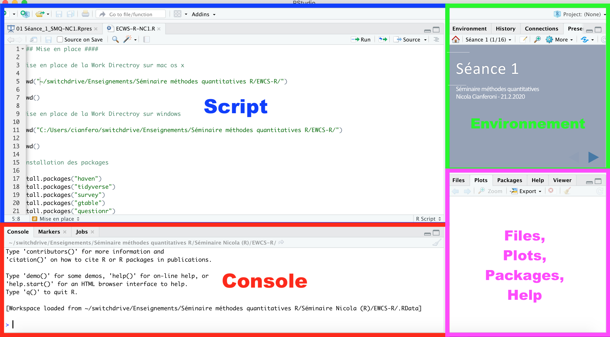

## Fonctionnement

Un logiciel basé sur la manipulation des objets (*object-oriented*)

*Alors qu’avec la plupart des logiciels on réfléchira avec un fichier de données ouvert à la fois, sous R chaque fichier de données correspondra à un objet différent chargé en mémoire, permettant de manipuler très facilement plusieurs objets à la fois.*

Source: https://larmarange.github.io/analyse-R/

Tout peut être placé ou stoqué dans un objet

- une base de données
- un graphique
- un tableau croisé
- un label
- un chiffre
- etc.

Exemple

```{r}

x <- 2

```

- j'ai stoqué le chiffre 2 dans un objet x
- la logique de R conduit à créer des objets en continu
- la "lecture" se fera de gauche à droite

## Installation

Windows

http://cran.r-project.org/bin/windows/base/ 

Mac OS X

http://cran.r-project.org/bin/macosx/ 

Tutoriel: https://techvidvan.com/tutorials/install-r/ 

Work directory (WD)

- Contient tous les fichiers utilisés et produits
- Important de choisir son emplacement correct
- La commande *setwd()* vous permet de définir la WD
- Exemple Windows:

setwd("C:/Users/cianfero/switchdrive/Enseignements/SMQ-UNIGE/EWCS-R/")

- Exemple Mac:

setwd("~/switchdrive/Enseignements/SMQ-UNIGE/EWCS-R/")

- La commande *getwd()* vous permet de trouver et/ou vérifier l'emplacement de votre working directory

## Packages

La logique des packages

- R Studio n'est pas un logiciel comme les autres (SPSS ou Stata)
- R Studio peut être considéré comme un langage
- Le packages de R assemblent les codes et proposent des langages pour les fonctions souhaitées
- Ces packages, en plus des codes, contiennent de la documentation, des tests et des exemples
- Pour installer un package, utilisez la fonction *install.packages("x")*
- Puis, chargez-le avec la fonction *library("x")*

Les packages essentiels

| Package       | Caractéristiques                       |
| :------------ | -------------------------------------: |
| tidyverse     | Suite d’extensions basées sur une philosophie commune
| haven         | Permet d'importer des fichiers en format SAS, SPSS, Stata
| ggplot2       | Permet d'effectuer les graphiques
| questionr     | Fournit les outils essentiels pour les analyses

D'autre packages pourront être installés au fur et à mesure suivant les besoins pour le traitement et l'analyse des données (cf. annexe).

## Script

R Script = feuille de commandes

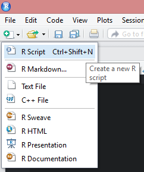{width=30%}

Pourquoi

- Garder une trace toutes les commandes effectuées
- Structurer la logique déployée à l'aide de #### (sections)
- Garder une commande en mémoire et la reproduire avec des adaptations
- Collaborer plus facilement en groupe

Astuces

- Notez tous dans les commentaires (à l'aide de #)
- Utilisez des noms simples pour les objets ("Q24" vs "durée-du-travail-des-cadres")
- Evitez le plus possible les accents (anglais?)
- Code = langage = clair, lisible, élégant

Pour lancer une ligne de code: "Run" ou "Ctrl + Enter"

Commentaires

```{r}
1 + 1 # commentaire
```

Les commentaires sont indispensables à la fois pour indiquer la fonction des commandes et pour retrouver le raisonnement déployé.

## Console

La console peut être utilisée aussi pour des calculs

```{r}
-10 / 3
```

Le langage de programmation doit être très précis à la virgule près!

## Premiers codes

Objets simples

```{r}
chiffre <- 1 + 1 # résultat d'un calcul
chiffre
chien <- "Chihuahua" # label
chien
```

Vecteurs

```{r}
tailles <- c(156, 164, 197, 147, 173)
tailles
```

Fonctions

```{r}
length(tailles)
min(tailles)
max(tailles)
mean(tailles)
sum(tailles)
```

Arrondir les nombres

```{r}

pi <- 3.14159265359 # création de l'objet
pi # objet

round(pi, 2) # arrondir l'objet pi à deux chiffres après la virgule

```

Supprimer les objets

```{r}

rm(pi) # suppression de l'objet pi de l'environnement

```

## Erreurs fréquentes 1

```{r error1, eval=F,echo=T,error=F}

# "Error: object 'Variable' not found"
variable <- c(1, 2.5, 4, 5.5, 5.75)
Variable      # Case sensitive
vriable       # Mal orthographié
variable      # N'a pas été créée avant  

# Parenthèses
# Pas assez:
round(mean(var <- c(1, 3, 2, 6))
# Ou trop: "Error: unexpected ')' in..."
      
# "Error: could not find function "test""
#   --> Erreur d'orthographe / case
#   --> Le package n'est pas chargé
```

NB: "Error" est différent de "warning"

## Erreurs fréquentes 2

```{r error2, eval=F,echo=T,error=F}
# "Error: unexpected symbol in..."
round(mean(variable) digits = 2)      # Incorrect
round(mean(variable), digits = 2)     # Correct

# "Error: non-numeric argument to binary operator"
vecteur_chr <- "hello"
vecteur_chr * 3  # "hello" ne peut pas être multiplié par 3

# "Error: object cannot be coerced to type ‘numeric’"
vecteur_chr <- c("NY", "LA", "ATL")
vecteur_num <- as.numeric(vecteur_chr)

# "Error: replacement has 4 rows, data has 3"
df <- data.frame (var_1 = c(1, 2, 3), var_2 = c(40, 66, 74))
df$var_3 <- c(1, 4, 7, 3)  
```

## Importation des données

1. Télécharger la base de données dans un emplacement fixe du PC
2. Installer et activer le pachage *haven*
3. Importer la base de données à l'aide de la commande XY *read_dta("x")*

Exemple sur windows

```{r, eval = FALSE}

ECWS <- read_dta("C:/Users/cianfero/switchdrive/Enseignements/Séminaire méthodes quantitatives R/EWCS-R/ewcs6_2015_ukda_1904.dta")

```

Exemple sur mac

```{r, eval = FALSE}

ECWS <- read_dta("~/switchdrive/Enseignements/Séminaire méthodes quantitatives R/EWCS-R/ewcs6_2015_ukda_1904.dta")

```

Astuce: garder cette commande dans le script

## Bon à savoir

La meilleure méthode pour apprendre R c'est de l'utiliser

- Il ne faut pas se poser trop de questions
- Armez-vous de patience
- Ne démoralisez-vous pas
- Cherchez surtout à trouver du plaisir

Le séminaire ne suffira pas en lui-même

- Cherchez à aller au-delà de ce que vous dit l'assistant
- Consultez les tutoriels en ligne
- Pratiquez autant que vous pouvez
- Venez au séminaire avec les bonnes questions

# Les rapports automatisés

## R Markdown

## Initiatiation

Pourquoi

- Communication et diffusion de résultats d’analyse
- Exportation en format HTML, PDF, Word, etc.

Pratique

- Texte libre mis en forme
- Intégration des blocs de code R

Avantages

- Le code et ses résultats ne sont pas séparés des analyses
- Le document final est reproductible
- Le document peut régénéré et mis à jour, par exemple si les données source sont modifiées
- Aucune mise en page n'est nécessaire! ≠ MS-Word

\newpage

## Éléments d’un document Rmd et syntaxe

En-tête (préambule)

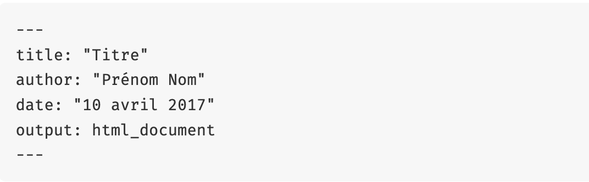{width=65%}

Texte du document
 
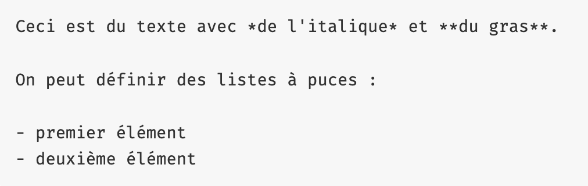{width=70%}
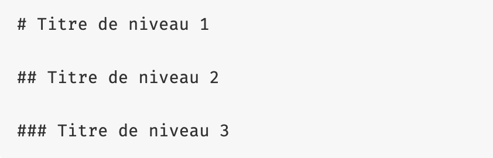{width=55%}

Blocs de code R (menu)

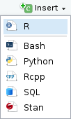{width=15%}

Blocs de code R (syntaxe)

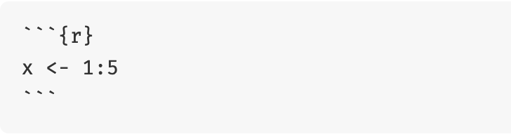{width=50%}

Blocs de code R (options)

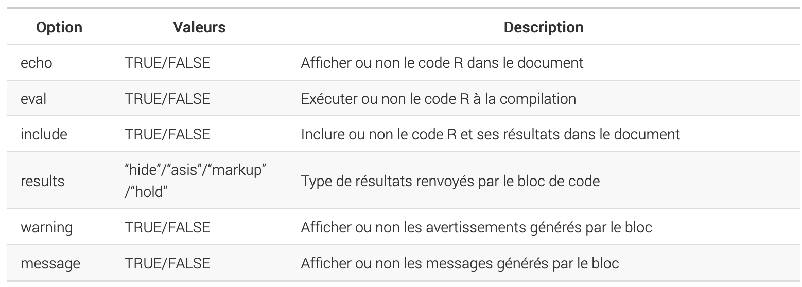{width=95%}


Options pour un document entier

```{r, eval = FALSE}

knitr::opts_chunk$set(echo = TRUE) # toujours montrer les codes
knitr::opts_chunk$set(warning = FALSE) # jamais montrer les avertissements
knitr::opts_chunk$set(include = TRUE) # toujours montrer les résultats

```

Options pour un script

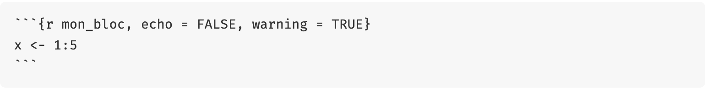

Compiler un document (Knit)

{width=30%}

### Comment procéder

R Studio 

- Commencer les explorations par ce logiciel
- Garder la syntaxe pour le raisonnement
- Commenter systématiquement la syntaxe

R Markdown

- Commencer à rédiger ici le design de recherche
- Intégrer au fur et à mesure la syntaxe

Comment s'y prendre

- R Markdown est plus facile à utiliser que R
- Veillez à ce que la syntaxe soit complète (*chunks*)
- Regardez l'exemple (modèle)
- Référez-vous aux ressources en ligne
- Utilisez un cloud pour partager le fichier

## R Pres

- A utiliser pour les présentations orales
- Même principe que R Markdown
- Mélange de textes et scripts
- Réferez-vous à l'exemple dans Moodle

D'autres supports alternatifs à R Pres et plus performants existent. Ils sont indiqués dans l'annexe. R Pres est le plus simple et c'est mieux de commencer par là.

https://support.rstudio.com/hc/en-us/articles/200486468-Authoring-R-Presentations

# Variables, vecteurs et data frame

## Objets

Conversions

```{r, eval = FALSE}

as.logical()
as.numeric()
as.factor()
as.chacarcter()

```

## Vecteurs

Objets unidimensionnels

- Facteurs (données labéllisées à plusieurs niveaux)
- Characters ("abcd")
- Nombres (3.14)
- Labels (noms plus longs appliqué aux variables)

## Data frame

Définition

- Objets R qui contiennent des données au format tabulaire
- Exemple: base de données EWCS
- Les colonnes sont désormais des variables.

Gestion

- Sélection d'une variable avec $ ou [,1]
- Sélection d'une ligne avec [1,]
- Ajout d'une colonne
- Ajout d'une ligne

Les trois règles pour un rangement conforme au *tidy data*

1. Chaque ligne correspond à une observation
2. Chaque colonne correspond à une variable
3. Chaque valeur est présente dans une unique case de la table

Faux

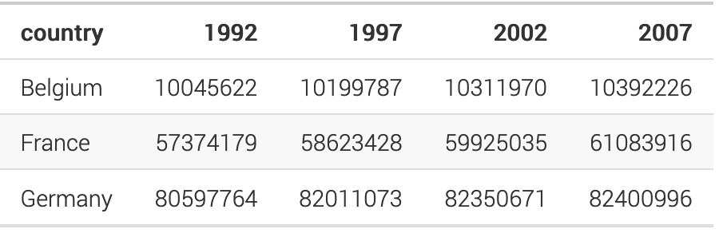{width=65%}

\newpage

Juste

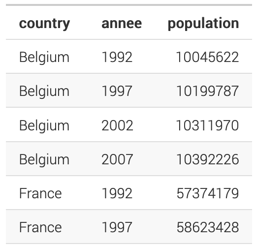{width=40%}

Variables dans un data frame

- Nom: le nom de la variable que nous utilisons dans nos codages
- Variable label: le label est le nom plus digeste de la variable
- Values: l'ensemble des valeurs que prend la variable
- Labels: certaines valeurs au sein d'une variable peuvent être attachées à un label

Les data frame peuvent être coupés en subsets

- Plus petits
- Plus maniables
- Plus adaptés à une recherche ciblée

Il y a deux façon de créer des subsets

- En sélectionnant les variables
- En filtrant les données

Sélection

- Consiste à sélectionner les variables importantes dans votre recherche
- On utilise la fonction select dans le package dplyr
- Commande: *select()*

Filtre

- Consiste à filtrer les données par rapport à certaines valeurs de variables
- On utilise la fonction filter dans le package dplyr
- Commande: *filter()*

Symboles du package *dplyr*

```{r, eval = FALSE}

>    # strictement supérieur
<    # strictement inférieur
>=   # supérieur ou égal
<=   # inférieur ou égal
!=   # différent
==   # égal

```

\newpage

## Description d'une base de données ou de ses variables

Accès à la base de données EWCS

- Utiliser les fonction class, head, str, freq, etc. pour découvrir les variables

```{r, eval = FALSE}

View(EWCS) # permet de voir le data frame ou votre variable en entier
head(EWCS) # affiche les premières colonnes et lignes
names(EWCS) # affiche tous les noms de variables de votre data frame
summary(EWCS) # affiche le min/max/median/quartiles de vos variables

```

Accès aux variables de la base de données EWCS

- Utiliser le symbole $ pour accéder à la variable
- Utiliser les fonction *class(), head(), str(), freq()*, etc. pour découvrir les variables
- Exemple: variable *Country* qui indique le pays du répondant

```{r, eval = FALSE}

View(EWCS$Country) # permet de voir le data frame ou votre variable en entier
head(EWCS$Country) # affiche les premières colonnes et lignes
names(EWCS$Country) # affiche tous les noms de variables de votre data frame
freq(EWCS$Country) # affiche les fréquences
summary(EWCS$Country) # affiche le min/max/median/quartiles de vos variables
class(EWCS$Country) # type de variable
str(EWCS$Country) # informations sur le contenu de la variable
var_label(EWCS$Country) # pour connaître le label de la variable
val_labels(EWCS$Country) # pour connaître le label des modalités de réponse de la variable

```

Rechercher la bonne dans la base de données

- Exemple: rechercher le terme *hours* pour les questions relevant du temps
- Utiliser la commande *lookfor()*

```{r, include = FALSE}

lookfor(EWCS, "hours") 

```

Création d'un objet à partir d'une variable d'un data frame

```{r}

# Q24 - How many hours do you usually work per week in your main paid job?

Q24 <- EWCS$Q24 # création d'un nouvel objet à partir de la variable
summary(Q24) # synthèse des informations

```

## Bonnes pratiques

Comment apprendre à "parler" avec le langage R Studio

1. D'abord clairifier ce que l'on veut
2. Puis choisir la bonne commande
3. Consulter les tutoriels en ligne
4. Procéder step-by-step
5. Créer toujours des nouveaux objets
6. Toujours vérifier l'étape franchie
7. Commenter systématiquement ce que l'on fait
8. Bien structurer le projet et la réflexion

# Données manquantes

Qu'est-ce que c'est

- Les données manquantes sont indiquées avec *NA* (Not Available)
- *NA* n'est pas un *character* mais un symbole à part entière
- Certaines opérations seront considérées comme incomplètes
- Pour exclure les *NA* des analyses ajouter le code *na.rm=TRUE* dans les formules
- La commande *is.na* vous permet de savoir si une valeure est définie comme missing

Dans certains cas, il faut considérer les champs vides comme des NA

- Exemple: espace vide lors les personnes n'ont pas répondu

```{r, eval = FALSE}

# Exemple: remplacer les champs vide en NA dans toute la base de données EWCS

EWCS[EWCS==""] <- NA

```

Il faut souvent tenir compte des données manquantes

- Exemple faux

```{r}

# Q3b_1 - Now thinking about the other members of your household, starting with the oldest ... 
# How old is he/she?"

Q3b_1 <- EWCS$Q3b_1

mean(Q3b_1) # moyenne

```

- Exemple juste

```{r}

# Q3b_1 - Now thinking about the other members of your household, starting with the oldest ... 
# How old is he/she?"

Q3b_1 <- EWCS$Q3b_1

mean(Q3b_1, na.rm = TRUE) # moyenne
```

# Recodages

## Pourquoi

A quoi ça sert

- Rares sont les variables directement adaptées
- Une cohérence est nécessaire avec le cadre théorique
- Un recodage requiert une manipulation sur le plan technique

Quand recoder

- Le recodage se fait uniquement lorsque l'on a une idée claire de nos variables dépendantes/indépendantes et des hypothèses. 
- Durant l'analyse, il sera parfois nécessaire de re-recoder une ou plusieurs variables.

## Trois étapes clefs

**Diagnostique**

Observer la variable, sa distribution et les données manquantes.

**Recodage**

Il y a plusieurs façon de recoder. Il faut choisir et réaliser la bonne technique.

**Vérification**

Les erreurs de recodage sont très courantes. Cela peut biaiser les résultats obtenus! Il faut toujours comparer la variable obtenue après recodage avec la variable originale afin de voir si le recodage obtenu est satisfaisant.   

## Recodages d'une seule variable

### Variables catégorielles

Dans la base de données EWCS, les variables sont de type *haven_labelled* (elles combinent nombre et label). Il faut donc convertir en facteur à l'aide du package *labelled*. Tutoriel: https://cran.r-project.org/web/packages/labelled/vignettes/intro_labelled.html 

**Exemple**

```{r, include = FALSE}

# Q30e - Repetitive hand or arm movements [Does your main paid job involve…?]

Q30e <- to_factor(EWCS$Q30e) # transformation de la variable d'origine en facteur
class(Q30e) # type de variable
freq(Q30e) # vérification

Q30e <- factor(Q30e, levels=c("Refusal (spontaneous)", "DK (spontaneous)", "Never", "Almost never", "Around 1/4 of the time", "Around half of the time", "Around 3/4 of the time", "Almost all of the time", "All of the time")) # opérationalisation
               
freq(Q30e) # vérification

```

Je souhaite considérer comme *NA* les modalités *DK (don't know)* et *Refusal* de la variable Q30e.

```{r, include = FALSE}

# Q30e - Repetitive hand or arm movements [Does your main paid job involve…?]

Q30e <- to_factor(EWCS$Q30e) # transformation de la variable d'origine en facteur
Q30e[Q30e == "Refusal (spontaneous)"] <- NA # modalité 8 = DK (spontaneous)  
Q30e[Q30e == "DK (spontaneous)"] <- NA # modalité 9 = Refusal (spontaneous)

freq(Q30e)

```

Problème: il y a deux étiquettes (labels) vides. Pour les supprimer, il faut transformer moméntanément variable de *factor* en *character*

```{r, echo = TRUE, include = FALSE}

# Q30e - Repetitive hand or arm movements [Does your main paid job involve…?]

Q30e <- to_factor(EWCS$Q30e) # transformation de la variable d'origine en factor
freq(Q30e) # vérification

Q30e[Q30e == "Refusal (spontaneous)"] <- NA #  DK (spontaneous) transformée en NA 
Q30e[Q30e == "DK (spontaneous)"] <- NA # Refusal (spontaneous) transformée en NA
freq(Q30e) # vérification

Q30e <- as.character(Q30e) # je transforme la variable en character

val_label(Q30e, "Refusal (spontaneous)") <- NULL # suppression du label
val_label(Q30e, "DK (spontaneous)") <- NULL # suppression du label

Q30e <- as.factor(Q30e) # je transforme la variable en factor
freq(Q30e) # vérification
```

Je souhaite regrouper les modalités de la variable Q30e en fusionnant les catégories *Almost all of the time, Around 3/4 of the time, Around half of the time, Around 1/4 of the time, Almost never* dans la catégorie *Part time*

```{r, include = FALSE}

# Q30e - Repetitive hand or arm movements [Does your main paid job involve…?]

Q30e <- to_factor(EWCS$Q30e) # transformation de la variable d'origine en facteur
Q30e <- recode(Q30e, "All of the time" = "All of the time",  "Almost all of the time" = "Part time", 
               "Around 3/4 of the time" = "Part time", "Around half of the time" = "Part time", 
               "Around 1/4 of the time" = "Part time", "Almost never" = "Part time", "Never" = "Never",
               "DK (spontaneous)" = "DK (spontaneous)", "Refusal (spontaneous)" = "Refusal (spontaneous)") 
freq(Q30e) # vérification
```

### Variables continues

Variable Q24 - How many hours do you usually work per week in your main paid job?
Problème: le tableau des fréquences est illisible

```{r, include = FALSE }

# Q24 - How many hours do you usually work per week in your main paid job?"

Q24 <- EWCS$Q24 # transformation de la variable d'origine en un objet
freq(Q24) # fréquences 

```

Première approche: générérer un histogramme pour découvrir la variable avec la fonction *hist()*

```{r}

# Q24 - How many hours do you usually work per week in your main paid job?"

Q24 <- EWCS$Q24 # transformation de la variable d'origine en un objet
hist(Q24)  # histogramme brut pour variables continues

```

Personnaliser l'histogramme pour le rendre lisible avec *breaks* and *xlim*

```{r}

# Q24 - How many hours do you usually work per week in your main paid job?"

Q24 <- EWCS$Q24 # transformation de la variable d'origine en un objet
hist(Q24, breaks = 500, xlim = c(0, 60))  # histogramme avec une configuration personnalisée

```

**Nettoyer la variable**

Supprimer réponses pas plausibles qui peuvent biaiser les analyses, comme le fait de travailler plus de 80 heures par semaine. Ce choix est détérminé par un choix conforme à la théorie. La distribution de la variable peut être prise en compte pour détérminer ce choix.

```{r}

# Q24 - How many hours do you usually work per week in your main paid job?"

Q24 <- EWCS$Q24 # transformation de la variable d'origine en un objet
Q24[Q24>80] <- NA # on considère comme NA les données supérieures ou égales à 80

```

Vérification

```{r}

# Q24 - How many hours do you usually work per week in your main paid job?"

hist(Q24)  # histogramme brut pour variables continues

```

Il est également possible de transformer en une variable avec des classes. Ce choix doit être conforme à la théorie.

Pour obtenir la fréquence de la nouvella variable

```{r}

# Q24 - How many hours do you usually work per week in your main paid job?"

Q24_cl <- cut(Q24, include.lowest=TRUE,  right=TRUE, breaks=c(0,39,43,80)) # recodage avec distribution entre classes

freq(Q24_cl) # vérification

```

## Création de nouvelles variables ou d'indices par des recodages

Il est possible de créer des nouvelles variables qui sont fonctions d'autres variables ou qui combinent plusieurs variables existantes.

### Création d'une nouvelle variable

**Question de départ**

On veut créer une nouvelle variable *age* à partir de l'année de naissance déclarée par la personne

```{r, include = FALSE}

# Q2b - Starting with yourself, how old are you?

freq(EWCS$Q2b) # vérification de la variable d'origine Q2b

```

**Opérationalisation**

Utiliser la fonction *mutate* du package *dplyr*

```{r, include = FALSE}

# Q2b - Starting with yourself, how old are you?

EWCS <- mutate(EWCS, age = 2015 - Q2b) # création d'une nouvelle variable

freq(EWCS$age) # vérification

```

### Création d'un indice 

Question de départ: on souhaite regrouper les personnes dont la santé peut être considérée comme étant à risque

- Q73 - Do you think your health or safety is at risk because of your work?
- Q74 - Does your work affect your health?
- Q75 - How is your health in general?

**Opérationnalisation**

1. Dichotomiser les variables

```{r, include = FALSE}

# Q73 - Do you think your health or safety is at risk because of your work?

Q73 <- to_factor(EWCS$Q73) # transformation de la variable d'origine en facteur

Q73_bin <- recode(Q73, "Yes" = 1, "Non" = 0, "DK/no opinion (spontaneous)" = 0, "Refusal (spontaneous)" = 0) # dichotomisation # création d'un nouveal objet en attribuant un score à chaque réponse

freq(Q73_bin) # vérification

# Q74 - Does your work affect your health?

Q74 <- to_factor(EWCS$Q74) # transformation de la variable d'origine en facteur

Q74_bin <- recode(Q74, "Yes, mainly positively" = 0, "Yes, mainly negatively" = 1, "Non" = 0, "DK/no opinion (spontaneous)" = 0, "Refusal (spontaneous)" = 0) # dichotomisation

freq(Q74_bin) # vérification

# Q75 - How is your health in general?

Q75 <- to_factor(EWCS$Q75) # transformation de la variable d'origine en facteur

Q75_bin <- recode(Q75, "Very good" = 0, "Good" = 0, "Fair" = 1, "Very bad" = 1, "DK/no opinion (spontaneous)" = 0, "Refusal (spontaneous)" = 0) # dichotomisation

freq(Q75_bin) # vérification

```

2. Création de l'indice

```{r}

HealthRisk <- Q73_bin + Q74_bin + Q75_bin # addition des trois variables dichotomiques dans un nouveal objet

freq(HealthRisk) # résultat sous forme de fréquence

```

## Bonnes pratiques

Comment choisir entre variables et indices?

> *L'indice est un ndicateur composite qui d'agrège l'information de plusieurs variables, mais il s'éloigne un peu de la réalité et l'intérprétation est plus difficile.*

Comment structurer le travail d'analyse avec R Studio

1. D'abord préparer le script avec les recodages
2. Puis créer un nouveau script pour les analyses
3. Gardez à part un script "bruillon" ou "tests"
4. Veiller à ce que les recodages soient conformes à la théorie
5. Toutes les commandes d'un script doivent être mises au propre
6. Remplir R Markdown au fur et à mesure, pas tout à la fin

# Préparation de l'échantillon

Je souhaite par exemple cibler les cadres, mais aucune variable n'indique précisément la fonction hiérarchique. On peut cependant indentifier cette population à l'aide des variables disponibles. Mon premier objectif est donc de cibler la population qui répond à ces deux critères:

- les personnes ayant un statut de travailleurs dépendants
- les personnes ayant la conduite de subordonnés dans le fonction

```{r}

# création d'une variable fn pour les cadres

EWCS <- mutate(EWCS, fh = case_when(EWCS$Q7 == 1 & EWCS$Q23 > 0 ~ "Cadres", EWCS$Q7 == 1 & EWCS$Q23 == 0 ~ "Travailleurs", TRUE ~ "Autre")) 

```

En plus de cela, je souhaite créer une base de donnée EWCS_2 filtrée avec seulement les personnes qui travaillent à temps plein.

```{r}

# création d'un échantillon EWCS_2 avec un filtre 

EWCS_2 <- EWCS  %>% 
  filter(Q2d == 2)

```

Ces deux commandes ont été générées avec le package *dplyr*. Les économies de commandesdans la syntaxe facilite une vision claire de comment est composé mon échantillon et permet de gagner du temps.

# Analyses univariées

## Variables quantitatives

### Tendance centrale / dispersion / distribution

La fonction *summary()* donne un résumé des principaux indicateurs de la variable

```{r}

# Q24 - How many hours do you usually work per week in your main paid job?

Q24 <- as.numeric(EWCS_2$Q24) # transformation de la variable d'origine en variable continue
Q24[Q24 > 72] <- NA # je considère manquantes les heures celles supérieurs à 72, soit l'équivalent de 12 heures par jours pendant 7 jours

summary(Q24) # j'observe la nouvelle distribution de la variable
```

Dans l'exemple:

- La médiane se situe à 40 heures, la moyenne à 41.55
- Le premier quartile à 39 heures, le troisième à 45 heures

La variance peut être obtenue à l'aide de la commande *var()*

```{r}

# Q24 - How many hours do you usually work per week in your main paid job?

var(Q24, na.rm = TRUE)

```

L'écart-type peut être obtenu à l'aide de la commande *sd()*

```{r}

# Q24 - How many hours do you usually work per week in your main paid job?

sd(Q24, na.rm = TRUE)

```

Les quartiles peuvent être calculés avec la commande *quantile()*

```{r}

# Q24 - How many hours do you usually work per week in your main paid job?

quantile(Q24, na.rm = TRUE)

```

Et si on voulait connaître la moyenne...

- ... pour chaque pays?
- ... pour les temps plein?
- ... pour les hommes et les femmes?
- ... en triant de manière descendante?
- ... en montrant seulement les 5 premiers?

Le package *dplyr* permet d'enchaîner des opérations (avec la fonction %>%) et d'obtenir rapidement une information précise dans une grande base de données comme celle de l'EWCS.

```{r, eval = FALSE}

EWCS %>% # base de donnée originale 
  group_by(to_factor(Country)) %>%  # regrouper par pays
  filter(Q2d == 2) %>% # uniquement les temps plein
  summarise(moyenne = mean(Q24)) %>% # on veut connaître la moyenne
  arrange(desc(moyenne)) %>% # je mets en ordre décroissant
  slice(1:5) # je sélectionne les cinq premières observations

```

### Représentation graphique

Le package *ggplot2* permet des nombreuses illustrations graphiques personnalisées avec la fonction *geom_histogram()*.

Exemple avec valeurs absolues

```{r traitement Q24, include = FALSE}

Q24 <- EWCS_2$Q24

Q24[Q24 > 72] <- NA # je considère manquantes les heures celles supérieurs à 72, soit l'équivalent de 12 heures par jours pendant 7 jours

EWCS_2$Q24 <- Q24 # création d'une base de données comme nouvel objet


```

```{r}

# Q24 - How many hours do you usually work per week in your main paid job?

ggplot(EWCS_2, aes(x=Q24)) +
  geom_histogram(color="black", fill="gray") +
  ggtitle("Durée du travail") +
  xlab("Heures") +
  ylab("Nombre de personnes") +
  theme_bw() # graphique de base avec valeurs absolues indiquées sur l'axe y

```

Exemple avec valeurs relatives

```{r}

ggplot(EWCS_2, aes(x=Q24, y= stat(count)/sum(stat(count)))) +
  geom_histogram(color="black", fill="gray") +
  ggtitle("Durée du travail") +
  xlab("Heures") +
  ylab("Nombre de personnes") +
  scale_y_continuous(labels = scales::percent_format()) + 
  theme_bw() # graphique avec valeurs relatives (pourcentages) indiquées sur l'axe y
```

## Variables qualitatives

### Fréquences

La fonction *freq()* vous donne toutes les informations nécessaires sur la distribution de la variable

```{r}

# Q89a Considering all my efforts and achievements in my job, I feel I get paid appropriately.

Q89a <- to_factor(EWCS$Q89a)

freq(Q89a)

```

La fonction *freq()* inclut des options pour personnaliser l'affichage

- *valid* indique si on souhaite ou non afficher les pourcentages sur les valeurs valides
- *cum* indique si on souhaite ou non afficher les pourcentages cumulés
- *total* permet d’ajouter une ligne avec les effectifs totaux
- *sort* permet de trier le tableau par fréquence croissante (*sort="inc"*) ou décroissante (*sort="dec"*).

Exemple

```{r}

# Q89a Considering all my efforts and achievements in my job, I feel I get paid appropriately.

Q89a <- to_factor(EWCS$Q89a)

freq(Q89a, valid = FALSE, total = FALSE, cum = TRUE, sort = "dec")

```
### Représentation graphique

Le package *ggplot2* permet d'illustrer aussi les variables qualitatives à l'aide de la même formule, mais avec la fonction *geom_bar()*.

Exemple avec valeurs absolues

```{r traitement Q89a}

Q89a <- to_factor(EWCS_2$Q89a)

EWCS_2$Q89a <- Q89a

```


```{r}

# Q89a Considering all my efforts and achievements in my job, I feel I get paid appropriately.

ggplot(EWCS_2, aes(x=Q89a)) +
  geom_bar(color="black", fill="gray") +
  ggtitle("Considering all my efforts and achievements in my job, I feel I get paid appropriately") +
  ylab("Nombre de personnes") +
  theme_bw()

```


Exemple avec valeurs relatives

```{r}

# Q89a Considering all my efforts and achievements in my job, I feel I get paid appropriately.

ggplot(EWCS_2, aes(x=Q89a, y= stat(count)/sum(stat(count)))) +
  geom_bar(color="black", fill="gray") +
  ggtitle("Considering all my efforts and achievements in my job, I feel I get paid appropriately") +
  ylab("Nombre de personnes") +
  scale_y_continuous(labels = scales::percent_format()) + 
  theme_bw()

```

# Analyses bivariées et trivariées

```{r préparation de la base de données EWCS_2, include = FALSE}

# Je garde uniquement les personnes qui déclarent travaillent à temps plein (Q2d)

EWCS_2 <- EWCS  %>% 
  filter(Q2d == 2) 

```

## Deux variables catégorielles

Tableaux croisés

Vous devriez configurer votre tableau pour que les **totaux de 100%** soient situées **en bas des colonnes** et au bout de chaque catégorie de la **variable indépendante**.

Exemple: dans quelle mesure le sexe explique-t-il le secteur où travaille la personne (public vs privé)?

```{r traitement variables Q2 et Q14, echo = FALSE}

## Q2a Gender

Q2a <- to_factor(EWCS_2$Q2a)
Q2a[Q2a == "Don't know (spontaneous)"] <- NA # je rend donnée manquante la modalité "DK/no opinion"

Q2a <- as.character(Q2a) # je transforme la variable en character

val_label(Q2a, "Don't know (spontaneous)") <- NULL # suppression du label

Q2a <- as.factor(Q2a) # je transforme la variable en factor

EWCS_2$Q2a <- Q2a

## Q14 Are you working in…? [private sector; public sector; joint private-public?

Q14 <- to_factor(EWCS_2$Q14)

Q14 <- recode(Q14, "The private sector"= "The private sector",
              "The public sector" = "The public sector",
              "A joint private-public organisation or company" = "Other",
              "Other, please specify:" = "Other",
              "The not-for-profit sector or an NGO" = "Other",
              "DK (spontaneous)" = "DK (spontaneous)",
              "Refusal (spontaneous)" = "Refusal (spontaneous)")

Q14[Q14 == "DK (spontaneous)"] <- NA # je rend donnée manquante la modalité "DK/no opinion"
Q14[Q14 == "Refusal (spontaneous)"] <- NA # je rend donnée manquante la modalité "DK/no opinion"

Q14 <- as.character(Q14) # je transforme la variable en character

val_label(Q14, "Refusal (spontaneous)") <- NULL # suppression du label
val_label(Q14, "DK (spontaneous)") <- NULL # suppression du label

Q14 <- as.factor(Q14) # je transforme la variable en factor

Q14 <- factor(Q14, levels=c("The private sector", "The public sector", "Other")) # opérationalisation

EWCS_2$Q14 <- Q14


```

```{r tableau croisé variables Q2a et Q14, results='asis'}
tab <- table(Q2a, Q14) # première possibilité (objets)
tab <- xtabs(~Q2a + Q14, EWCS_2) # deuxième possibilité (variables de la base de données)

cprop(tab, digits = 1, percent = TRUE) # pourcentages en colonne
lprop(tab, digits = 1, percent = TRUE) # pourcentages à la ligne

```

Test du Chi-2

```{r}

chisq.test(tab) # test du chi carré
chisq.residuals(tab) # résidus du chi carré

```

V de Cramer

```{r}

cramer.v(tab) # V de Cramer

```

## Trois variables catégorielles

Tableaux croisés avec trois variables

```{r création variable fh, include = FALSE}
EWCS_2 <- mutate(EWCS_2, fh = case_when(EWCS_2$Q7 == 1 & EWCS_2$Q23 > 0 ~ "Cadres", EWCS_2$Q7 == 1 & EWCS_2$Q23 == 0 ~ "Travailleurs", TRUE ~ "Autre")) 
```


```{r}

# Q2a - Gender
# Q14 - Are you working in…? (sector)
# fh - fonction hiérarchique

tab1 <- xtabs(~Q2a + Q14 + fh, EWCS_2) # tableau croisé à trois entrées

addmargins(prop.table(tab1))

```

## Deux variables continues (métriques ou ordinales)

Corrélation de Pearson

```{r, corrélations}

# EWCS - base de données non filtrée contenant les personnes travaillant à temps plein et temps partiel

# Q24 - How many hours do you usually work per week in your main paid job?
# Q2b - Starting with yourself, how old are you?"

cor(EWCS$Q24, EWCS$Q2b, method="pearson", use = "complete.obs") 
cor.test(EWCS$Q24, EWCS$Q2b, method="pearson", use = "complete.obs")

```

### Trois variables continues

Correlations (semi-)partielles

```{r création variable Q104_euro, include = FALSE}

Q104_euro <- EWCS$Q104_euro
Q2b <- EWCS$Q2b

Q24 <- as.numeric(EWCS$Q24) # transformation de la variable d'origine en variable continue

Q2b <- EWCS$Q2b

```

```{r, correlatios (semi-partielles)}

# Q24 - How many hours do you usually work per week in your main paid job?
# Q2b - Starting with yourself, how old are you?"
# Q104 - Please can you tell us how much are your NET monthly earnings

library(ppcor) # L'installation du package ppcor est nécessaire

pcor.test(Q24, Q2b, Q104_euro)    # Correlations partielles
spcor.test(Q24, Q2b, Q104_euro)   # Correlations semi-partielles

```

## Une variable continue et une variable catégorielle

### t-test

Analyse de la variance

```{r préparation Q24}

Q24 <- EWCS_2$Q24

Q24[Q24 > 72] <- NA # je considère manquantes les heures celles supérieurs à 72, soit l'équivalent de 12 heures par jours pendant 7 jours

EWCS_2$Q24 <- Q24

```


```{r}

# Q24 - How many hours do you usually work per week in your main paid job?
# Q2a - Gender

tapply(Q24, Q2a, mean, na.rm = TRUE)
t.test(Q24 ~ Q2a)

```

Représentation graphique

```{r}

ggplot(EWCS_2) +
  aes(x = Q2a, y = Q24) +
  geom_boxplot(na.rm = TRUE) +
  ylab("Heures hebdomadaires") +
  scale_x_discrete(na.translate = FALSE) +
  ggtitle("Répartition des heures de travail par sexe") +
  theme_bw()

```

```{r}

ggplot(EWCS_2) +
  aes(x = Q2a, y = Q24) +
  geom_violin(na.rm = TRUE) +
  ylab("Heures hebdomadaires") +
  scale_x_discrete(na.translate = FALSE) +
  ggtitle("Répartition des heures de travail par sexe") +
  theme_bw()

```

### ANOVA

Analyse de la variance

```{r, include = FALSE}
library(arsenal) # L'installation du package arsenal est nécessaire 
```


```{r}

my_controls <- tableby.control(
  test = T,
  total = T,
  numeric.test = "anova", cat.test = "chisq",
  numeric.stats = c("meansd", "medianq1q3", "range", "Nmiss2"),
  cat.stats = c("countpct", "Nmiss2"),
  stats.labels = list(
    meansd = "Mean (SD)",
    medianq1q3 = "Median (Q1, Q3)",
    range = "Min - Max",
    Nmiss2 = "Missing"))

my_labels <- list(Q24 = "Durée du travail", Q2a = "Sexe")
table_one <- tableby(fh ~ Q24, data = EWCS_2, control = my_controls)

```

```{r, results="asis"}
summary(table_one, title = "Principaux indicateurs descriptifs", text=TRUE, digits=1, digits.p=3)
```


```{r}

# Q24 - How many hours do you usually work per week in your main paid job?
# fh - fonction hiérarchique

anv <- aov(Q24 ~ fh, data=EWCS_2)

summary(anv)

```

Représentation graphique avec la fonction *geom_boxplot()*

```{r}

ggplot(EWCS_2) +
  aes(x = fh, y = Q24) +
  geom_boxplot(na.rm = TRUE) +
  ylab("Heures hebdomadaires") +
  scale_x_discrete(na.translate = FALSE) +
  ggtitle("Répartition des heures de travail par fonction hiérarchique") +
  theme_bw()

```

Représentation graphique avec la fonction *geom_violin()*

```{r}

ggplot(EWCS_2) +
  aes(x = fh, y = Q24) +
  geom_violin(na.rm = TRUE) +
  ylab("Heures hebdomadaires") +
  scale_x_discrete(na.translate = FALSE) +
  ggtitle("Répartition des heures de travail par fonction hiérarchique") +
  scale_x_discrete(na.translate = FALSE) +
  theme_bw()

```

## Bonus

Il existe de nombreux packages pour les statistiques descriptives: https://thatdatatho.com/2018/08/20/easily-create-descriptive-summary-statistic-tables-r-studio 

```{r variable division sexuée du travail (DST), echo = FALSE}

EWCS_2 <- EWCS_2 %>% mutate(DST = case_when(Q3c_1 == 1 & Q3e_1 == 1 ~ "Partenaire à temps partiel",
                                            Q3c_2 == 1 & Q3e_1 == 1 ~ "Partenaire à temps partiel",
                                            Q3c_3 == 1 & Q3e_1 == 1 ~ "Partenaire à temps partiel",
                                            Q3c_4 == 1 & Q3e_1 == 1 ~ "Partenaire à temps partiel",
                                            Q3c_5 == 1 & Q3e_1 == 1 ~ "Partenaire à temps partiel",
                                            Q3c_6 == 1 & Q3e_1 == 1 ~ "Partenaire à temps partiel",
                                            Q3c_7 == 1 & Q3e_1 == 1 ~ "Partenaire à temps partiel",
                                            Q3c_8 == 1 & Q3e_1 == 1 ~ "Partenaire à temps partiel",
                                            Q3c_9 == 1 & Q3e_1 == 1 ~ "Partenaire à temps partiel",
                                            Q3c_10 == 1 & Q3e_10 == 1 ~ "Partenaire à temps partiel",
                                            Q3c_1 == 1 & Q3e_1 == 2 ~ "Partenaire à temps plein",
                                            Q3c_2 == 1 & Q3e_1 == 2 ~ "Partenaire à temps plein",
                                            Q3c_3 == 1 & Q3e_1 == 2 ~ "Partenaire à temps plein",
                                            Q3c_4 == 1 & Q3e_1 == 2 ~ "Partenaire à temps plein",
                                            Q3c_5 == 1 & Q3e_1 == 2 ~ "Partenaire à temps plein",
                                            Q3c_6 == 1 & Q3e_1 == 2 ~ "Partenaire à temps plein",
                                            Q3c_7 == 1 & Q3e_1 == 2 ~ "Partenaire à temps plein",
                                            Q3c_8 == 1 & Q3e_1 == 2 ~ "Partenaire à temps plein",
                                            Q3c_9 == 1 & Q3e_1 == 2 ~ "Partenaire à temps plein",
                                            Q3c_10 == 1 & Q3e_10 == 2 ~ "Partenaire à temps plein",
                                            TRUE ~ "Autre"))

DST <- EWCS_2$DST

```

### Package *Table1*

```{r, results="asis"}

my_controls <- tableby.control(
  test = T,
  total = T,
  numeric.test = "anova", cat.test = "chisq",
  numeric.stats = c("meansd", "medianq1q3", "range", "Nmiss2"),
  cat.stats = c("countpct", "Nmiss2"),
  stats.labels = list(
    meansd = "Mean (SD)",
    medianq1q3 = "Median (Q1, Q3)",
    range = "Min - Max",
    Nmiss2 = "Missing"))

my_labels <- list(Q24 = "Durée du travail", Q2a = "Sexe", Q14 = "Secteur d'activité", DST = "Division du travail dans le ménage")
table_one <- tableby(fh ~ Q24 + Q2a + Q14 + DST, data = EWCS_2, control = my_controls)
summary(table_one, title = "Principaux indicateurs descriptifs", text=TRUE, digits=1, digits.p=3)

```

### Package *Arsenal*

```{r arsenal library, include = FALSE}
library(arsenal)
```

```{r arsenal tableby, results="asis"}
my_controls <- tableby.control(
  test = T,
  total = T,
  numeric.test = "anova", cat.test = "chisq",
  numeric.stats = c("meansd", "medianq1q3", "range", "Nmiss2"),
  cat.stats = c("countpct", "Nmiss2"),
  stats.labels = list(
    meansd = "Mean (SD)",
    medianq1q3 = "Median (Q1, Q3)",
    range = "Min - Max",
    Nmiss2 = "Missing"))

my_labels <- list(Q24 = "Durée du travail", Q2a = "Sexe", Q2b = "Age", Q12_years = "Ancienneté", Q14 = "Secteur d'activité", DST = "Organisation du ménage", sat = "Satisfaction")
table_one <- tableby(fh ~ Q24 + Q2a + Q2b + Q12_years + Q14, data = EWCS_2, control = my_controls)
summary(table_one, title = "Description des principaux indicateurs", abelTranslations = my_labels, digits=1, digits.p=3)

```

# Analyses multivariées

## Choix de la régression

Régression linéare

- Variable dépendante métrique
- Variable indépendante métrique ou dichotomique

Régression logistique binomiale

- Variable dépendante dichotomique

Régression logistique multinomiale

- Variable dépendante catégorielle

Régression logistique ordinale

- Variable dépendante irdubake

## Régression linéaire

- Variable dépendante: métrique
- Variables indépendantes: métriques ou dichotomiques

Lecture des sorties de la fonction *summary()*

- **Call**: la fomule du modèle
- **Coefficients**: l’estimation du coefficient, l’écart-type estimé, la valeur du test de Student de nullité statistique du coefficientet enfin la *p-value* associé à ce test
- **Signif**. codes: les significations des symboles de niveau de significativité 
- **Multiple R-squared**: coefficient de détermination R2
- **Adjusted R-squared**: coefficient de détermination R2 ajusté
- **F-statistic**: valeur de la statistique de Fisher du test de significativité globale

Exemple

- Régression linéraire entre l'âge (Q2b) et la durée du travail (Q24)

Résultats

```{r traitement variables Q2b et Q24, include = FALSE}

## Q2b How olde are you?

Q2b <- as.numeric(EWCS_2$Q2b) # transformation de la variable d'origine en variable continue

Q2b[Q2b > 100] <- NA # je considère manquantes les heures celles supérieurs à 72, soit l'équivalent de 12 heures par jours pendant 7 jours

hist(Q2b) # j'observe d'abord la distribution de la variable originale
summary(Q2b) # j'observe d'abord la distribution de la variable originale

EWCS_2$Q2b <- Q2b # insertion de la variable que nous avons retravaillée Q24 dans cette nouvelle base de données

## Q24 - How many hours do you usually work per week in your main paid job?

### Traitement des variables manquantes

Q24 <- as.numeric(EWCS_2$Q24) # transformation de la variable d'origine en variable continue

Q24[Q24 > 72] <- NA # je considère manquantes les heures celles supérieurs à 72, soit l'équivalent de 12 heures par jours pendant 7 jours

EWCS_2$Q24 <- Q24 # insertion de la variable que nous avons retravaillée Q24 dans cette nouvelle base de données

```

```{r régression linéaire m1 - diapositive 1}

# Q2b - Starting with yourself, how old are you?
# Q24 - How many hours do you usually work per week in your main paid job?

m1 <- lm(Q24 ~ Q2b, data=EWCS_2) # durée du temps de travail et âge (seulement les temps pleins)
summary(m1)
```

Interprétation

- La significativité globale du modèle est très élevée (*p value* du test de Fisher < 0.001)

```{r régression linéaire modèle 1 - diapositive 2}

library("parameters") # package permettant une meilleure visualisation des résultats
model_parameters(m1)

```

Interpretation

- Temps de travail = constante (42,5 heures) - l'age x coefficient (- 0.02)
- La durée du travail tend à diminuer avec l'âge

Visualisation graphique avec la méthode *lm*

```{r régression linéaire modèle 1 - graphique 1}

ggplot(EWCS_2, aes(x=Q2b, y= Q24)) +
  geom_smooth(method="lm", se=TRUE, fullrange=FALSE, level=0.95) +
  ggtitle("Régression entre durée du travail et âge") +
  xlab("Âge") +
  ylab("Heures par semaine") +
  theme_bw() 

# se indique l'intervalle de confiance
# level indique le niveau de cet intervalle

```

Visualisation graphique avec la méthode *auto*

```{r régression linéaire modèle 1 - graphique 2}

ggplot(EWCS_2, aes(x=Q2b, y= Q24)) +
  geom_smooth(method="auto", se=TRUE, fullrange=FALSE, level=0.95) +
  ggtitle("Régression entre durée du travail et âge") +
  xlab("Âge") +
  ylab("Heures par semaine") +
  theme_bw()

```

Possibilité d'ajouter une ou plusieurs variables de contrôle

```{r traitement variable Q2a, include = FALSE}

# Q2a Gender

Q2a <- to_factor(EWCS_2$Q2a)
Q2a[Q2a == "Don't know (spontaneous)"] <- NA # je rend donnée manquante la modalité "DK/no opinion"

Q2a <- as.character(Q2a) # je transforme la variable en character

val_label(Q2a, "Don't know (spontaneous)") <- NULL # suppression du label

Q2a <- as.factor(Q2a) # je transforme la variable en factor

EWCS_2$Q2a <- Q2a

```

```{r régression linéaire modèle 2}

# Variable de contrôle: Q2a Gender
# Première modalité: "Female"

freq(Q2a)

m2 <- lm(Q24 ~ Q2b + Q2a, data=EWCS_2)
model_parameters(m2)

```

Interprétation

- Le fait que l'on soit un homme ou une femme n'a pas d'effet sur la relation entre l'âge et la durée du travail
- La durée du travail tend toujours à diminuer avec l'âge même si les hommes travaillent travaillent 2.9 heures de plus que les femmes
- La relation reste statistiquement significative (*p value* > 0.001) entre l'âge et la durée du travail

Visualisation graphique

```{r régression linéaire modèle 2 - graphique 1}

ggplot(EWCS_2, aes(x=Q2b, y= Q24)) +
  geom_smooth(method="lm", se=TRUE, fullrange=FALSE, level=0.95) +
  ggtitle("Régression entre durée du travail et âge") +
  xlab("Sexe") +
  ylab("Heures par semaine") +
  facet_wrap(~ Q2a) +
  theme_bw()


```

Régression linéaire avec prise en compte d'un effet d'intéraction entre sexe (Q2a) et fonction hiérarchique (fh)

```{r régression linéaire - eff int }

m3 <- lm(Q24 ~ Q2b + Q2a * fh, data=EWCS_2)
model_parameters(m3)

```

Interprétation

- Une intéraction entre sexe et fonction hiérarchique est observée entre le sexe et la fonction hiérarchique (*p value* < ou =  0.001).
- La relation entre l'âge et la durée du travail reste significative (*p value* < 0.001) avec la prise en compte de cette intéraction.

## Régressions logistiques

### Binomiale

```{r traitement variables Q14 - sat - Q2b_2, include = FALSE}

## Hypothèse 2. Satisfaction au travail (variables simples)

### Q89a Considering all my efforts and achievements in my job, I feel I get paid appropriately.

freq(EWCS_2$Q89a) # informations sur la fréquence de la variable d'origine

Q89a <- to_factor(EWCS_2$Q89a)

EWCS_2$Q89a <- Q89a

Q89a_s <- recode(Q89a, "Strongly agree" = 4,
                 "Tend to agree" = 3,
                 "Neither agree nor disagree" = 2,
                 "Tend to disagree" = 1,
                 "Strongly disagree" = 0)

freq(Q89a_s)

### Q90b I am enthusiastic about my job

Q90b <- to_factor(EWCS_2$Q90b)

Q90b_s <- recode(Q90b, "Always" = 4,
                 "Most of the time" = 3,
                 "Sometimes" = 2,
                 "Rarely" = 1,
                 "Never" = 0)

### Création d'une nouvelle variable sat (satisfaction) combinant ces deux variables Q89a et Q90b

sat <- Q89a_s + Q90b_s

var_label(sat) <- "Satisfaction au travail (indice)"

EWCS_2$sat <- sat # j'insère la variable sat dans la base de donnée parallèle

## Q14 Are you working in…? [private sector; public sector; joint private-public?

Q14 <- to_factor(EWCS_2$Q14)

Q14 <- recode(Q14, "The private sector"= "The private sector",
              "The public sector" = "The public sector",
              "A joint private-public organisation or company" = "Other",
              "Other, please specify:" = "Other",
              "The not-for-profit sector or an NGO" = "Other",
              "DK (spontaneous)" = "DK (spontaneous)",
              "Refusal (spontaneous)" = "Refusal (spontaneous)")

Q14[Q14 == "DK (spontaneous)"] <- NA # je rend donnée manquante la modalité "DK/no opinion"
Q14[Q14 == "Refusal (spontaneous)"] <- NA # je rend donnée manquante la modalité "DK/no opinion"

Q14 <- as.character(Q14) # je transforme la variable en character

val_label(Q14, "Refusal (spontaneous)") <- NULL # suppression du label
val_label(Q14, "DK (spontaneous)") <- NULL # suppression du label

Q14 <- as.factor(Q14) # je transforme la variable en factor

Q14 <- factor(Q14, levels=c("The private sector", "The public sector", "Other")) # opérationalisation

EWCS_2$Q14 <- Q14

## Q2b_2 Âge au carré

Q2b_2 <- Q2b^2 # âge au carré

EWCS_2$Q2b_2 <- Q2b_2

```

Exemple

- Variable dépendante: le fait de vivre seul ou en famille dans son ménage (Q1_cel)
- Modalité de référence: la personne vit en famille (≠ seule)

```{r création variable Q1_cel, include = FALSE}

## Q1 - Including yourself, can you please tell me how many people live in this house?

Q1 <- EWCS_2$Q1
Q1 <- as.numeric(Q1)

Q1_cel <- case_when(Q1 > 1 ~ "Famille",
                       TRUE ~ "Seul")
                
EWCS_2$Q1_cel <- as.factor(Q1_cel)

freq(EWCS_2$Q1_cel)

```

Six modèles de régressions

```{r régression logistique binomiale - six modèles}

reg_bin1 <- glm(Q1_cel ~ Q24, EWCS_2, family = binomial(logit))
reg_bin2 <- glm(Q1_cel ~ Q24 + fh, data = EWCS_2, family = binomial(logit))
reg_bin3 <- glm(Q1_cel ~ Q24 + fh + Q14, data = EWCS_2, family = binomial(logit))
reg_bin4 <- glm(Q1_cel ~ Q24 + fh + Q14 + sat, data = EWCS_2, family = binomial(logit))
reg_bin5 <- glm(Q1_cel ~ Q24 + fh + Q14 + sat + Q2a, data = EWCS_2, family = binomial(logit))
reg_bin6 <- glm(Q1_cel ~ Q24 + fh + Q14 + sat + Q2a + Q2b_2, data = EWCS_2, family = binomial(logit))

```

Pour comparer ces six modèles à l'aide d'une analyse de la variance, un traitement supplémentaire est nécessaire en raison des NA. Ce procédé n'est pas nécessaire lorsque la base de données n'a pas de NA.

```{r régression logistique binomiale - six modèles tr}

# défintion d'une formule emballage

update_nested <- function(object, formula., ..., evaluate = TRUE){
  update(object = object, formula. = formula., data = object$model, ..., evaluate = evaluate)
}

# traitement

reg_bin6 <- glm(Q1_cel ~ Q24 + fh + Q14 + sat + Q2a + Q2b_2, data = EWCS_2, family = binomial(logit)) # modèle retenu
reg_bin5 <- update_nested(reg_bin6, .~.-Q2b_2) # suppression de la variable Q2b_2
reg_bin4 <- update_nested(reg_bin5, .~.-Q2a) # suppression de la variable Q2a
reg_bin3 <- update_nested(reg_bin4, .~.-sat) # suppression de la variable sat 
reg_bin2 <- update_nested(reg_bin3, .~.-Q14) # suppression de la variable Q14 
reg_bin1 <- update_nested(reg_bin2, .~.-fh) # suppression de la variable fh 

```

Comparaison des six modèles avec une analyse de la variance

```{r anova régressions ordinales comp 1}

anova(reg_bin1, reg_bin2, reg_bin3, reg_bin4, reg_bin5, reg_bin6, test = "Chisq")

```

Significativité des variables du modèle retenu

```{r régression logistique binomiale - modèle 6}

# Variable dépendante Q1_cel
# Modalité de référence: "Famille"

drop1(reg_bin6, test = "Chisq") # significativité des variables

```

Interpretation

- On observe un lien statistiquement significatif (*p value* > 0.001) entre la situation familale (Q1_cel) et la durée du travail (Q24), la fonction hiérarchique (fh) et l'âge au carré (Q2b_2). 
- Un lien significatif avec une marge d'erreur plus importante (*p value* > 0.05) est observée entre la situation familiale (Q1_cel) et le secteur d'activité (Q14) et la satisfaction au travail (sat).
- Aucun lien statistiquement significatif est observé entre la situation familiale (Q1_cel) et le sexe (Q2a)

Odds-ratio (tableau)

```{r logistique binomiale odds-ratio 1}

odds.ratio(reg_bin6) # odds-ratio du modèle

```

Présentation des odds-ratio en format *tidy*

```{r régression logistique binomiale odds-ratio 2}

library(broom) # ce package permet de visualiser les résultats dans un format tidy

tidy(reg_bin6, exponentiate = TRUE, conf.int = TRUE)

```

Présentation des odds-ratio avec le package *gtsummary*

```{r régression logistique binomiale odds-ratio  3}

library(gtsummary)
tbl_regression(reg_bin6, exponentiate = TRUE) %>% as_gt() # ajout %>% as_gt() nécessaire pour imprimer sur un pdf

```

Interprétation

- La probabilité de se trouver dans une famille est plus élevée pour les cadres (OR: 1.07) et surtout pour les travailleurs sans fonction hiérarchique (OR: 1.3) par rapport à la catégorie "autre".
- Les personnes actives dans le secteur public ont une moindre proabilité (OR: 0.92) de se trouver dans un ménage composé par des personens seules par rapport à celles actives dans le secteur privé.
- Le temps de travail (OR: 0.99) et l'âge au carré (OR: 1) ont un effet satistiquement significatif, mais très faible sur la probabilité de se trouver en famille plutôt que seuls.
- La probailité d'être dans une famille plutôt que seuls est associé avec une satisfaction au travail (OR: 1.02) et un âge (OR: 1.00014) plus élevés.

Odds-ratio (graphique)

```{r régression logistique binomiale odds-ratio graph}

library(GGally)
ggcoef(reg_bin6, exponentiate = TRUE)

```


Modèle avec prise en compte des effets d'intéraction entre la durée du travail (Q24) et le sexe (Q2a)

```{r régression logistique bin int 1}

reg_bin_eff <- glm(Q1_cel ~ Q24 * Q2a + fh + Q14 + sat + Q2b_2, data = EWCS_2, family = binomial(logit))
drop1(reg_bin_eff, test = "Chisq") # significativité des modèles

```

```{r régression logistique bin eff int 2}

odds.ratio(reg_bin_eff)

```

Comparaison entre les modèles avec et sans prise en compte des effets d'intéraction

```{r anova régressions ordinales comp 2}

anova(reg_bin6, reg_bin_eff, test = "Chisq")

```

Interprétation

- L'intéraction postulée est que le fait d'être un homme augmente la probabilité de travailler plus d'heures.
- L'effet du temps de travail sur le sexe n'est pas statistiquement significatif (*p value* > 0.05) lorsqu'il s'agit d'expliquer la situation familiale.
- Le modèle n'est pas beaucoup plus solide et on peut s'interroger sur la pertinence de tenir compte de l'interaction entre temps de travail et sexe.

### Multinomiale

Variable dépendante: fonction hiérarchique (fh)

```{r création sat et Q2b_2, include = FALSE}

## Hypothèse 2. Satisfaction au travail (variables simples)

### Q89a Considering all my efforts and achievements in my job, I feel I get paid appropriately.

Q89a <- to_factor(EWCS_2$Q89a)

EWCS_2$Q89a <- Q89a

Q89a_s <- recode(Q89a, "Strongly agree" = 4,
                 "Tend to agree" = 3,
                 "Neither agree nor disagree" = 2,
                 "Tend to disagree" = 1,
                 "Strongly disagree" = 0)

### Q90b I am enthusiastic about my job

Q90b <- to_factor(EWCS_2$Q90b)

Q90b_s <- recode(Q90b, "Always" = 4,
                 "Most of the time" = 3,
                 "Sometimes" = 2,
                 "Rarely" = 1,
                 "Never" = 0)

### Création d'une nouvelle variable sat (satisfaction) combinant ces deux variables Q89a et Q90b

sat <- Q89a_s + Q90b_s

var_label(sat) <- "Satisfaction au travail (indice)"

EWCS_2$sat <- sat # j'insère la variable sat dans la base de donnée parallèle

## Q2b_2 Âge au carré

Q2b <- EWCS_2$Q2b

Q2b_2 <- Q2b^2 # âge au carré

EWCS_2$Q2b_2 <- Q2b_2

```

```{r création variable fh pour regm1, include = FALSE}

EWCS_2 <- mutate(EWCS_2, fh = case_when(EWCS_2$Q7 == 1 & EWCS_2$Q23 > 0 ~ "Cadres", EWCS_2$Q7 == 1 & EWCS_2$Q23 == 0 ~ "Travailleurs", TRUE ~ "Autre")) 

```

Modèle

```{r régression logistique multinomiale - formule de base}

library(nnet)

EWCS_2$fh <- factor(EWCS_2$fh, levels = c("Cadres", "Travailleurs", "Autre"))
fh <- EWCS_2$fh # Modalité de référence: les cadres

regm1 <- multinom(fh ~ Q24 + Q14 + sat + Q2a + Q2b_2, data = EWCS_2)

```

Odds-ratio

```{r régression logistique multinomiale - odds ratio 1}

odds.ratio(regm1)

```

Interpretation

- Toutes les variables indépendantes et intervenantes sont statistiquement significatives (*p value* < 0.001) saut pour les travailleurs du secteur public et la satisfaction de la catégorie "autre" (*p value* < 0.1).
- Par rapport aux cadres, parmi les travailleurs sans fonction hiérarchique ont davantage de probabilité de trouver des femmes (Q2aMale OR: 0.69), des personnes moins satisfaites (sat OR: 0.84), une moindre proportion de presonnes travaillant dans le secteur privé (Q14The private OR: 0.95) et une durée du travail plus basse (Q24 OR: 0.98). L'âge au carré n'a pas incidence (Q2b_2 OR: 1).

### Ordinale

Variable dépendante: enthousiasme concernant le travail (Q90a)

```{r objet Q90b, include = FALSE}

### Q90b I am enthusiastic about my job

Q90b <- to_factor(EWCS_2$Q90b)

```

```{r régression logistique ordinale - package, echo = TRUE, include = FALSE}

library(ordinal) # activation du package permettant de faire une régression logistique ordinale

```

Résultats

```{r régression logistique ordinale - formule de base}

### Q90b I am enthusiastic about my job, modalité de référence "Always"

rego <- clm(as.factor(Q90b) ~ Q24 + fh + Q14 + Q2a + Q2b_2, data = EWCS_2)

summary(rego)

```

La commande *summary(rego)* nous indique le coefficient Beta (estimate) et la significativité de chaque variable dans le modèle. La significativité de chaque variable est une information nécessaire pour estimer la solidité du modèle, mais le coefficient des variables ne peut pas être utilisée en tant que tel. Nous devons connaître les odds-ratio pour chaque modalité de réponse. Pour obtenir les odds-ratio, il faut connaître l'exposant du coefficient Beta. Il y a plusieurs manière pour les obtenir.

Formule de base pour obtenir les odds-ratio

```{r régression logistique ordinale - odds ratio 2}

exp(coef(rego))

```

Présentation des odds-ratio en format *tidy*

```{r régression logistique ordinale - odds ratio 3}

tidy(rego, exponentiate = TRUE, conf.int = TRUE)

```

Présentation des odds-ratio avec le package *gtsummary*

```{r régression logistique ordinale - odds ratio 4}

library(gtsummary)
tbl_regression(rego, exponentiate = TRUE) %>% as_gt() # ajout %>% as_gt() nécessaire pour imprimer sur un pdf

```

Interpretation

- Toutes les variables indépendantes et intervenantes sont statistiquement significatives (*p value* < 0.001) à l'exception de l'âge au carré (Q2b_2).
- Les hommes ont 1.09 fois plus de probabilité d'être enthousiastes de leur travail par rapport aux femmes (Q2aMale).
- Les personnes travaillant dans le secteur public ont 0.76 fois moins de probabilités d'être enthousiastes de leur travail (Q14The public sector).

\newpage

# Annexes

## Guides et ressources 

### R Studio

En anglais

- [Cheat Sheets](https://www.rstudio.com/resources/cheatsheets)
- [R for Data Science](https://r4ds.had.co.nz)

En français

- [Introduction à l’analyse d’enquêtes avec R et RStudio](http://larmarange.github.io/analyse-R)
- [Introduction à R et au tidyverse](https://juba.github.io)

Recherchez: "How to ... in R Studio"

- [Google](https://www.google.com)
- [stack overflow](https://stackoverflow.com)

### R Markdown

- [R Markdown Cookbook](https://bookdown.org/yihui/rmarkdown-cookbook/)
- [R Markdown: The Definitive Guide](https://bookdown.org/yihui/rmarkdown/)

### ggplot2

- [The R Graph Gallery](https://www.r-graph-gallery.com)

- [The Complete ggplot2 Tutorial](http://r-statistics.co/Complete-Ggplot2-Tutorial-Part1-With-R-Code.html)

- [Elegant Graphics for Data Analysis](https://ggplot2-book.org/index.html)

### Présentations

- [Vuilt-in presentation formats in the R *Markdown* package](https://bookdown.org/yihui/rmarkdown/presentations.html)

### Autres packages

- [Packages for easily create descriptive summary statistics tables](https://thatdatatho.com/2018/08/20/easily-create-descriptive-summary-statistic-tables-r-studio/)
- [Summarytools: a coherent set of functions centered on data exploration and simple reporting](https://cran.r-project.org/web/packages/summarytools/vignettes/Introduction.html)
- [kableExtra: how to generate complex tables in LaTeX and R Markdown](https://cran.r-project.org/web/packages/kableExtra/vignettes/awesome_table_in_html.html#overview)


