Les dimensions de la qualité du travail
================
Apprendre R Studio avec l’Enquête européenne sur les conditions de
travail (EWCS)
Nicola Cianferoni, sémestre de printemps 2020, Université de Genève

  - [Introduction à la sociologie du
    travail](#introduction-à-la-sociologie-du-travail)
      - [Qu’est-ce qu’un travail?](#quest-ce-quun-travail)
      - [Tendances actuelles](#tendances-actuelles)
      - [Défis actuels](#défis-actuels)
      - [Champs d’étude pour la recherche
        sociologique](#champs-détude-pour-la-recherche-sociologique)
      - [Autres approches pour l’analyse du
        travail](#autres-approches-pour-lanalyse-du-travail)
      - [Bibliographie](#bibliographie)
      - [Enquête européenne sur les conditions de travail
        (EWCS)](#enquête-européenne-sur-les-conditions-de-travail-ewcs)
      - [Ressources documentaires](#ressources-documentaires)
  - [Design de recherche](#design-de-recherche)
      - [Démarche](#démarche)
      - [Comment choisir un thème](#comment-choisir-un-thème)
      - [Question de recherche](#question-de-recherche)
      - [Théorie(s)](#théories)
      - [Hypothèse(s)](#hypothèses)
      - [Variables](#variables)
      - [Analyse et interprétation](#analyse-et-interprétation)
      - [Règles de citation](#règles-de-citation)
          - [Livre](#livre)
          - [Article](#article)
      - [Exemples](#exemples)
          - [Bon désign de recherche](#bon-désign-de-recherche)
          - [Mauvais design de recherche](#mauvais-design-de-recherche)
      - [Bonnes pratiques](#bonnes-pratiques)
  - [Initiation à R Studio](#initiation-à-r-studio)
      - [Fonctionnement](#fonctionnement)
      - [Installation](#installation)
      - [Packages](#packages)
      - [Script](#script)
      - [Console](#console)
      - [Premiers codes](#premiers-codes)
      - [Erreurs fréquentes 1](#erreurs-fréquentes-1)
      - [Erreurs fréquentes 2](#erreurs-fréquentes-2)
      - [Importation des données](#importation-des-données)
      - [Bon à savoir](#bon-à-savoir)
  - [Les rapports automatisés](#les-rapports-automatisés)
      - [R Markdown](#r-markdown)
      - [Initiatiation](#initiatiation)
      - [Éléments d’un document Rmd et
        syntaxe](#éléments-dun-document-rmd-et-syntaxe)
          - [Comment procéder](#comment-procéder)
      - [R Pres](#r-pres)
  - [Variables, vecteurs et data
    frame](#variables-vecteurs-et-data-frame)
      - [Objets](#objets)
      - [Vecteurs](#vecteurs)
      - [Data frame](#data-frame)
      - [Description d’une base de données ou de ses
        variables](#description-dune-base-de-données-ou-de-ses-variables)
      - [Bonnes pratiques](#bonnes-pratiques-1)
  - [Données manquantes](#données-manquantes)
  - [Recodages](#recodages)
      - [Pourquoi](#pourquoi)
      - [Trois étapes clefs](#trois-étapes-clefs)
      - [Recodages d’une seule variable](#recodages-dune-seule-variable)
          - [Variables catégorielles](#variables-catégorielles)
          - [Variables continues](#variables-continues)
      - [Création de nouvelles variables ou d’indices par des
        recodages](#création-de-nouvelles-variables-ou-dindices-par-des-recodages)
          - [Création d’une nouvelle
            variable](#création-dune-nouvelle-variable)
          - [Création d’un indice](#création-dun-indice)
      - [Bonnes pratiques](#bonnes-pratiques-2)
  - [Préparation de l’échantillon](#préparation-de-léchantillon)
  - [Analyses univariées](#analyses-univariées)
      - [Variables quantitatives](#variables-quantitatives)
          - [Tendance centrale / dispersion /
            distribution](#tendance-centrale-dispersion-distribution)
          - [Représentation graphique](#représentation-graphique)
      - [Variables qualitatives](#variables-qualitatives)
          - [Fréquences](#fréquences)
          - [Représentation graphique](#représentation-graphique-1)
  - [Analyses bivariées et
    trivariées](#analyses-bivariées-et-trivariées)
      - [Deux variables catégorielles](#deux-variables-catégorielles)
      - [Trois variables catégorielles](#trois-variables-catégorielles)
      - [Deux variables continues (métriques ou
        ordinales)](#deux-variables-continues-métriques-ou-ordinales)
          - [Trois variables continues](#trois-variables-continues)
      - [Une variable continue et une variable
        catégorielle](#une-variable-continue-et-une-variable-catégorielle)
          - [t-test](#t-test)
          - [ANOVA](#anova)
      - [Bonus](#bonus)
          - [Package *Table1*](#package-table1)
          - [Package *Arsenal*](#package-arsenal)
  - [Analyses multivariées](#analyses-multivariées)
      - [Choix de la régression](#choix-de-la-régression)
      - [Régression linéaire](#régression-linéaire)
      - [Régressions logistiques](#régressions-logistiques)
          - [Binomiale](#binomiale)
          - [Multinomiale](#multinomiale)
          - [Ordinale](#ordinale)
  - [Annexes](#annexes)
      - [Guides et ressources](#guides-et-ressources)
          - [R Studio](#r-studio)
          - [R Markdown](#r-markdown-1)
          - [ggplot2](#ggplot2)
          - [Présentations](#présentations)
          - [Autres packages](#autres-packages)

# Introduction à la sociologie du travail

## Qu’est-ce qu’un travail?

Une activité sociale

*L’homme est un animal social… essentiellement occupé de travail. Le
travail est un commun dénominateur et une condition de toute vie humaine
en société.*

Un fait social

*Le travail est essentiellement, à travers la technique, la
transformation par l’homme de la nature qui, à son tour, réagit sur
l’homme en le modifiant.*

Un rapport social

*Dans cette interaction entre l’homme et son milieu (plus ou moins
naturel) à travers la technique semble bien résider, en fin de compte,
l’élément moteur qui explique l’évolution ou la révolution des
structures sociales.*

Source: *Traité de sociologie du travail*, 1961

## Tendances actuelles

  - Production à flux tendu
  - Plateformes numériques, algorithmes
  - Longues journées de travail
  - Horaires irréguliers, flexibilité
  - Intensification du travail
  - Porosité entre travail et hors travail
  - Migrations (nationales et internationales)
  - Insécurité de l’emploi
  - Faiblesse du syndicalisme

## Défis actuels

  - Articulation travail-famille
  - Risques psychosociaux, souffrance au travail
  - Évolution des protections légales
  - Inégalités hommes-femmes
  - Mise en concurrence
  - Conflictualité sociale

## Champs d’étude pour la recherche sociologique

  - Évolution des contraintes physiques et psychiques
  - Division sociale et sexuée du travail
  - Effets de l’organisation du travail (travail prescrit)
  - Impact des restructurations
  - Rôle du travail dans la construction de la santé
  - Répartition de la main-d’œuvre sur le marché du travail
  - Mobilité professionnelle, viellissement
  - Persistence du travail ouvrier, essor des services
  - Poids du statut, du métier, de la hiérarchie
  - Relations collectives de travail, conflits sociaux

## Autres approches pour l’analyse du travail

  - Organisation scientifique du travail
  - Gestion des ressources humaines
  - Psychodynamique du travail
  - Psychologie du travail
  - Ergonomie
  - Médecine du travail
  - Relations industrielles
  - Economie politique
  - Politiques sociales

## Bibliographie

  - Battagliola, F. (2008). *Histoire du travail des femmes*. Paris: La
    Découverte.
  - Beaujolin-Bellet, R. et Schmidt, G. (2012), *Les restructurations
    d’enteprises*, Paris: La Découverte.
  - Bevort, A. et al. (2012), *Dictionnaire du travail*, Paris: PUF.
  - Cianferoni, N. (2019), *Travailler dans la grande distribution. La
    journée de travail va-t-elle redevenir une question sociale?*,
    Zurich/Genève: Seismo.
  - Durand, J.-P. (2004). *La chaîne invisible. Travailler aujourd’hui:
    flux tendu et servitude volontaire*. Paris: Seuil.
  - Du Roy, I. (2009), *Orange stressé. Le management par le stress à
    France Télécom*, Paris: La Découverte.
  - Erbès-Seguin, S. (2010). *La sociologie du travail*. Paris: La
    Découverte.
  - Gollac, M., & Volkoff, S. (2007). *Les conditions de travail*.
    Paris: La Découverte.
  - Lallement, M. (2007), *Le travail. Une sociologie contemporaine*,
    Paris: Gallimard.
  - Marquis, J.-F. (2010), *Conditions de travail, chômage et état de
    santé. La situation en Suisse à la lumière de l’Enquête suisse sur
    la santé 2007*, Lausanne: Page deux.
  - Stroobants, M. (2007). *Sociologie du travail*. Paris: Armand Colin.
  - Thuderoz, C. (2010). *Sociologie des entreprises*. Paris: La
    découverte.

## Enquête européenne sur les conditions de travail (EWCS)

Qu’est-ce que c’est?

  - Plus grande enquête comparative sur les conditions de travail en
    Europe

  - Participation de tous les pays européens et de la Suisse

  - Réalisée tous les cinq ans depuis 1990 par l’Eurofound

  - Enquête par téléphone sur la base d’un tirage aléatoire

  - Questions standardisées sur les conditions de travail englobant
    diverses professions, secteurs et groupes d’âge. 6ème édition (2015)

  - Plus 43 000 personnes actives provenant de 35 pays

  - Échantillon suisse composé de 1006 personnes actives

Dimensions relevées

  - Environnement physique
  - Intensité du travail
  - Durée du travail
  - Environnement social
  - Compétences et autonomie
  - Perspectives de carrière
  - Rémunération
  - Satisfaction

## Ressources documentaires

Suisse

  - [Centre de prestations *Conditions de travail* du Secrétariat d’État
    à l’économie
    (SECO)](https://www.seco.admin.ch/seco/fr/home/Arbeit/Arbeitsbedingungen.html)

  - [Institut universitaire romand de santé au travail
    (IST)](http://www.i-s-t.ch/accueil/)

  - [Rubrique *Personnes actives occupées* de l’Office fédéral de la
    statistique
    (OFS)](https://www.bfs.admin.ch/bfs/fr/home/statistiques/travail-remuneration/activite-professionnelle-temps-travail/actifs-occupes.html)

Europe

  - [Institut syndical européen (ETUI)](https://www.etui.org)

  - [Sixième enquête européenne sur les conditions de travail
    (EWCS)](https://www.eurofound.europa.eu/fr/surveys/european-working-conditions-surveys/sixth-european-working-conditions-survey-2015)

# Design de recherche

## Démarche

1.  Choix d’un thème
2.  Question de recherche
3.  Théorie(s)
4.  Hypothèse(s)
5.  Stratégie(s)
6.  Ressources
7.  Analyse et interprétation
8.  Conclusion

## Comment choisir un thème

Sources

  - Lectures
  - Expériences de vie
  - Intérêts personnels
  - Débats dans la sociétés

Exemples

  - Débats sur la loi sur le travail
  - Protection de la santé des cadres

## Question de recherche

  - Interrogation sur la relation entre des variables
  - Claire, faisable, pertinente et simple
  - Exemple: A + B –\> C

Exemple

  - Comment peut-on expliquer les heures supplémentaires des cadres?

## Théorie(s)

Définitions

  - Concepts abstraits établis pour interpréter les faits sociaux
  - Permettent de comprendre les logiques sociales
  - Évoluent d’après le développement historique des sociétés
  - Permettent de justifier les hypothèses et d’analyser les résultats

Exemples

  - Intensification du travail: resserrement des pores de la journée de
    travail
  - Cadres: travailleurs salariés avec des fonction de conduits
  - Statut social: position dans la hiérarchie
  - Santé: bien-être physique et psychique, pas seulement absence de
    maladies

## Hypothèse(s)

Définitions

  - Réponse(s) provisoire(s) à la question de recherche
  - Établies à l’aide de la littérature scientifique
  - Falsifiables par les données empiriques

Exemples

1.  Les cadres travaillent plus longtemps parce qu’ils ont des grandes
    responsabilités
2.  La disponibilité temporelle des cadres présuppose une division
    sexuée du travail au sein du ménage

> *Les hypothèses doivent toujours être falsifiables\!*

## Variables

Choix des variables

  - Sélection à l’aide de la littérature
  - Experimentation des relations (tests)
  - Identification des niveaux d’analyse

Trois types de variables

  - Dépendante: celle que l’on cherche à **expliquer** dans la relation.
  - Indépendantes: celles qui **permettent d’expliquer** la variable
    dépendante.
  - Intervenantes: celles qui **peuvent intervenir** dans la relation.

Exemples

  - Dépendante: durée du travail (Q24).
  - Indépendantes: satisfaction (indice basé sur Q89, Q90, …),
    composition du ménage (Q1, Q2).
  - Intervenantes: secteur public/privé (Q14), taille de l’entreprise
    (Q16a), intensité de travail (Q49), peur de perdre l’emploi (Q89g).

## Analyse et interprétation

Comment procéder

  - Présentation des résultats
  - Explication des choix opérés
  - Discussion par rapport à la question de recherche
  - Vérification empirique des hypothèses
  - Conclusion

Ressources

  - Littérature scientifique
  - Expériences personnelles
  - Échanges divers
  - Sources d’information

## Règles de citation

Il est recommandé d’utiliser la norme APA.

### Livre

Nom, initiale(s) du prénom. (date de publication). Titre en italique.
Edition (dès la 2e éd.). Lieu de publication: Editeur.

  - Référence: Lessard-Hébert, M., Goyette, G. et Boutin, G. (1997). *La
    recherche qualitative: fondements et pratiques*. Bruxelles: De
    Boeck.
  - Citation: (Lessard-Hébert et al., 1997)

### Article

Nom, initiale(s) du prénom. (date de publication). Titre de l’article en
guillemets. Nom du périodique en italique, numéro du volume (numéro du
fascicule), pages.

  - Référence: Fauconnier G. & Turner M. (2003), «Conceptual Blending,
    Form and Meaning», *Recherches en communication*, 19(1), 57-86.
  - Citation: (Fauconnier et Turner, 2003)

Instructions

<http://edutechwiki.unige.ch/fr/R%C3%A8gles_de_citation_et_r%C3%A9f%C3%A9rencement_bibliographique>

## Exemples

### Bon désign de recherche

Je démarre ma réflexion sur le temps de travail des cadres (en filtrant
la population concernée) en prenant connaissance de la variable **Q24**
qui indique la durée du travail.

``` r
# Q24 - How many hours do you usually work per week in your main paid job?

summary(Q24_cadres)
```

    ##    Min. 1st Qu.  Median    Mean 3rd Qu.    Max. 
    ##       1      40      40      77      50     888

Graphique

``` r
hist(Q24_cadres, breaks = 500, xlim = c(0, 80))  # histogramme avec une configuration personnalisée
```

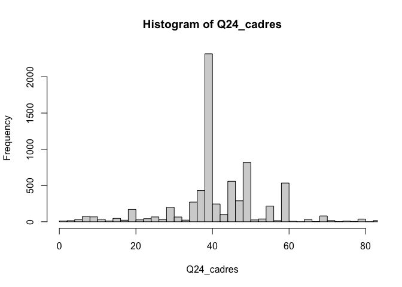<!-- -->

Puis, j’opérationnalisae mon design de recherche.

| Étapes                | Stratégies                                           |
| :-------------------- | ---------------------------------------------------- |
| Choix d’un thème      | Temps de travail, heures supplémentaires             |
| Question de recherche | Comment expliquer le surcroît de travail des cadres? |
| Théorie(s)            | Servitude volontaire, division sexuée du travail     |
| Hypothèse(s)          | 1\. Satisfaction; 2. Organisation du ménage          |
| Ressources            | Articles, littérature, travaux empiriques            |

| Variables     | Stratégies                                                                                |
| :------------ | ----------------------------------------------------------------------------------------- |
| Dépendante    | Durée du contrat de travail                                                               |
| Indépendantes | Satisfaction au travail, composition du ménage                                            |
| Intervenantes | Secteur d’activité, taille de l’entreprise, intensité du travail, peur de perdre l’emploi |

### Mauvais design de recherche

Qu’est-ce qui ne va pas?

| Étapes                | Stratégies                                                                             |
| :-------------------- | -------------------------------------------------------------------------------------- |
| Choix d’un thème      | Condition de travail et santé mentale                                                  |
| Question de recherche | Dans quelle mesure les conditions de travail affectent-ils le burn-out?                |
| Théorie(s)            | Un nombre d’heures trop élevé peut porter atteinte à la santé                          |
| Hypothèse(s)          | Le fait d’avoir un revenu faible peut conduire à une plus grande détresse émotionnelle |

| Variables     | Stratégies                                                 |
| :------------ | ---------------------------------------------------------- |
| Dépendante    | Durée du contrat de travail, restructuration, stress       |
| Indépendantes | Taux d’emploi, statut d’emploi, charge de travail          |
| Intervenantes | Fréquence des activités sportives, sexe, heures de travail |

Discussion

  - Il faut bien définir ce que l’on entend par conditions de travail et
    santé mentale (littérature)
  - Les conditions de travail ont un impact sur la santé mentale, mais
    les effets se font sentir notamment sur la durée (nuancer)
  - Aucune question ne porte directement sur le burn-out et il faut
    identifier donc les facteurs de risque (grande charge de travail et
    faible autonomie) ou la manifestation de ce phénomène (détresse
    émotionnelle, fatigue, etc.)
  - Le revenu est une dimension parmi d’autres des conditions de travail
    et l’hypothèse doit être revue. Exemple: une grosse charge de
    travail et la pression du supérieur hiérarchique peuvent favoriser
    les facteurs de risque d’un burn-out.

## Bonnes pratiques

Importance d’un bon design de recherche

  - Partir d’une question globale, puis resserer
  - Savoir où on veut aller dans la construction de notre projet
  - Disposer d’outils pour interpréter les résultats
  - Choix de variables qui représentent au mieux la réalité que l’on
    souhaite comprendre

Astuces

  - Rester dans la simplicité
  - Se référer à la littérature
  - Limiter le nombre de variables retenues
  - Limiter l’usage des indicateurs composites

# Initiation à R Studio

Qu’est-ce que c’est?

  - Logiciel de statistique multi-plateforme
  - Analyses quantitatives et qualitatives
  - 100% langage de programmation
  - Mise à jour permanente
  - Logiciel très puissant avec ses extensions
  - Permet une mise en page ésthétique

> *Le coût d’entrée est élevé, mais il en vaut le prix\!*

Pourquoi R Studio?

  - Logiciel libre et gratuit
  - Développement par les universités
  - De plus en plus incontournable dans la recherche
  - Permet plus de flexibilité grace aux scripts
  - Intégration d’outils de présentation (R Markdown)
  - Personnalisation par les *Packages*
  - Communauté très active en ligne (<https://stackoverflow.com/>)
  - Beaucoup de manuels en ligne à disposition

L’interface de travail


## Fonctionnement

Un logiciel basé sur la manipulation des objets (*object-oriented*)

*Alors qu’avec la plupart des logiciels on réfléchira avec un fichier de
données ouvert à la fois, sous R chaque fichier de données correspondra
à un objet différent chargé en mémoire, permettant de manipuler très
facilement plusieurs objets à la fois.*

Source: <https://larmarange.github.io/analyse-R/>

Tout peut être placé ou stoqué dans un objet

  - une base de données
  - un graphique
  - un tableau croisé
  - un label
  - un chiffre
  - etc.

Exemple

``` r
x <- 2
```

  - j’ai stoqué le chiffre 2 dans un objet x
  - la logique de R conduit à créer des objets en continu
  - la “lecture” se fera de gauche à droite

## Installation

Windows

<http://cran.r-project.org/bin/windows/base/>

Mac OS X

<http://cran.r-project.org/bin/macosx/>

Tutoriel: <https://techvidvan.com/tutorials/install-r/>

Work directory (WD)

  - Contient tous les fichiers utilisés et produits
  - Important de choisir son emplacement correct
  - La commande *setwd()* vous permet de définir la WD
  - Exemple Windows:

setwd(“C:/Users/cianfero/switchdrive/Enseignements/SMQ-UNIGE/EWCS-R/”)

  - Exemple Mac:

setwd(“\~/switchdrive/Enseignements/SMQ-UNIGE/EWCS-R/”)

  - La commande *getwd()* vous permet de trouver et/ou vérifier
    l’emplacement de votre working directory

## Packages

La logique des packages

  - R Studio n’est pas un logiciel comme les autres (SPSS ou Stata)
  - R Studio peut être considéré comme un langage
  - Le packages de R assemblent les codes et proposent des langages pour
    les fonctions souhaitées
  - Ces packages, en plus des codes, contiennent de la documentation,
    des tests et des exemples
  - Pour installer un package, utilisez la fonction
    *install.packages(“x”)*
  - Puis, chargez-le avec la fonction *library(“x”)*

Les packages essentiels

| Package   |                                          Caractéristiques |
| :-------- | --------------------------------------------------------: |
| tidyverse |     Suite d’extensions basées sur une philosophie commune |
| haven     | Permet d’importer des fichiers en format SAS, SPSS, Stata |
| ggplot2   |                         Permet d’effectuer les graphiques |
| questionr |           Fournit les outils essentiels pour les analyses |

D’autre packages pourront être installés au fur et à mesure suivant les
besoins pour le traitement et l’analyse des données (cf. annexe).

## Script

R Script = feuille de commandes


Pourquoi

  - Garder une trace toutes les commandes effectuées
  - Structurer la logique déployée à l’aide de \#\#\#\# (sections)
  - Garder une commande en mémoire et la reproduire avec des adaptations
  - Collaborer plus facilement en groupe

Astuces

  - Notez tous dans les commentaires (à l’aide de \#)
  - Utilisez des noms simples pour les objets (“Q24” vs
    “durée-du-travail-des-cadres”)
  - Evitez le plus possible les accents (anglais?)
  - Code = langage = clair, lisible, élégant

Pour lancer une ligne de code: “Run” ou “Ctrl + Enter”

Commentaires

``` r
1 + 1 # commentaire
```

    ## [1] 2

Les commentaires sont indispensables à la fois pour indiquer la fonction
des commandes et pour retrouver le raisonnement déployé.

## Console

La console peut être utilisée aussi pour des calculs

``` r
-10 / 3
```

    ## [1] -3.3

Le langage de programmation doit être très précis à la virgule près\!

## Premiers codes

Objets simples

``` r
chiffre <- 1 + 1 # résultat d'un calcul
chiffre
```

    ## [1] 2

``` r
chien <- "Chihuahua" # label
chien
```

    ## [1] "Chihuahua"

Vecteurs

``` r
tailles <- c(156, 164, 197, 147, 173)
tailles
```

    ## [1] 156 164 197 147 173

Fonctions

``` r
length(tailles)
```

    ## [1] 5

``` r
min(tailles)
```

    ## [1] 147

``` r
max(tailles)
```

    ## [1] 197

``` r
mean(tailles)
```

    ## [1] 167

``` r
sum(tailles)
```

    ## [1] 837

Arrondir les nombres

``` r
pi <- 3.14159265359 # création de l'objet
pi # objet
```

    ## [1] 3.1

``` r
round(pi, 2) # arrondir l'objet pi à deux chiffres après la virgule
```

    ## [1] 3.1

Supprimer les objets

``` r
rm(pi) # suppression de l'objet pi de l'environnement
```

## Erreurs fréquentes 1

``` r
# "Error: object 'Variable' not found"
variable <- c(1, 2.5, 4, 5.5, 5.75)
Variable      # Case sensitive
vriable       # Mal orthographié
variable      # N'a pas été créée avant  

# Parenthèses
# Pas assez:
round(mean(var <- c(1, 3, 2, 6))
# Ou trop: "Error: unexpected ')' in..."
      
# "Error: could not find function "test""
#   --> Erreur d'orthographe / case
#   --> Le package n'est pas chargé
```

NB: “Error” est différent de “warning”

## Erreurs fréquentes 2

``` r
# "Error: unexpected symbol in..."
round(mean(variable) digits = 2)      # Incorrect
round(mean(variable), digits = 2)     # Correct

# "Error: non-numeric argument to binary operator"
vecteur_chr <- "hello"
vecteur_chr * 3  # "hello" ne peut pas être multiplié par 3

# "Error: object cannot be coerced to type ‘numeric’"
vecteur_chr <- c("NY", "LA", "ATL")
vecteur_num <- as.numeric(vecteur_chr)

# "Error: replacement has 4 rows, data has 3"
df <- data.frame (var_1 = c(1, 2, 3), var_2 = c(40, 66, 74))
df$var_3 <- c(1, 4, 7, 3)  
```

## Importation des données

1.  Télécharger la base de données dans un emplacement fixe du PC
2.  Installer et activer le pachage *haven*
3.  Importer la base de données à l’aide de la commande XY
    *read\_dta(“x”)*

Exemple sur windows

``` r
ECWS <- read_dta("C:/Users/cianfero/switchdrive/Enseignements/Séminaire méthodes quantitatives R/EWCS-R/ewcs6_2015_ukda_1904.dta")
```

Exemple sur mac

``` r
ECWS <- read_dta("~/switchdrive/Enseignements/Séminaire méthodes quantitatives R/EWCS-R/ewcs6_2015_ukda_1904.dta")
```

Astuce: garder cette commande dans le script

## Bon à savoir

La meilleure méthode pour apprendre R c’est de l’utiliser

  - Il ne faut pas se poser trop de questions
  - Armez-vous de patience
  - Ne démoralisez-vous pas
  - Cherchez surtout à trouver du plaisir

Le séminaire ne suffira pas en lui-même

  - Cherchez à aller au-delà de ce que vous dit l’assistant
  - Consultez les tutoriels en ligne
  - Pratiquez autant que vous pouvez
  - Venez au séminaire avec les bonnes questions

# Les rapports automatisés

## R Markdown

## Initiatiation

Pourquoi

  - Communication et diffusion de résultats d’analyse
  - Exportation en format HTML, PDF, Word, etc.

Pratique

  - Texte libre mis en forme
  - Intégration des blocs de code R

Avantages

  - Le code et ses résultats ne sont pas séparés des analyses
  - Le document final est reproductible
  - Le document peut régénéré et mis à jour, par exemple si les données
    source sont modifiées
  - Aucune mise en page n’est nécessaire\! ≠ MS-Word

## Éléments d’un document Rmd et syntaxe

En-tête (préambule)


Texte du document

 

Blocs de code R (menu)


Blocs de code R (syntaxe)


Blocs de code R (options)


Options pour un document entier

``` r
knitr::opts_chunk$set(echo = TRUE) # toujours montrer les codes
knitr::opts_chunk$set(warning = FALSE) # jamais montrer les avertissements
knitr::opts_chunk$set(include = TRUE) # toujours montrer les résultats
```

Options pour un script


Compiler un document (Knit)


### Comment procéder

R Studio

  - Commencer les explorations par ce logiciel
  - Garder la syntaxe pour le raisonnement
  - Commenter systématiquement la syntaxe

R Markdown

  - Commencer à rédiger ici le design de recherche
  - Intégrer au fur et à mesure la syntaxe

Comment s’y prendre

  - R Markdown est plus facile à utiliser que R
  - Veillez à ce que la syntaxe soit complète (*chunks*)
  - Regardez l’exemple (modèle)
  - Référez-vous aux ressources en ligne
  - Utilisez un cloud pour partager le fichier

## R Pres

  - A utiliser pour les présentations orales
  - Même principe que R Markdown
  - Mélange de textes et scripts
  - Réferez-vous à l’exemple dans Moodle

D’autres supports alternatifs à R Pres et plus performants existent. Ils
sont indiqués dans l’annexe. R Pres est le plus simple et c’est mieux de
commencer par là.

<https://support.rstudio.com/hc/en-us/articles/200486468-Authoring-R-Presentations>

# Variables, vecteurs et data frame

## Objets

Conversions

``` r
as.logical()
as.numeric()
as.factor()
as.chacarcter()
```

## Vecteurs

Objets unidimensionnels

  - Facteurs (données labéllisées à plusieurs niveaux)
  - Characters (“abcd”)
  - Nombres (3.14)
  - Labels (noms plus longs appliqué aux variables)

## Data frame

Définition

  - Objets R qui contiennent des données au format tabulaire
  - Exemple: base de données EWCS
  - Les colonnes sont désormais des variables.

Gestion

  - Sélection d’une variable avec $ ou \[,1\]
  - Sélection d’une ligne avec \[1,\]
  - Ajout d’une colonne
  - Ajout d’une ligne

Les trois règles pour un rangement conforme au *tidy data*

1.  Chaque ligne correspond à une observation
2.  Chaque colonne correspond à une variable
3.  Chaque valeur est présente dans une unique case de la table

Faux


Juste


Variables dans un data frame

  - Nom: le nom de la variable que nous utilisons dans nos codages
  - Variable label: le label est le nom plus digeste de la variable
  - Values: l’ensemble des valeurs que prend la variable
  - Labels: certaines valeurs au sein d’une variable peuvent être
    attachées à un label

Les data frame peuvent être coupés en subsets

  - Plus petits
  - Plus maniables
  - Plus adaptés à une recherche ciblée

Il y a deux façon de créer des subsets

  - En sélectionnant les variables
  - En filtrant les données

Sélection

  - Consiste à sélectionner les variables importantes dans votre
    recherche
  - On utilise la fonction select dans le package dplyr
  - Commande: *select()*

Filtre

  - Consiste à filtrer les données par rapport à certaines valeurs de
    variables
  - On utilise la fonction filter dans le package dplyr
  - Commande: *filter()*

Symboles du package *dplyr*

``` r
>    # strictement supérieur
<    # strictement inférieur
>=   # supérieur ou égal
<=   # inférieur ou égal
!=   # différent
==   # égal
```

## Description d’une base de données ou de ses variables

Accès à la base de données EWCS

  - Utiliser les fonction class, head, str, freq, etc. pour découvrir
    les variables

<!-- end list -->

``` r
View(EWCS) # permet de voir le data frame ou votre variable en entier
head(EWCS) # affiche les premières colonnes et lignes
names(EWCS) # affiche tous les noms de variables de votre data frame
summary(EWCS) # affiche le min/max/median/quartiles de vos variables
```

Accès aux variables de la base de données EWCS

  - Utiliser le symbole $ pour accéder à la variable
  - Utiliser les fonction *class(), head(), str(), freq()*, etc. pour
    découvrir les variables
  - Exemple: variable *Country* qui indique le pays du répondant

<!-- end list -->

``` r
View(EWCS$Country) # permet de voir le data frame ou votre variable en entier
head(EWCS$Country) # affiche les premières colonnes et lignes
names(EWCS$Country) # affiche tous les noms de variables de votre data frame
freq(EWCS$Country) # affiche les fréquences
summary(EWCS$Country) # affiche le min/max/median/quartiles de vos variables
class(EWCS$Country) # type de variable
str(EWCS$Country) # informations sur le contenu de la variable
var_label(EWCS$Country) # pour connaître le label de la variable
val_labels(EWCS$Country) # pour connaître le label des modalités de réponse de la variable
```

Rechercher la bonne dans la base de données

  - Exemple: rechercher le terme *hours* pour les questions relevant du
    temps
  - Utiliser la commande *lookfor()*

Création d’un objet à partir d’une variable d’un data frame

``` r
# Q24 - How many hours do you usually work per week in your main paid job?

Q24 <- EWCS$Q24 # création d'un nouvel objet à partir de la variable
summary(Q24) # synthèse des informations
```

    ##    Min. 1st Qu.  Median    Mean 3rd Qu.    Max. 
    ##       1      35      40      66      45     888

## Bonnes pratiques

Comment apprendre à “parler” avec le langage R Studio

1.  D’abord clairifier ce que l’on veut
2.  Puis choisir la bonne commande
3.  Consulter les tutoriels en ligne
4.  Procéder step-by-step
5.  Créer toujours des nouveaux objets
6.  Toujours vérifier l’étape franchie
7.  Commenter systématiquement ce que l’on fait
8.  Bien structurer le projet et la réflexion

# Données manquantes

Qu’est-ce que c’est

  - Les données manquantes sont indiquées avec *NA* (Not Available)
  - *NA* n’est pas un *character* mais un symbole à part entière
  - Certaines opérations seront considérées comme incomplètes
  - Pour exclure les *NA* des analyses ajouter le code *na.rm=TRUE* dans
    les formules
  - La commande *is.na* vous permet de savoir si une valeure est définie
    comme missing

Dans certains cas, il faut considérer les champs vides comme des NA

  - Exemple: espace vide lors les personnes n’ont pas répondu

<!-- end list -->

``` r
# Exemple: remplacer les champs vide en NA dans toute la base de données EWCS

EWCS[EWCS==""] <- NA
```

Il faut souvent tenir compte des données manquantes

  - Exemple faux

<!-- end list -->

``` r
# Q3b_1 - Now thinking about the other members of your household, starting with the oldest ... 
# How old is he/she?"

Q3b_1 <- EWCS$Q3b_1

mean(Q3b_1) # moyenne
```

    ## [1] NA

  - Exemple juste

<!-- end list -->

``` r
# Q3b_1 - Now thinking about the other members of your household, starting with the oldest ... 
# How old is he/she?"

Q3b_1 <- EWCS$Q3b_1

mean(Q3b_1, na.rm = TRUE) # moyenne
```

    ## [1] 55

# Recodages

## Pourquoi

A quoi ça sert

  - Rares sont les variables directement adaptées
  - Une cohérence est nécessaire avec le cadre théorique
  - Un recodage requiert une manipulation sur le plan technique

Quand recoder

  - Le recodage se fait uniquement lorsque l’on a une idée claire de nos
    variables dépendantes/indépendantes et des hypothèses.
  - Durant l’analyse, il sera parfois nécessaire de re-recoder une ou
    plusieurs variables.

## Trois étapes clefs

**Diagnostique**

Observer la variable, sa distribution et les données manquantes.

**Recodage**

Il y a plusieurs façon de recoder. Il faut choisir et réaliser la bonne
technique.

**Vérification**

Les erreurs de recodage sont très courantes. Cela peut biaiser les
résultats obtenus\! Il faut toujours comparer la variable obtenue après
recodage avec la variable originale afin de voir si le recodage obtenu
est satisfaisant.

## Recodages d’une seule variable

### Variables catégorielles

Dans la base de données EWCS, les variables sont de type
*haven\_labelled* (elles combinent nombre et label). Il faut donc
convertir en facteur à l’aide du package *labelled*. Tutoriel:
<https://cran.r-project.org/web/packages/labelled/vignettes/intro_labelled.html>

**Exemple**

Je souhaite considérer comme *NA* les modalités *DK (don’t know)* et
*Refusal* de la variable Q30e.

Problème: il y a deux étiquettes (labels) vides. Pour les supprimer, il
faut transformer moméntanément variable de *factor* en *character*

Je souhaite regrouper les modalités de la variable Q30e en fusionnant
les catégories *Almost all of the time, Around 3/4 of the time, Around
half of the time, Around 1/4 of the time, Almost never* dans la
catégorie *Part time*

### Variables continues

Variable Q24 - How many hours do you usually work per week in your main
paid job? Problème: le tableau des fréquences est illisible

Première approche: générérer un histogramme pour découvrir la variable
avec la fonction *hist()*

``` r
# Q24 - How many hours do you usually work per week in your main paid job?"

Q24 <- EWCS$Q24 # transformation de la variable d'origine en un objet
hist(Q24)  # histogramme brut pour variables continues
```

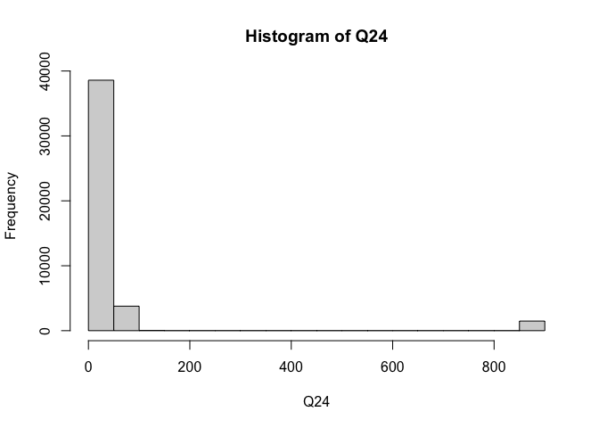<!-- -->

Personnaliser l’histogramme pour le rendre lisible avec *breaks* and
*xlim*

``` r
# Q24 - How many hours do you usually work per week in your main paid job?"

Q24 <- EWCS$Q24 # transformation de la variable d'origine en un objet
hist(Q24, breaks = 500, xlim = c(0, 60))  # histogramme avec une configuration personnalisée
```

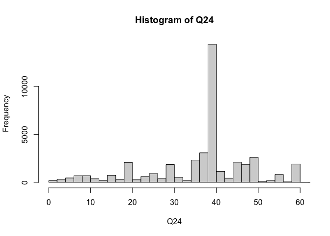<!-- -->

**Nettoyer la variable**

Supprimer réponses pas plausibles qui peuvent biaiser les analyses,
comme le fait de travailler plus de 80 heures par semaine. Ce choix est
détérminé par un choix conforme à la théorie. La distribution de la
variable peut être prise en compte pour détérminer ce choix.

``` r
# Q24 - How many hours do you usually work per week in your main paid job?"

Q24 <- EWCS$Q24 # transformation de la variable d'origine en un objet
Q24[Q24>80] <- NA # on considère comme NA les données supérieures ou égales à 80
```

Vérification

``` r
# Q24 - How many hours do you usually work per week in your main paid job?"

hist(Q24)  # histogramme brut pour variables continues
```

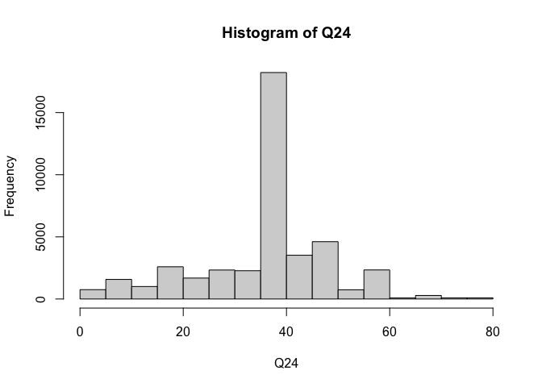<!-- -->

Il est également possible de transformer en une variable avec des
classes. Ce choix doit être conforme à la théorie.

Pour obtenir la fréquence de la nouvella variable

``` r
# Q24 - How many hours do you usually work per week in your main paid job?"

Q24_cl <- cut(Q24, include.lowest=TRUE,  right=TRUE, breaks=c(0,39,43,80)) # recodage avec distribution entre classes

freq(Q24_cl) # vérification
```

    ##             n    % val%
    ## [0,39]  16596 37.8   39
    ## (39,43] 15199 34.7   36
    ## (43,80] 10420 23.8   25
    ## NA       1635  3.7   NA

## Création de nouvelles variables ou d’indices par des recodages

Il est possible de créer des nouvelles variables qui sont fonctions
d’autres variables ou qui combinent plusieurs variables existantes.

### Création d’une nouvelle variable

**Question de départ**

On veut créer une nouvelle variable *age* à partir de l’année de
naissance déclarée par la personne

**Opérationalisation**

Utiliser la fonction *mutate* du package *dplyr*

### Création d’un indice

Question de départ: on souhaite regrouper les personnes dont la santé
peut être considérée comme étant à risque

  - Q73 - Do you think your health or safety is at risk because of your
    work?
  - Q74 - Does your work affect your health?
  - Q75 - How is your health in general?

**Opérationnalisation**

1.  Dichotomiser les variables

2.  Création de l’indice

<!-- end list -->

``` r
HealthRisk <- Q73_bin + Q74_bin + Q75_bin # addition des trois variables dichotomiques dans un nouveal objet

freq(HealthRisk) # résultat sous forme de fréquence
```

    ##        n    % val%
    ## 0    256  0.6  2.8
    ## 1   1061  2.4 11.7
    ## 2   5061 11.5 55.7
    ## 3   2707  6.2 29.8
    ## NA 34765 79.3   NA

## Bonnes pratiques

Comment choisir entre variables et indices?

> *L’indice est un ndicateur composite qui d’agrège l’information de
> plusieurs variables, mais il s’éloigne un peu de la réalité et
> l’intérprétation est plus difficile.*

Comment structurer le travail d’analyse avec R Studio

1.  D’abord préparer le script avec les recodages
2.  Puis créer un nouveau script pour les analyses
3.  Gardez à part un script “bruillon” ou “tests”
4.  Veiller à ce que les recodages soient conformes à la théorie
5.  Toutes les commandes d’un script doivent être mises au propre
6.  Remplir R Markdown au fur et à mesure, pas tout à la fin

# Préparation de l’échantillon

Je souhaite par exemple cibler les cadres, mais aucune variable
n’indique précisément la fonction hiérarchique. On peut cependant
indentifier cette population à l’aide des variables disponibles. Mon
premier objectif est donc de cibler la population qui répond à ces deux
critères:

  - les personnes ayant un statut de travailleurs dépendants
  - les personnes ayant la conduite de subordonnés dans le fonction

<!-- end list -->

``` r
# création d'une variable fn pour les cadres

EWCS <- mutate(EWCS, fh = case_when(EWCS$Q7 == 1 & EWCS$Q23 > 0 ~ "Cadres", EWCS$Q7 == 1 & EWCS$Q23 == 0 ~ "Travailleurs", TRUE ~ "Autre")) 
```

En plus de cela, je souhaite créer une base de donnée EWCS\_2 filtrée
avec seulement les personnes qui travaillent à temps plein.

``` r
# création d'un échantillon EWCS_2 avec un filtre 

EWCS_2 <- EWCS  %>% 
  filter(Q2d == 2)
```

Ces deux commandes ont été générées avec le package *dplyr*. Les
économies de commandesdans la syntaxe facilite une vision claire de
comment est composé mon échantillon et permet de gagner du temps.

# Analyses univariées

## Variables quantitatives

### Tendance centrale / dispersion / distribution

La fonction *summary()* donne un résumé des principaux indicateurs de la
variable

``` r
# Q24 - How many hours do you usually work per week in your main paid job?

Q24 <- as.numeric(EWCS_2$Q24) # transformation de la variable d'origine en variable continue
Q24[Q24 > 72] <- NA # je considère manquantes les heures celles supérieurs à 72, soit l'équivalent de 12 heures par jours pendant 7 jours

summary(Q24) # j'observe la nouvelle distribution de la variable
```

    ##    Min. 1st Qu.  Median    Mean 3rd Qu.    Max.    NA's 
    ##       1      39      40      42      45      72    1024

Dans l’exemple:

  - La médiane se situe à 40 heures, la moyenne à 41.55
  - Le premier quartile à 39 heures, le troisième à 45 heures

La variance peut être obtenue à l’aide de la commande *var()*

``` r
# Q24 - How many hours do you usually work per week in your main paid job?

var(Q24, na.rm = TRUE)
```

    ## [1] 87

L’écart-type peut être obtenu à l’aide de la commande *sd()*

``` r
# Q24 - How many hours do you usually work per week in your main paid job?

sd(Q24, na.rm = TRUE)
```

    ## [1] 9.3

Les quartiles peuvent être calculés avec la commande *quantile()*

``` r
# Q24 - How many hours do you usually work per week in your main paid job?

quantile(Q24, na.rm = TRUE)
```

    ##   0%  25%  50%  75% 100% 
    ##    1   39   40   45   72

Et si on voulait connaître la moyenne…

  - … pour chaque pays?
  - … pour les temps plein?
  - … pour les hommes et les femmes?
  - … en triant de manière descendante?
  - … en montrant seulement les 5 premiers?

Le package *dplyr* permet d’enchaîner des opérations (avec la fonction
%\>%) et d’obtenir rapidement une information précise dans une grande
base de données comme celle de l’EWCS.

``` r
EWCS %>% # base de donnée originale 
  group_by(to_factor(Country)) %>%  # regrouper par pays
  filter(Q2d == 2) %>% # uniquement les temps plein
  summarise(moyenne = mean(Q24)) %>% # on veut connaître la moyenne
  arrange(desc(moyenne)) %>% # je mets en ordre décroissant
  slice(1:5) # je sélectionne les cinq premières observations
```

### Représentation graphique

Le package *ggplot2* permet des nombreuses illustrations graphiques
personnalisées avec la fonction *geom\_histogram()*.

Exemple avec valeurs absolues

``` r
# Q24 - How many hours do you usually work per week in your main paid job?

ggplot(EWCS_2, aes(x=Q24)) +
  geom_histogram(color="black", fill="gray") +
  ggtitle("Durée du travail") +
  xlab("Heures") +
  ylab("Nombre de personnes") +
  theme_bw() # graphique de base avec valeurs absolues indiquées sur l'axe y
```

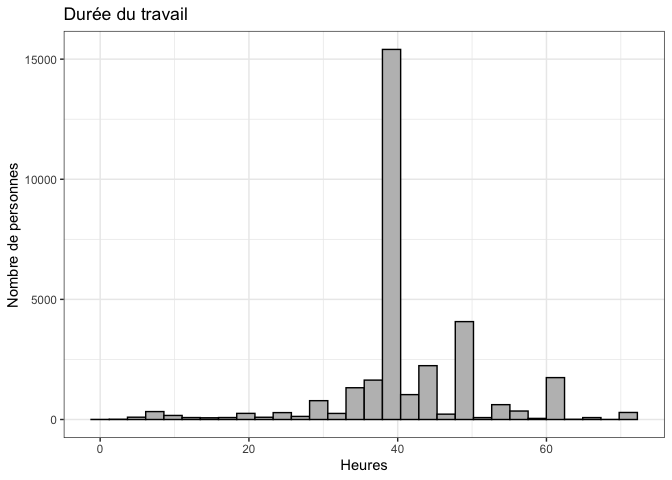<!-- -->

Exemple avec valeurs relatives

``` r
ggplot(EWCS_2, aes(x=Q24, y= stat(count)/sum(stat(count)))) +
  geom_histogram(color="black", fill="gray") +
  ggtitle("Durée du travail") +
  xlab("Heures") +
  ylab("Nombre de personnes") +
  scale_y_continuous(labels = scales::percent_format()) + 
  theme_bw() # graphique avec valeurs relatives (pourcentages) indiquées sur l'axe y
```

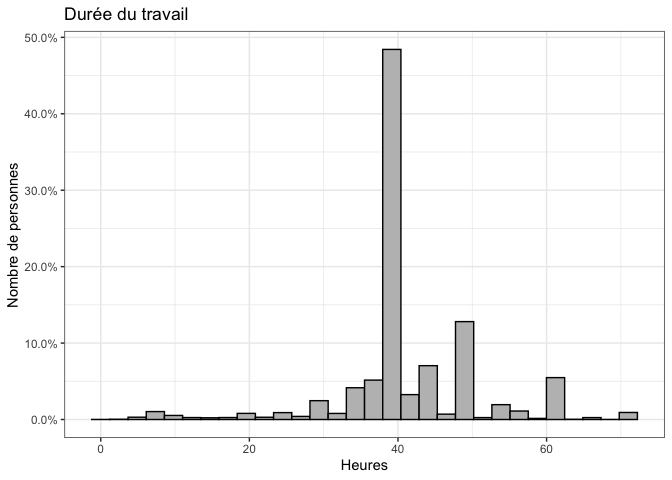<!-- -->

## Variables qualitatives

### Fréquences

La fonction *freq()* vous donne toutes les informations nécessaires sur
la distribution de la variable

``` r
# Q89a Considering all my efforts and achievements in my job, I feel I get paid appropriately.

Q89a <- to_factor(EWCS$Q89a)

freq(Q89a)
```

    ##                                  n    % val%
    ## Strongly agree                7463 17.0 17.0
    ## Tend to agree                13992 31.9 31.9
    ## Neither agree nor disagree    7762 17.7 17.7
    ## Tend to disagree              7139 16.3 16.3
    ## Strongly disagree             6002 13.7 13.7
    ## Not applicable (spontaneous)  1231  2.8  2.8
    ## DK (spontaneous)               157  0.4  0.4
    ## Refusal (spontaneous)          104  0.2  0.2

La fonction *freq()* inclut des options pour personnaliser l’affichage

  - *valid* indique si on souhaite ou non afficher les pourcentages sur
    les valeurs valides
  - *cum* indique si on souhaite ou non afficher les pourcentages
    cumulés
  - *total* permet d’ajouter une ligne avec les effectifs totaux
  - *sort* permet de trier le tableau par fréquence croissante
    (*sort=“inc”*) ou décroissante (*sort=“dec”*).

Exemple

``` r
# Q89a Considering all my efforts and achievements in my job, I feel I get paid appropriately.

Q89a <- to_factor(EWCS$Q89a)

freq(Q89a, valid = FALSE, total = FALSE, cum = TRUE, sort = "dec")
```

    ##                                  n    % %cum
    ## Tend to agree                13992 31.9   32
    ## Neither agree nor disagree    7762 17.7   50
    ## Strongly agree                7463 17.0   67
    ## Tend to disagree              7139 16.3   83
    ## Strongly disagree             6002 13.7   97
    ## Not applicable (spontaneous)  1231  2.8   99
    ## DK (spontaneous)               157  0.4  100
    ## Refusal (spontaneous)          104  0.2  100

### Représentation graphique

Le package *ggplot2* permet d’illustrer aussi les variables qualitatives
à l’aide de la même formule, mais avec la fonction *geom\_bar()*.

Exemple avec valeurs absolues

``` r
Q89a <- to_factor(EWCS_2$Q89a)

EWCS_2$Q89a <- Q89a
```

``` r
# Q89a Considering all my efforts and achievements in my job, I feel I get paid appropriately.

ggplot(EWCS_2, aes(x=Q89a)) +
  geom_bar(color="black", fill="gray") +
  ggtitle("Considering all my efforts and achievements in my job, I feel I get paid appropriately") +
  ylab("Nombre de personnes") +
  theme_bw()
```

<!-- -->

Exemple avec valeurs relatives

``` r
# Q89a Considering all my efforts and achievements in my job, I feel I get paid appropriately.

ggplot(EWCS_2, aes(x=Q89a, y= stat(count)/sum(stat(count)))) +
  geom_bar(color="black", fill="gray") +
  ggtitle("Considering all my efforts and achievements in my job, I feel I get paid appropriately") +
  ylab("Nombre de personnes") +
  scale_y_continuous(labels = scales::percent_format()) + 
  theme_bw()
```

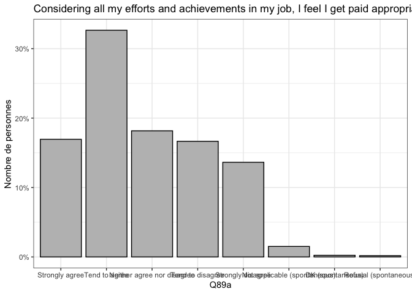<!-- -->

# Analyses bivariées et trivariées

## Deux variables catégorielles

Tableaux croisés

Vous devriez configurer votre tableau pour que les **totaux de 100%**
soient situées **en bas des colonnes** et au bout de chaque catégorie de
la **variable indépendante**.

Exemple: dans quelle mesure le sexe explique-t-il le secteur où
travaille la personne (public vs privé)?

``` r
tab <- table(Q2a, Q14) # première possibilité (objets)
tab <- xtabs(~Q2a + Q14, EWCS_2) # deuxième possibilité (variables de la base de données)

cprop(tab, digits = 1, percent = TRUE) # pourcentages en colonne
```

``` 
    Q14
```

Q2a The private sector The public sector Other All  
Female 39.7% 57.3% 44.8% 44.3% Male 60.3% 42.7% 55.2% 55.7% Total 100.0%
100.0% 100.0% 100.0%

``` r
lprop(tab, digits = 1, percent = TRUE) # pourcentages à la ligne
```

``` 
    Q14
```

Q2a The private sector The public sector Other Total Female 62.1% 32.2%
5.7% 100.0% Male 75.3% 19.1% 5.6% 100.0% All 69.5% 24.9% 5.6% 100.0%

Test du Chi-2

``` r
chisq.test(tab) # test du chi carré
```

    ## 
    ##  Pearson's Chi-squared test
    ## 
    ## data:  tab
    ## X-squared = 759, df = 2, p-value <0.0000000000000002

``` r
chisq.residuals(tab) # résidus du chi carré
```

    ##         Q14
    ## Q2a      The private sector The public sector  Other
    ##   Female             -10.62             17.59   0.30
    ##   Male                 9.48            -15.70  -0.26

V de Cramer

``` r
cramer.v(tab) # V de Cramer
```

    ## [1] 0.15

## Trois variables catégorielles

Tableaux croisés avec trois variables

``` r
# Q2a - Gender
# Q14 - Are you working in…? (sector)
# fh - fonction hiérarchique

tab1 <- xtabs(~Q2a + Q14 + fh, EWCS_2) # tableau croisé à trois entrées

addmargins(prop.table(tab1))
```

    ## , , fh = Autre
    ## 
    ##         Q14
    ## Q2a      The private sector The public sector  Other    Sum
    ##   Female             0.0487            0.0014 0.0043 0.0544
    ##   Male               0.1002            0.0017 0.0087 0.1107
    ##   Sum                0.1489            0.0031 0.0130 0.1650
    ## 
    ## , , fh = Cadres
    ## 
    ##         Q14
    ## Q2a      The private sector The public sector  Other    Sum
    ##   Female             0.0297            0.0182 0.0032 0.0511
    ##   Male               0.0588            0.0211 0.0048 0.0847
    ##   Sum                0.0885            0.0393 0.0080 0.1359
    ## 
    ## , , fh = Travailleurs
    ## 
    ##         Q14
    ## Q2a      The private sector The public sector  Other    Sum
    ##   Female             0.1970            0.1233 0.0177 0.3379
    ##   Male               0.2601            0.0836 0.0174 0.3611
    ##   Sum                0.4571            0.2069 0.0352 0.6991
    ## 
    ## , , fh = Sum
    ## 
    ##         Q14
    ## Q2a      The private sector The public sector  Other    Sum
    ##   Female             0.2754            0.1429 0.0252 0.4435
    ##   Male               0.4191            0.1064 0.0310 0.5565
    ##   Sum                0.6945            0.2493 0.0562 1.0000

## Deux variables continues (métriques ou ordinales)

Corrélation de Pearson

``` r
# EWCS - base de données non filtrée contenant les personnes travaillant à temps plein et temps partiel

# Q24 - How many hours do you usually work per week in your main paid job?
# Q2b - Starting with yourself, how old are you?"

cor(EWCS$Q24, EWCS$Q2b, method="pearson", use = "complete.obs") 
```

    ## [1] 0.083

``` r
cor.test(EWCS$Q24, EWCS$Q2b, method="pearson", use = "complete.obs")
```

    ## 
    ##  Pearson's product-moment correlation
    ## 
    ## data:  EWCS$Q24 and EWCS$Q2b
    ## t = 17, df = 43848, p-value <0.0000000000000002
    ## alternative hypothesis: true correlation is not equal to 0
    ## 95 percent confidence interval:
    ##  0.073 0.092
    ## sample estimates:
    ##   cor 
    ## 0.083

### Trois variables continues

Correlations (semi-)partielles

``` r
# Q24 - How many hours do you usually work per week in your main paid job?
# Q2b - Starting with yourself, how old are you?"
# Q104 - Please can you tell us how much are your NET monthly earnings

library(ppcor) # L'installation du package ppcor est nécessaire

pcor.test(Q24, Q2b, Q104_euro)    # Correlations partielles
```

    ##   estimate                                                p.value statistic
    ## 1    0.072 0.0000000000000000000000000000000000000000000000000052        15
    ##       n gp  Method
    ## 1 43850  1 pearson

``` r
spcor.test(Q24, Q2b, Q104_euro)   # Correlations semi-partielles
```

    ##   estimate                                              p.value statistic     n
    ## 1    0.071 0.00000000000000000000000000000000000000000000000006        15 43850
    ##   gp  Method
    ## 1  1 pearson

## Une variable continue et une variable catégorielle

### t-test

Analyse de la variance

``` r
Q24 <- EWCS_2$Q24

Q24[Q24 > 72] <- NA # je considère manquantes les heures celles supérieurs à 72, soit l'équivalent de 12 heures par jours pendant 7 jours

EWCS_2$Q24 <- Q24
```

``` r
# Q24 - How many hours do you usually work per week in your main paid job?
# Q2a - Gender

tapply(Q24, Q2a, mean, na.rm = TRUE)
```

    ## Female   Male 
    ##     40     43

``` r
t.test(Q24 ~ Q2a)
```

    ## 
    ##  Welch Two Sample t-test
    ## 
    ## data:  Q24 by Q2a
    ## t = -28, df = 31269, p-value <0.0000000000000002
    ## alternative hypothesis: true difference in means is not equal to 0
    ## 95 percent confidence interval:
    ##  -3.1 -2.7
    ## sample estimates:
    ## mean in group Female   mean in group Male 
    ##                   40                   43

Représentation graphique

``` r
ggplot(EWCS_2) +
  aes(x = Q2a, y = Q24) +
  geom_boxplot(na.rm = TRUE) +
  ylab("Heures hebdomadaires") +
  scale_x_discrete(na.translate = FALSE) +
  ggtitle("Répartition des heures de travail par sexe") +
  theme_bw()
```

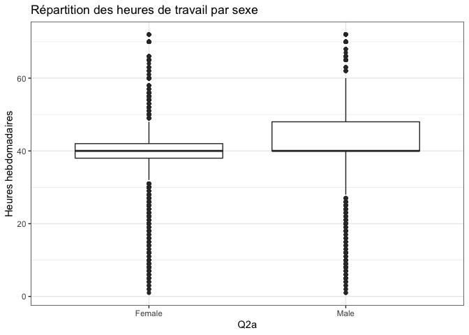<!-- -->

``` r
ggplot(EWCS_2) +
  aes(x = Q2a, y = Q24) +
  geom_violin(na.rm = TRUE) +
  ylab("Heures hebdomadaires") +
  scale_x_discrete(na.translate = FALSE) +
  ggtitle("Répartition des heures de travail par sexe") +
  theme_bw()
```

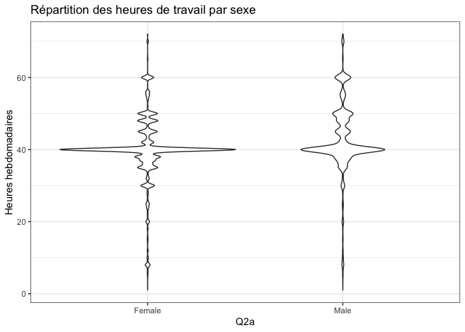<!-- -->

### ANOVA

Analyse de la variance

``` r
my_controls <- tableby.control(
  test = T,
  total = T,
  numeric.test = "anova", cat.test = "chisq",
  numeric.stats = c("meansd", "medianq1q3", "range", "Nmiss2"),
  cat.stats = c("countpct", "Nmiss2"),
  stats.labels = list(
    meansd = "Mean (SD)",
    medianq1q3 = "Median (Q1, Q3)",
    range = "Min - Max",
    Nmiss2 = "Missing"))

my_labels <- list(Q24 = "Durée du travail", Q2a = "Sexe")
table_one <- tableby(fh ~ Q24, data = EWCS_2, control = my_controls)
```

``` r
summary(table_one, title = "Principaux indicateurs descriptifs", text=TRUE, digits=1, digits.p=3)
```

|                                                                          |  Autre (N=5428)   |  Cadres (N=4454)  | Travailleurs (N=22957) |  Total (N=32839)  |  p value |
| :----------------------------------------------------------------------- | :---------------: | :---------------: | :--------------------: | :---------------: | -------: |
| Q24 - How many hours do you usually work per week in your main paid job? |                   |                   |                        |                   | \< 0.001 |
| \- Mean (SD)                                                             |    45.5 (13.5)    |    42.5 (8.1)     |       40.5 (8.1)       |    41.6 (9.3)     |          |
| \- Median (Q1, Q3)                                                       | 48.0 (40.0, 56.0) | 40.0 (40.0, 45.0) |   40.0 (38.0, 42.0)    | 40.0 (39.0, 45.0) |          |
| \- Min - Max                                                             |    1.0 - 72.0     |    2.0 - 72.0     |       1.0 - 72.0       |    1.0 - 72.0     |          |
| \- Missing                                                               |        494        |        103        |          427           |       1024        |          |

Principaux indicateurs descriptifs

``` r
# Q24 - How many hours do you usually work per week in your main paid job?
# fh - fonction hiérarchique

anv <- aov(Q24 ~ fh, data=EWCS_2)

summary(anv)
```

    ##                Df  Sum Sq Mean Sq F value              Pr(>F)    
    ## fh              2  105917   52958     632 <0.0000000000000002 ***
    ## Residuals   31812 2665389      84                                
    ## ---
    ## Signif. codes:  0 '***' 0.001 '**' 0.01 '*' 0.05 '.' 0.1 ' ' 1
    ## 1024 observations deleted due to missingness

Représentation graphique avec la fonction *geom\_boxplot()*

``` r
ggplot(EWCS_2) +
  aes(x = fh, y = Q24) +
  geom_boxplot(na.rm = TRUE) +
  ylab("Heures hebdomadaires") +
  scale_x_discrete(na.translate = FALSE) +
  ggtitle("Répartition des heures de travail par fonction hiérarchique") +
  theme_bw()
```

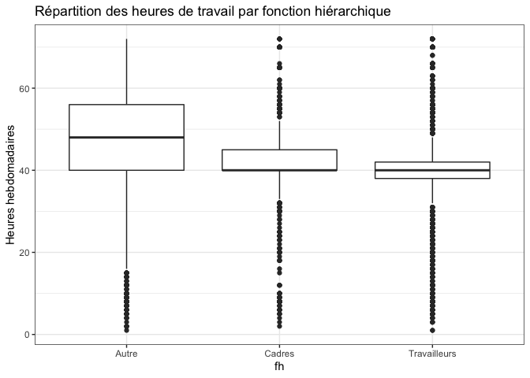<!-- -->

Représentation graphique avec la fonction *geom\_violin()*

``` r
ggplot(EWCS_2) +
  aes(x = fh, y = Q24) +
  geom_violin(na.rm = TRUE) +
  ylab("Heures hebdomadaires") +
  scale_x_discrete(na.translate = FALSE) +
  ggtitle("Répartition des heures de travail par fonction hiérarchique") +
  scale_x_discrete(na.translate = FALSE) +
  theme_bw()
```

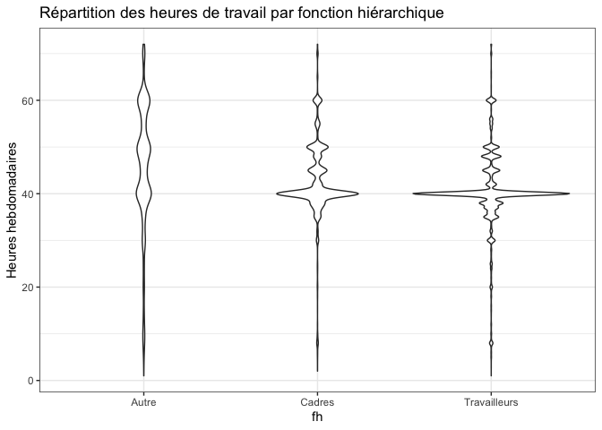<!-- -->

## Bonus

Il existe de nombreux packages pour les statistiques descriptives:
<https://thatdatatho.com/2018/08/20/easily-create-descriptive-summary-statistic-tables-r-studio>

### Package *Table1*

``` r
my_controls <- tableby.control(
  test = T,
  total = T,
  numeric.test = "anova", cat.test = "chisq",
  numeric.stats = c("meansd", "medianq1q3", "range", "Nmiss2"),
  cat.stats = c("countpct", "Nmiss2"),
  stats.labels = list(
    meansd = "Mean (SD)",
    medianq1q3 = "Median (Q1, Q3)",
    range = "Min - Max",
    Nmiss2 = "Missing"))

my_labels <- list(Q24 = "Durée du travail", Q2a = "Sexe", Q14 = "Secteur d'activité", DST = "Division du travail dans le ménage")
table_one <- tableby(fh ~ Q24 + Q2a + Q14 + DST, data = EWCS_2, control = my_controls)
summary(table_one, title = "Principaux indicateurs descriptifs", text=TRUE, digits=1, digits.p=3)
```

|                                                                          |  Autre (N=5428)   |  Cadres (N=4454)  | Travailleurs (N=22957) |  Total (N=32839)  |  p value |
| :----------------------------------------------------------------------- | :---------------: | :---------------: | :--------------------: | :---------------: | -------: |
| Q24 - How many hours do you usually work per week in your main paid job? |                   |                   |                        |                   | \< 0.001 |
| \- Mean (SD)                                                             |    45.5 (13.5)    |    42.5 (8.1)     |       40.5 (8.1)       |    41.6 (9.3)     |          |
| \- Median (Q1, Q3)                                                       | 48.0 (40.0, 56.0) | 40.0 (40.0, 45.0) |   40.0 (38.0, 42.0)    | 40.0 (39.0, 45.0) |          |
| \- Min - Max                                                             |    1.0 - 72.0     |    2.0 - 72.0     |       1.0 - 72.0       |    1.0 - 72.0     |          |
| \- Missing                                                               |        494        |        103        |          427           |       1024        |          |
| Q2a                                                                      |                   |                   |                        |                   | \< 0.001 |
| \- Female                                                                |   1789 (33.0%)    |   1676 (37.6%)    |     11103 (48.4%)      |   14568 (44.4%)   |          |
| \- Male                                                                  |   3639 (67.0%)    |   2778 (62.4%)    |     11850 (51.6%)      |   18267 (55.6%)   |          |
| \- Missing                                                               |         0         |         0         |           4            |         4         |          |
| Q14                                                                      |                   |                   |                        |                   | \< 0.001 |
| \- The private sector                                                    |   4873 (90.2%)    |   2897 (65.2%)    |     14959 (65.4%)      |   22729 (69.4%)   |          |
| \- The public sector                                                     |    102 (1.9%)     |   1287 (28.9%)    |      6771 (29.6%)      |   8160 (24.9%)    |          |
| \- Other                                                                 |    426 (7.9%)     |    262 (5.9%)     |      1151 (5.0%)       |    1839 (5.6%)    |          |
| \- Missing                                                               |        27         |         8         |           76           |        111        |          |
| DST                                                                      |                   |                   |                        |                   | \< 0.001 |
| \- Autre                                                                 |   3258 (60.0%)    |   2269 (50.9%)    |     13795 (60.1%)      |   19322 (58.8%)   |          |
| \- Partenaire à temps partiel                                            |    348 (6.4%)     |    376 (8.4%)     |      1156 (5.0%)       |    1880 (5.7%)    |          |
| \- Partenaire à temps plein                                              |   1822 (33.6%)    |   1809 (40.6%)    |      8006 (34.9%)      |   11637 (35.4%)   |          |
| \- Missing                                                               |         0         |         0         |           0            |         0         |          |

Principaux indicateurs descriptifs

### Package *Arsenal*

``` r
my_controls <- tableby.control(
  test = T,
  total = T,
  numeric.test = "anova", cat.test = "chisq",
  numeric.stats = c("meansd", "medianq1q3", "range", "Nmiss2"),
  cat.stats = c("countpct", "Nmiss2"),
  stats.labels = list(
    meansd = "Mean (SD)",
    medianq1q3 = "Median (Q1, Q3)",
    range = "Min - Max",
    Nmiss2 = "Missing"))

my_labels <- list(Q24 = "Durée du travail", Q2a = "Sexe", Q2b = "Age", Q12_years = "Ancienneté", Q14 = "Secteur d'activité", DST = "Organisation du ménage", sat = "Satisfaction")
table_one <- tableby(fh ~ Q24 + Q2a + Q2b + Q12_years + Q14, data = EWCS_2, control = my_controls)
summary(table_one, title = "Description des principaux indicateurs", abelTranslations = my_labels, digits=1, digits.p=3)
```

|                                                                                       |  Autre (N=5428)   |  Cadres (N=4454)  | Travailleurs (N=22957) |  Total (N=32839)  |  p value |
| :------------------------------------------------------------------------------------ | :---------------: | :---------------: | :--------------------: | :---------------: | -------: |
| **Q24 - How many hours do you usually work per week in your main paid job?**          |                   |                   |                        |                   | \< 0.001 |
| Mean (SD)                                                                             |    45.5 (13.5)    |    42.5 (8.1)     |       40.5 (8.1)       |    41.6 (9.3)     |          |
| Median (Q1, Q3)                                                                       | 48.0 (40.0, 56.0) | 40.0 (40.0, 45.0) |   40.0 (38.0, 42.0)    | 40.0 (39.0, 45.0) |          |
| Min - Max                                                                             |    1.0 - 72.0     |    2.0 - 72.0     |       1.0 - 72.0       |    1.0 - 72.0     |          |
| Missing                                                                               |        494        |        103        |          427           |       1024        |          |
| **Q2a**                                                                               |                   |                   |                        |                   | \< 0.001 |
| Female                                                                                |   1789 (33.0%)    |   1676 (37.6%)    |     11103 (48.4%)      |   14568 (44.4%)   |          |
| Male                                                                                  |   3639 (67.0%)    |   2778 (62.4%)    |     11850 (51.6%)      |   18267 (55.6%)   |          |
| Missing                                                                               |         0         |         0         |           4            |         4         |          |
| **Q2b - Starting with yourself, how old are you?**                                    |                   |                   |                        |                   | \< 0.001 |
| Mean (SD)                                                                             |    48.7 (52.9)    |    46.9 (56.4)    |      45.0 (56.6)       |    45.9 (56.0)    |          |
| Median (Q1, Q3)                                                                       | 46.0 (38.0, 54.0) | 44.0 (35.0, 52.0) |   42.0 (32.0, 51.0)    | 43.0 (34.0, 52.0) |          |
| Min - Max                                                                             |   15.0 - 999.0    |   16.0 - 999.0    |      15.0 - 999.0      |   15.0 - 999.0    |          |
| Missing                                                                               |         0         |         0         |           0            |         0         |          |
| **Q12\_years - What is the exact duration of the contract in number of years and mo** |                   |                   |                        |                   |    0.261 |
| Mean (SD)                                                                             |    40.5 (42.3)    |    18.0 (31.2)    |      16.9 (30.7)       |    17.0 (30.8)    |          |
| Median (Q1, Q3)                                                                       | 42.5 (6.0, 77.0)  |  2.5 (1.0, 8.0)   |     1.0 (1.0, 6.0)     |  1.0 (1.0, 6.0)   |          |
| Min - Max                                                                             |    0.0 - 77.0     |    0.0 - 88.0     |       0.0 - 99.0       |    0.0 - 99.0     |          |
| Missing                                                                               |       5424        |       4154        |         20220          |       29798       |          |
| **Q14**                                                                               |                   |                   |                        |                   | \< 0.001 |
| The private sector                                                                    |   4873 (90.2%)    |   2897 (65.2%)    |     14959 (65.4%)      |   22729 (69.4%)   |          |
| The public sector                                                                     |    102 (1.9%)     |   1287 (28.9%)    |      6771 (29.6%)      |   8160 (24.9%)    |          |
| Other                                                                                 |    426 (7.9%)     |    262 (5.9%)     |      1151 (5.0%)       |    1839 (5.6%)    |          |
| Missing                                                                               |        27         |         8         |           76           |        111        |          |

Description des principaux indicateurs

# Analyses multivariées

## Choix de la régression

Régression linéare

  - Variable dépendante métrique
  - Variable indépendante métrique ou dichotomique

Régression logistique binomiale

  - Variable dépendante dichotomique

Régression logistique multinomiale

  - Variable dépendante catégorielle

Régression logistique ordinale

  - Variable dépendante irdubake

## Régression linéaire

  - Variable dépendante: métrique
  - Variables indépendantes: métriques ou dichotomiques

Lecture des sorties de la fonction *summary()*

  - **Call**: la fomule du modèle
  - **Coefficients**: l’estimation du coefficient, l’écart-type estimé,
    la valeur du test de Student de nullité statistique du coefficientet
    enfin la *p-value* associé à ce test
  - **Signif**. codes: les significations des symboles de niveau de
    significativité
  - **Multiple R-squared**: coefficient de détermination R2
  - **Adjusted R-squared**: coefficient de détermination R2 ajusté
  - **F-statistic**: valeur de la statistique de Fisher du test de
    significativité globale

Exemple

  - Régression linéraire entre l’âge (Q2b) et la durée du travail (Q24)

Résultats

``` r
# Q2b - Starting with yourself, how old are you?
# Q24 - How many hours do you usually work per week in your main paid job?

m1 <- lm(Q24 ~ Q2b, data=EWCS_2) # durée du temps de travail et âge (seulement les temps pleins)
summary(m1)
```

    ## 
    ## Call:
    ## lm(formula = Q24 ~ Q2b, data = EWCS_2)
    ## 
    ## Residuals:
    ##    Min     1Q Median     3Q    Max 
    ## -40.89  -2.13  -1.47   3.62  30.89 
    ## 
    ## Coefficients:
    ##             Estimate Std. Error t value             Pr(>|t|)    
    ## (Intercept) 42.50765    0.20206  210.37 < 0.0000000000000002 ***
    ## Q2b         -0.02218    0.00457   -4.85            0.0000012 ***
    ## ---
    ## Signif. codes:  0 '***' 0.001 '**' 0.01 '*' 0.05 '.' 0.1 ' ' 1
    ## 
    ## Residual standard error: 9.3 on 31724 degrees of freedom
    ##   (1113 observations deleted due to missingness)
    ## Multiple R-squared:  0.000742,   Adjusted R-squared:  0.000711 
    ## F-statistic: 23.6 on 1 and 31724 DF,  p-value: 0.00000121

Interprétation

  - La significativité globale du modèle est très élevée (*p value* du
    test de Fisher \< 0.001)

<!-- end list -->

``` r
library("parameters") # package permettant une meilleure visualisation des résultats
model_parameters(m1)
```

    ## Parameter   | Coefficient |   SE |         95% CI |      t |    df |      p
    ## ---------------------------------------------------------------------------
    ## (Intercept) |       42.51 | 0.20 | [42.11, 42.90] | 210.37 | 31724 | < .001
    ## Q2b         |       -0.02 | 0.00 | [-0.03, -0.01] |  -4.85 | 31724 | < .001

Interpretation

  - Temps de travail = constante (42,5 heures) - l’age x coefficient (-
    0.02)
  - La durée du travail tend à diminuer avec l’âge

Visualisation graphique avec la méthode *lm*

``` r
ggplot(EWCS_2, aes(x=Q2b, y= Q24)) +
  geom_smooth(method="lm", se=TRUE, fullrange=FALSE, level=0.95) +
  ggtitle("Régression entre durée du travail et âge") +
  xlab("Âge") +
  ylab("Heures par semaine") +
  theme_bw() 
```

<!-- -->

``` r
# se indique l'intervalle de confiance
# level indique le niveau de cet intervalle
```

Visualisation graphique avec la méthode *auto*

``` r
ggplot(EWCS_2, aes(x=Q2b, y= Q24)) +
  geom_smooth(method="auto", se=TRUE, fullrange=FALSE, level=0.95) +
  ggtitle("Régression entre durée du travail et âge") +
  xlab("Âge") +
  ylab("Heures par semaine") +
  theme_bw()
```

<!-- -->

Possibilité d’ajouter une ou plusieurs variables de contrôle

``` r
# Variable de contrôle: Q2a Gender
# Première modalité: "Female"

freq(Q2a)
```

    ##            n  % val%
    ## Female 14568 44   44
    ## Male   18267 56   56
    ## NA         4  0   NA

``` r
m2 <- lm(Q24 ~ Q2b + Q2a, data=EWCS_2)
model_parameters(m2)
```

    ## Parameter   | Coefficient |   SE |         95% CI |      t |    df |      p
    ## ---------------------------------------------------------------------------
    ## (Intercept) |       40.98 | 0.21 | [40.57, 41.39] | 197.70 | 31719 | < .001
    ## Q2b         |       -0.02 | 0.00 | [-0.03, -0.01] |  -5.19 | 31719 | < .001
    ## Q2a [Male]  |        2.86 | 0.10 | [ 2.66,  3.07] |  27.51 | 31719 | < .001

Interprétation

  - Le fait que l’on soit un homme ou une femme n’a pas d’effet sur la
    relation entre l’âge et la durée du travail
  - La durée du travail tend toujours à diminuer avec l’âge même si les
    hommes travaillent travaillent 2.9 heures de plus que les femmes
  - La relation reste statistiquement significative (*p value* \> 0.001)
    entre l’âge et la durée du travail

Visualisation graphique

``` r
ggplot(EWCS_2, aes(x=Q2b, y= Q24)) +
  geom_smooth(method="lm", se=TRUE, fullrange=FALSE, level=0.95) +
  ggtitle("Régression entre durée du travail et âge") +
  xlab("Sexe") +
  ylab("Heures par semaine") +
  facet_wrap(~ Q2a) +
  theme_bw()
```

<!-- -->

Régression linéaire avec prise en compte d’un effet d’intéraction entre
sexe (Q2a) et fonction hiérarchique (fh)

``` r
m3 <- lm(Q24 ~ Q2b + Q2a * fh, data=EWCS_2)
model_parameters(m3)
```

    ## Parameter                      | Coefficient |   SE |         95% CI |      t |    df |      p
    ## ----------------------------------------------------------------------------------------------
    ## (Intercept)                    |       45.07 | 0.30 | [44.48, 45.67] | 149.49 | 31715 | < .001
    ## Q2b                            |       -0.04 | 0.00 | [-0.05, -0.04] |  -9.96 | 31715 | < .001
    ## Q2a [Male]                     |        3.73 | 0.27 | [ 3.19,  4.26] |  13.65 | 31715 | < .001
    ## fh [Cadres]                    |       -2.11 | 0.32 | [-2.72, -1.49] |  -6.67 | 31715 | < .001
    ## fh [Travailleurs]              |       -3.84 | 0.24 | [-4.31, -3.37] | -16.05 | 31715 | < .001
    ## Q2a [Male] * fh [Cadres]       |       -1.29 | 0.39 | [-2.06, -0.52] |  -3.28 | 31715 | 0.001 
    ## Q2a [Male] * fh [Travailleurs] |       -1.51 | 0.30 | [-2.10, -0.93] |  -5.06 | 31715 | < .001

Interprétation

  - Une intéraction entre sexe et fonction hiérarchique est observée
    entre le sexe et la fonction hiérarchique (*p value* \< ou = 0.001).
  - La relation entre l’âge et la durée du travail reste significative
    (*p value* \< 0.001) avec la prise en compte de cette intéraction.

## Régressions logistiques

### Binomiale

Exemple

  - Variable dépendante: le fait de vivre seul ou en famille dans son
    ménage (Q1\_cel)
  - Modalité de référence: la personne vit en famille (≠ seule)

Six modèles de régressions

``` r
reg_bin1 <- glm(Q1_cel ~ Q24, EWCS_2, family = binomial(logit))
reg_bin2 <- glm(Q1_cel ~ Q24 + fh, data = EWCS_2, family = binomial(logit))
reg_bin3 <- glm(Q1_cel ~ Q24 + fh + Q14, data = EWCS_2, family = binomial(logit))
reg_bin4 <- glm(Q1_cel ~ Q24 + fh + Q14 + sat, data = EWCS_2, family = binomial(logit))
reg_bin5 <- glm(Q1_cel ~ Q24 + fh + Q14 + sat + Q2a, data = EWCS_2, family = binomial(logit))
reg_bin6 <- glm(Q1_cel ~ Q24 + fh + Q14 + sat + Q2a + Q2b_2, data = EWCS_2, family = binomial(logit))
```

Pour comparer ces six modèles à l’aide d’une analyse de la variance, un
traitement supplémentaire est nécessaire en raison des NA. Ce procédé
n’est pas nécessaire lorsque la base de données n’a pas de NA.

``` r
# défintion d'une formule emballage

update_nested <- function(object, formula., ..., evaluate = TRUE){
  update(object = object, formula. = formula., data = object$model, ..., evaluate = evaluate)
}

# traitement

reg_bin6 <- glm(Q1_cel ~ Q24 + fh + Q14 + sat + Q2a + Q2b_2, data = EWCS_2, family = binomial(logit)) # modèle retenu
reg_bin5 <- update_nested(reg_bin6, .~.-Q2b_2) # suppression de la variable Q2b_2
reg_bin4 <- update_nested(reg_bin5, .~.-Q2a) # suppression de la variable Q2a
reg_bin3 <- update_nested(reg_bin4, .~.-sat) # suppression de la variable sat 
reg_bin2 <- update_nested(reg_bin3, .~.-Q14) # suppression de la variable Q14 
reg_bin1 <- update_nested(reg_bin2, .~.-fh) # suppression de la variable fh 
```

Comparaison des six modèles avec une analyse de la variance

``` r
anova(reg_bin1, reg_bin2, reg_bin3, reg_bin4, reg_bin5, reg_bin6, test = "Chisq")
```

    ## Analysis of Deviance Table
    ## 
    ## Model 1: Q1_cel ~ Q24
    ## Model 2: Q1_cel ~ Q24 + fh
    ## Model 3: Q1_cel ~ Q24 + fh + Q14
    ## Model 4: Q1_cel ~ Q24 + fh + Q14 + sat
    ## Model 5: Q1_cel ~ Q24 + fh + Q14 + sat + Q2a
    ## Model 6: Q1_cel ~ Q24 + fh + Q14 + sat + Q2a + Q2b_2
    ##   Resid. Df Resid. Dev Df Deviance             Pr(>Chi)    
    ## 1     31025      26236                                     
    ## 2     31023      26216  2     19.4             0.000062 ***
    ## 3     31021      26210  2      6.1                0.046 *  
    ## 4     31020      26205  1      5.4                0.020 *  
    ## 5     31019      26202  1      2.9                0.089 .  
    ## 6     31018      26128  1     74.5 < 0.0000000000000002 ***
    ## ---
    ## Signif. codes:  0 '***' 0.001 '**' 0.01 '*' 0.05 '.' 0.1 ' ' 1

Significativité des variables du modèle retenu

``` r
# Variable dépendante Q1_cel
# Modalité de référence: "Famille"

drop1(reg_bin6, test = "Chisq") # significativité des variables
```

    ## Single term deletions
    ## 
    ## Model:
    ## Q1_cel ~ Q24 + fh + Q14 + sat + Q2a + Q2b_2
    ##        Df Deviance   AIC  LRT             Pr(>Chi)    
    ## <none>       26128 26146                              
    ## Q24     1    26141 26157 13.1              0.00029 ***
    ## fh      2    26166 26180 38.0         0.0000000055 ***
    ## Q14     2    26136 26150  8.8              0.01247 *  
    ## sat     1    26134 26150  6.1              0.01383 *  
    ## Q2a     1    26130 26146  2.2              0.14236    
    ## Q2b_2   1    26202 26218 74.5 < 0.0000000000000002 ***
    ## ---
    ## Signif. codes:  0 '***' 0.001 '**' 0.01 '*' 0.05 '.' 0.1 ' ' 1

Interpretation

  - On observe un lien statistiquement significatif (*p value* \> 0.001)
    entre la situation familale (Q1\_cel) et la durée du travail (Q24),
    la fonction hiérarchique (fh) et l’âge au carré (Q2b\_2).
  - Un lien significatif avec une marge d’erreur plus importante (*p
    value* \> 0.05) est observée entre la situation familiale (Q1\_cel)
    et le secteur d’activité (Q14) et la satisfaction au travail (sat).
  - Aucun lien statistiquement significatif est observé entre la
    situation familiale (Q1\_cel) et le sexe (Q2a)

Odds-ratio (tableau)

``` r
odds.ratio(reg_bin6) # odds-ratio du modèle
```

    ##                         OR 2.5 % 97.5 %                    p    
    ## (Intercept)          0.127 0.101   0.16 < 0.0000000000000002 ***
    ## Q24                  0.994 0.990   1.00              0.00027 ***
    ## fhCadres             1.068 0.942   1.21              0.30250    
    ## fhTravailleurs       1.299 1.178   1.43           0.00000019 ***
    ## Q14The public sector 0.917 0.850   0.99              0.02535 *  
    ## Q14Other             1.113 0.972   1.27              0.11544    
    ## sat                  1.022 1.004   1.04              0.01403 *  
    ## Q2aMale              1.049 0.984   1.12              0.14259    
    ## Q2b_2                1.000 1.000   1.00 < 0.0000000000000002 ***
    ## ---
    ## Signif. codes:  0 '***' 0.001 '**' 0.01 '*' 0.05 '.' 0.1 ' ' 1

Présentation des odds-ratio en format *tidy*

``` r
library(broom) # ce package permet de visualiser les résultats dans un format tidy

tidy(reg_bin6, exponentiate = TRUE, conf.int = TRUE)
```

    ## # A tibble: 9 x 7
    ##   term                 estimate std.error statistic  p.value conf.low conf.high
    ##   <chr>                   <dbl>     <dbl>     <dbl>    <dbl>    <dbl>     <dbl>
    ## 1 (Intercept)             0.127 0.114        -18.2  7.64e-74    0.101     0.158
    ## 2 Q24                     0.994 0.00179       -3.64 2.71e- 4    0.990     0.997
    ## 3 fhCadres                1.07  0.0638         1.03 3.03e- 1    0.942     1.21 
    ## 4 fhTravailleurs          1.30  0.0502         5.21 1.91e- 7    1.18      1.43 
    ## 5 Q14The public sector    0.917 0.0387        -2.24 2.53e- 2    0.850     0.989
    ## 6 Q14Other                1.11  0.0680         1.57 1.15e- 1    0.972     1.27 
    ## 7 sat                     1.02  0.00879        2.46 1.40e- 2    1.00      1.04 
    ## 8 Q2aMale                 1.05  0.0328         1.47 1.43e- 1    0.984     1.12 
    ## 9 Q2b_2                   1.00  0.0000162      8.67 4.27e-18    1.00      1.00

Présentation des odds-ratio avec le package *gtsummary*

``` r
library(gtsummary)
tbl_regression(reg_bin6, exponentiate = TRUE) %>% as_gt() # ajout %>% as_gt() nécessaire pour imprimer sur un pdf
```

<!--html_preserve-->

<style>html {
  font-family: -apple-system, BlinkMacSystemFont, 'Segoe UI', Roboto, Oxygen, Ubuntu, Cantarell, 'Helvetica Neue', 'Fira Sans', 'Droid Sans', Arial, sans-serif;
}

#txoufannay .gt_table {
  display: table;
  border-collapse: collapse;
  margin-left: auto;
  margin-right: auto;
  color: #333333;
  font-size: 16px;
  background-color: #FFFFFF;
  width: auto;
  border-top-style: solid;
  border-top-width: 2px;
  border-top-color: #A8A8A8;
  border-right-style: none;
  border-right-width: 2px;
  border-right-color: #D3D3D3;
  border-bottom-style: solid;
  border-bottom-width: 2px;
  border-bottom-color: #A8A8A8;
  border-left-style: none;
  border-left-width: 2px;
  border-left-color: #D3D3D3;
}

#txoufannay .gt_heading {
  background-color: #FFFFFF;
  text-align: center;
  border-bottom-color: #FFFFFF;
  border-left-style: none;
  border-left-width: 1px;
  border-left-color: #D3D3D3;
  border-right-style: none;
  border-right-width: 1px;
  border-right-color: #D3D3D3;
}

#txoufannay .gt_title {
  color: #333333;
  font-size: 125%;
  font-weight: initial;
  padding-top: 4px;
  padding-bottom: 4px;
  border-bottom-color: #FFFFFF;
  border-bottom-width: 0;
}

#txoufannay .gt_subtitle {
  color: #333333;
  font-size: 85%;
  font-weight: initial;
  padding-top: 0;
  padding-bottom: 4px;
  border-top-color: #FFFFFF;
  border-top-width: 0;
}

#txoufannay .gt_bottom_border {
  border-bottom-style: solid;
  border-bottom-width: 2px;
  border-bottom-color: #D3D3D3;
}

#txoufannay .gt_col_headings {
  border-top-style: solid;
  border-top-width: 2px;
  border-top-color: #D3D3D3;
  border-bottom-style: solid;
  border-bottom-width: 2px;
  border-bottom-color: #D3D3D3;
  border-left-style: none;
  border-left-width: 1px;
  border-left-color: #D3D3D3;
  border-right-style: none;
  border-right-width: 1px;
  border-right-color: #D3D3D3;
}

#txoufannay .gt_col_heading {
  color: #333333;
  background-color: #FFFFFF;
  font-size: 100%;
  font-weight: normal;
  text-transform: inherit;
  border-left-style: none;
  border-left-width: 1px;
  border-left-color: #D3D3D3;
  border-right-style: none;
  border-right-width: 1px;
  border-right-color: #D3D3D3;
  vertical-align: bottom;
  padding-top: 5px;
  padding-bottom: 6px;
  padding-left: 5px;
  padding-right: 5px;
  overflow-x: hidden;
}

#txoufannay .gt_column_spanner_outer {
  color: #333333;
  background-color: #FFFFFF;
  font-size: 100%;
  font-weight: normal;
  text-transform: inherit;
  padding-top: 0;
  padding-bottom: 0;
  padding-left: 4px;
  padding-right: 4px;
}

#txoufannay .gt_column_spanner_outer:first-child {
  padding-left: 0;
}

#txoufannay .gt_column_spanner_outer:last-child {
  padding-right: 0;
}

#txoufannay .gt_column_spanner {
  border-bottom-style: solid;
  border-bottom-width: 2px;
  border-bottom-color: #D3D3D3;
  vertical-align: bottom;
  padding-top: 5px;
  padding-bottom: 6px;
  overflow-x: hidden;
  display: inline-block;
  width: 100%;
}

#txoufannay .gt_group_heading {
  padding: 8px;
  color: #333333;
  background-color: #FFFFFF;
  font-size: 100%;
  font-weight: initial;
  text-transform: inherit;
  border-top-style: solid;
  border-top-width: 2px;
  border-top-color: #D3D3D3;
  border-bottom-style: solid;
  border-bottom-width: 2px;
  border-bottom-color: #D3D3D3;
  border-left-style: none;
  border-left-width: 1px;
  border-left-color: #D3D3D3;
  border-right-style: none;
  border-right-width: 1px;
  border-right-color: #D3D3D3;
  vertical-align: middle;
}

#txoufannay .gt_empty_group_heading {
  padding: 0.5px;
  color: #333333;
  background-color: #FFFFFF;
  font-size: 100%;
  font-weight: initial;
  border-top-style: solid;
  border-top-width: 2px;
  border-top-color: #D3D3D3;
  border-bottom-style: solid;
  border-bottom-width: 2px;
  border-bottom-color: #D3D3D3;
  vertical-align: middle;
}

#txoufannay .gt_striped {
  background-color: rgba(128, 128, 128, 0.05);
}

#txoufannay .gt_from_md > :first-child {
  margin-top: 0;
}

#txoufannay .gt_from_md > :last-child {
  margin-bottom: 0;
}

#txoufannay .gt_row {
  padding-top: 8px;
  padding-bottom: 8px;
  padding-left: 5px;
  padding-right: 5px;
  margin: 10px;
  border-top-style: solid;
  border-top-width: 1px;
  border-top-color: #D3D3D3;
  border-left-style: none;
  border-left-width: 1px;
  border-left-color: #D3D3D3;
  border-right-style: none;
  border-right-width: 1px;
  border-right-color: #D3D3D3;
  vertical-align: middle;
  overflow-x: hidden;
}

#txoufannay .gt_stub {
  color: #333333;
  background-color: #FFFFFF;
  font-size: 100%;
  font-weight: initial;
  text-transform: inherit;
  border-right-style: solid;
  border-right-width: 2px;
  border-right-color: #D3D3D3;
  padding-left: 12px;
}

#txoufannay .gt_summary_row {
  color: #333333;
  background-color: #FFFFFF;
  text-transform: inherit;
  padding-top: 8px;
  padding-bottom: 8px;
  padding-left: 5px;
  padding-right: 5px;
}

#txoufannay .gt_first_summary_row {
  padding-top: 8px;
  padding-bottom: 8px;
  padding-left: 5px;
  padding-right: 5px;
  border-top-style: solid;
  border-top-width: 2px;
  border-top-color: #D3D3D3;
}

#txoufannay .gt_grand_summary_row {
  color: #333333;
  background-color: #FFFFFF;
  text-transform: inherit;
  padding-top: 8px;
  padding-bottom: 8px;
  padding-left: 5px;
  padding-right: 5px;
}

#txoufannay .gt_first_grand_summary_row {
  padding-top: 8px;
  padding-bottom: 8px;
  padding-left: 5px;
  padding-right: 5px;
  border-top-style: double;
  border-top-width: 6px;
  border-top-color: #D3D3D3;
}

#txoufannay .gt_table_body {
  border-top-style: solid;
  border-top-width: 2px;
  border-top-color: #D3D3D3;
  border-bottom-style: solid;
  border-bottom-width: 2px;
  border-bottom-color: #D3D3D3;
}

#txoufannay .gt_footnotes {
  color: #333333;
  background-color: #FFFFFF;
  border-bottom-style: none;
  border-bottom-width: 2px;
  border-bottom-color: #D3D3D3;
  border-left-style: none;
  border-left-width: 2px;
  border-left-color: #D3D3D3;
  border-right-style: none;
  border-right-width: 2px;
  border-right-color: #D3D3D3;
}

#txoufannay .gt_footnote {
  margin: 0px;
  font-size: 90%;
  padding: 4px;
}

#txoufannay .gt_sourcenotes {
  color: #333333;
  background-color: #FFFFFF;
  border-bottom-style: none;
  border-bottom-width: 2px;
  border-bottom-color: #D3D3D3;
  border-left-style: none;
  border-left-width: 2px;
  border-left-color: #D3D3D3;
  border-right-style: none;
  border-right-width: 2px;
  border-right-color: #D3D3D3;
}

#txoufannay .gt_sourcenote {
  font-size: 90%;
  padding: 4px;
}

#txoufannay .gt_left {
  text-align: left;
}

#txoufannay .gt_center {
  text-align: center;
}

#txoufannay .gt_right {
  text-align: right;
  font-variant-numeric: tabular-nums;
}

#txoufannay .gt_font_normal {
  font-weight: normal;
}

#txoufannay .gt_font_bold {
  font-weight: bold;
}

#txoufannay .gt_font_italic {
  font-style: italic;
}

#txoufannay .gt_super {
  font-size: 65%;
}

#txoufannay .gt_footnote_marks {
  font-style: italic;
  font-size: 65%;
}
</style>

<div id="txoufannay" style="overflow-x:auto;overflow-y:auto;width:auto;height:auto;">

<table class="gt_table">

<thead class="gt_col_headings">

<tr>

<th class="gt_col_heading gt_columns_bottom_border gt_left" rowspan="1" colspan="1">

<strong>Characteristic</strong>

</th>

<th class="gt_col_heading gt_columns_bottom_border gt_center" rowspan="1" colspan="1">

<strong>OR</strong><sup class="gt_footnote_marks">1</sup>

</th>

<th class="gt_col_heading gt_columns_bottom_border gt_center" rowspan="1" colspan="1">

<strong>95% CI</strong><sup class="gt_footnote_marks">1</sup>

</th>

<th class="gt_col_heading gt_columns_bottom_border gt_center" rowspan="1" colspan="1">

<strong>p-value</strong>

</th>

</tr>

</thead>

<tbody class="gt_table_body">

<tr>

<td class="gt_row gt_left">

Q24

</td>

<td class="gt_row gt_center">

0.99

</td>

<td class="gt_row gt_center">

0.99, 1.00

</td>

<td class="gt_row gt_center">

\<0.001

</td>

</tr>

<tr>

<td class="gt_row gt_left">

fh

</td>

<td class="gt_row gt_center">

</td>

<td class="gt_row gt_center">

</td>

<td class="gt_row gt_center">

</td>

</tr>

<tr>

<td class="gt_row gt_left" style="text-align: left; text-indent: 10px;">

Autre

</td>

<td class="gt_row gt_center">

—

</td>

<td class="gt_row gt_center">

—

</td>

<td class="gt_row gt_center">

</td>

</tr>

<tr>

<td class="gt_row gt_left" style="text-align: left; text-indent: 10px;">

Cadres

</td>

<td class="gt_row gt_center">

1.07

</td>

<td class="gt_row gt_center">

0.94, 1.21

</td>

<td class="gt_row gt_center">

0.3

</td>

</tr>

<tr>

<td class="gt_row gt_left" style="text-align: left; text-indent: 10px;">

Travailleurs

</td>

<td class="gt_row gt_center">

1.30

</td>

<td class="gt_row gt_center">

1.18, 1.43

</td>

<td class="gt_row gt_center">

\<0.001

</td>

</tr>

<tr>

<td class="gt_row gt_left">

Q14

</td>

<td class="gt_row gt_center">

</td>

<td class="gt_row gt_center">

</td>

<td class="gt_row gt_center">

</td>

</tr>

<tr>

<td class="gt_row gt_left" style="text-align: left; text-indent: 10px;">

The private sector

</td>

<td class="gt_row gt_center">

—

</td>

<td class="gt_row gt_center">

—

</td>

<td class="gt_row gt_center">

</td>

</tr>

<tr>

<td class="gt_row gt_left" style="text-align: left; text-indent: 10px;">

The public sector

</td>

<td class="gt_row gt_center">

0.92

</td>

<td class="gt_row gt_center">

0.85, 0.99

</td>

<td class="gt_row gt_center">

0.025

</td>

</tr>

<tr>

<td class="gt_row gt_left" style="text-align: left; text-indent: 10px;">

Other

</td>

<td class="gt_row gt_center">

1.11

</td>

<td class="gt_row gt_center">

0.97, 1.27

</td>

<td class="gt_row gt_center">

0.12

</td>

</tr>

<tr>

<td class="gt_row gt_left">

Satisfaction au travail (indice)

</td>

<td class="gt_row gt_center">

1.02

</td>

<td class="gt_row gt_center">

1.00, 1.04

</td>

<td class="gt_row gt_center">

0.014

</td>

</tr>

<tr>

<td class="gt_row gt_left">

Q2a

</td>

<td class="gt_row gt_center">

</td>

<td class="gt_row gt_center">

</td>

<td class="gt_row gt_center">

</td>

</tr>

<tr>

<td class="gt_row gt_left" style="text-align: left; text-indent: 10px;">

Female

</td>

<td class="gt_row gt_center">

—

</td>

<td class="gt_row gt_center">

—

</td>

<td class="gt_row gt_center">

</td>

</tr>

<tr>

<td class="gt_row gt_left" style="text-align: left; text-indent: 10px;">

Male

</td>

<td class="gt_row gt_center">

1.05

</td>

<td class="gt_row gt_center">

0.98, 1.12

</td>

<td class="gt_row gt_center">

0.14

</td>

</tr>

<tr>

<td class="gt_row gt_left">

Q2b\_2

</td>

<td class="gt_row gt_center">

1.00

</td>

<td class="gt_row gt_center">

1.00, 1.00

</td>

<td class="gt_row gt_center">

\<0.001

</td>

</tr>

</tbody>

<tfoot>

<tr class="gt_footnotes">

<td colspan="4">

<p class="gt_footnote">

<sup class="gt_footnote_marks"> <em>1</em> </sup>

OR = Odds Ratio, CI = Confidence Interval <br />

</p>

</td>

</tr>

</tfoot>

</table>

</div>

<!--/html_preserve-->

Interprétation

  - La probabilité de se trouver dans une famille est plus élevée pour
    les cadres (OR: 1.07) et surtout pour les travailleurs sans fonction
    hiérarchique (OR: 1.3) par rapport à la catégorie “autre”.
  - Les personnes actives dans le secteur public ont une moindre
    proabilité (OR: 0.92) de se trouver dans un ménage composé par des
    personens seules par rapport à celles actives dans le secteur privé.
  - Le temps de travail (OR: 0.99) et l’âge au carré (OR: 1) ont un
    effet satistiquement significatif, mais très faible sur la
    probabilité de se trouver en famille plutôt que seuls.
  - La probailité d’être dans une famille plutôt que seuls est associé
    avec une satisfaction au travail (OR: 1.02) et un âge (OR: 1.00014)
    plus élevés.

Odds-ratio (graphique)

``` r
library(GGally)
ggcoef(reg_bin6, exponentiate = TRUE)
```

<!-- -->

Modèle avec prise en compte des effets d’intéraction entre la durée du
travail (Q24) et le sexe (Q2a)

``` r
reg_bin_eff <- glm(Q1_cel ~ Q24 * Q2a + fh + Q14 + sat + Q2b_2, data = EWCS_2, family = binomial(logit))
drop1(reg_bin_eff, test = "Chisq") # significativité des modèles
```

    ## Single term deletions
    ## 
    ## Model:
    ## Q1_cel ~ Q24 * Q2a + fh + Q14 + sat + Q2b_2
    ##         Df Deviance   AIC  LRT             Pr(>Chi)    
    ## <none>        26124 26144                              
    ## fh       2    26161 26177 37.3         0.0000000079 ***
    ## Q14      2    26133 26149  8.7                0.013 *  
    ## sat      1    26130 26148  6.1                0.014 *  
    ## Q2b_2    1    26198 26216 74.4 < 0.0000000000000002 ***
    ## Q24:Q2a  1    26128 26146  3.7                0.056 .  
    ## ---
    ## Signif. codes:  0 '***' 0.001 '**' 0.01 '*' 0.05 '.' 0.1 ' ' 1

``` r
odds.ratio(reg_bin_eff)
```

    ##                          OR  2.5 % 97.5 %                    p    
    ## (Intercept)          0.1084 0.0821   0.14 < 0.0000000000000002 ***
    ## Q24                  0.9975 0.9921   1.00                0.374    
    ## Q2aMale              1.3842 1.0347   1.85                0.029 *  
    ## fhCadres             1.0645 0.9393   1.21                0.327    
    ## fhTravailleurs       1.2942 1.1737   1.43           0.00000028 ***
    ## Q14The public sector 0.9176 0.8504   0.99                0.026 *  
    ## Q14Other             1.1133 0.9727   1.27                0.115    
    ## sat                  1.0219 1.0044   1.04                0.014 *  
    ## Q2b_2                1.0001 1.0001   1.00 < 0.0000000000000002 ***
    ## Q24:Q2aMale          0.9932 0.9863   1.00                0.056 .  
    ## ---
    ## Signif. codes:  0 '***' 0.001 '**' 0.01 '*' 0.05 '.' 0.1 ' ' 1

Comparaison entre les modèles avec et sans prise en compte des effets
d’intéraction

``` r
anova(reg_bin6, reg_bin_eff, test = "Chisq")
```

    ## Analysis of Deviance Table
    ## 
    ## Model 1: Q1_cel ~ Q24 + fh + Q14 + sat + Q2a + Q2b_2
    ## Model 2: Q1_cel ~ Q24 * Q2a + fh + Q14 + sat + Q2b_2
    ##   Resid. Df Resid. Dev Df Deviance Pr(>Chi)  
    ## 1     31018      26128                       
    ## 2     31017      26124  1     3.66    0.056 .
    ## ---
    ## Signif. codes:  0 '***' 0.001 '**' 0.01 '*' 0.05 '.' 0.1 ' ' 1

Interprétation

  - L’intéraction postulée est que le fait d’être un homme augmente la
    probabilité de travailler plus d’heures.
  - L’effet du temps de travail sur le sexe n’est pas statistiquement
    significatif (*p value* \> 0.05) lorsqu’il s’agit d’expliquer la
    situation familiale.
  - Le modèle n’est pas beaucoup plus solide et on peut s’interroger sur
    la pertinence de tenir compte de l’interaction entre temps de
    travail et sexe.

### Multinomiale

Variable dépendante: fonction hiérarchique (fh)

Modèle

``` r
library(nnet)

EWCS_2$fh <- factor(EWCS_2$fh, levels = c("Cadres", "Travailleurs", "Autre"))
fh <- EWCS_2$fh # Modalité de référence: les cadres

regm1 <- multinom(fh ~ Q24 + Q14 + sat + Q2a + Q2b_2, data = EWCS_2)
```

    ## # weights:  24 (14 variable)
    ## initial  value 34086.643481 
    ## iter  10 value 23600.217531
    ## iter  20 value 22350.502702
    ## final  value 22350.211785 
    ## converged

Odds-ratio

``` r
odds.ratio(regm1)
```

    ##                                        OR   2.5 % 97.5 %                    p
    ## Travailleurs/(Intercept)          72.8150 72.5484  73.08 < 0.0000000000000002
    ## Travailleurs/Q24                   0.9729  0.9707   0.98 < 0.0000000000000002
    ## Travailleurs/Q14The public sector  0.9512  0.8887   1.02                0.148
    ## Travailleurs/Q14Other              0.8262  0.8172   0.84 < 0.0000000000000002
    ## Travailleurs/sat                   0.8374  0.8241   0.85 < 0.0000000000000002
    ## Travailleurs/Q2aMale               0.6905  0.6639   0.72 < 0.0000000000000002
    ## Travailleurs/Q2b_2                 0.9998  0.9998   1.00 < 0.0000000000000002
    ## Autre/(Intercept)                  0.2905  0.2902   0.29 < 0.0000000000000002
    ## Autre/Q24                          1.0271  1.0242   1.03 < 0.0000000000000002
    ## Autre/Q14The public sector         0.0499  0.0495   0.05 < 0.0000000000000002
    ## Autre/Q14Other                     0.8850  0.8812   0.89 < 0.0000000000000002
    ## Autre/sat                          0.9787  0.9588   1.00                0.039
    ## Autre/Q2aMale                      0.9091  0.8853   0.93      0.0000000000021
    ## Autre/Q2b_2                        1.0003  1.0003   1.00 < 0.0000000000000002
    ##                                      
    ## Travailleurs/(Intercept)          ***
    ## Travailleurs/Q24                  ***
    ## Travailleurs/Q14The public sector    
    ## Travailleurs/Q14Other             ***
    ## Travailleurs/sat                  ***
    ## Travailleurs/Q2aMale              ***
    ## Travailleurs/Q2b_2                ***
    ## Autre/(Intercept)                 ***
    ## Autre/Q24                         ***
    ## Autre/Q14The public sector        ***
    ## Autre/Q14Other                    ***
    ## Autre/sat                         *  
    ## Autre/Q2aMale                     ***
    ## Autre/Q2b_2                       ***
    ## ---
    ## Signif. codes:  0 '***' 0.001 '**' 0.01 '*' 0.05 '.' 0.1 ' ' 1

Interpretation

  - Toutes les variables indépendantes et intervenantes sont
    statistiquement significatives (*p value* \< 0.001) saut pour les
    travailleurs du secteur public et la satisfaction de la catégorie
    “autre” (*p value* \< 0.1).
  - Par rapport aux cadres, parmi les travailleurs sans fonction
    hiérarchique ont davantage de probabilité de trouver des femmes
    (Q2aMale OR: 0.69), des personnes moins satisfaites (sat OR: 0.84),
    une moindre proportion de presonnes travaillant dans le secteur
    privé (Q14The private OR: 0.95) et une durée du travail plus basse
    (Q24 OR: 0.98). L’âge au carré n’a pas incidence (Q2b\_2 OR: 1).

### Ordinale

Variable dépendante: enthousiasme concernant le travail (Q90a)

Résultats

``` r
### Q90b I am enthusiastic about my job, modalité de référence "Always"

rego <- clm(as.factor(Q90b) ~ Q24 + fh + Q14 + Q2a + Q2b_2, data = EWCS_2)

summary(rego)
```

    ## formula: as.factor(Q90b) ~ Q24 + fh + Q14 + Q2a + Q2b_2
    ## data:    EWCS_2
    ## 
    ##  link  threshold nobs  logLik    AIC      niter max.grad cond.H 
    ##  logit flexible  31630 -41359.88 82745.77 8(0)  3.83e-08 2.7e+09
    ## 
    ## Coefficients:
    ##                        Estimate Std. Error z value             Pr(>|z|)    
    ## Q24                   0.0123886  0.0011887   10.42 < 0.0000000000000002 ***
    ## fhTravailleurs        0.5191267  0.0308885   16.81 < 0.0000000000000002 ***
    ## fhAutre              -0.1654870  0.0395636   -4.18             0.000029 ***
    ## Q14The public sector -0.2938983  0.0253508  -11.59 < 0.0000000000000002 ***
    ## Q14Other             -0.1641595  0.0465662   -3.53              0.00042 ***
    ## Q2aMale               0.0871485  0.0213662    4.08             0.000045 ***
    ## Q2b_2                 0.0000066  0.0000108    0.61              0.53970    
    ## ---
    ## Signif. codes:  0 '***' 0.001 '**' 0.01 '*' 0.05 '.' 0.1 ' ' 1
    ## 
    ## Threshold coefficients:
    ##     Estimate Std. Error z value
    ## 1|2  -0.2059     0.0637   -3.23
    ## 2|3   1.7329     0.0645   26.85
    ## 3|4   3.1548     0.0667   47.29
    ## 4|5   4.4456     0.0727   61.14
    ## 5|8   6.9612     0.1343   51.84
    ## 8|9   8.1484     0.2227   36.59
    ## (1209 observations deleted due to missingness)

La commande *summary(rego)* nous indique le coefficient Beta (estimate)
et la significativité de chaque variable dans le modèle. La
significativité de chaque variable est une information nécessaire pour
estimer la solidité du modèle, mais le coefficient des variables ne peut
pas être utilisée en tant que tel. Nous devons connaître les odds-ratio
pour chaque modalité de réponse. Pour obtenir les odds-ratio, il faut
connaître l’exposant du coefficient Beta. Il y a plusieurs manière pour
les obtenir.

Formule de base pour obtenir les odds-ratio

``` r
exp(coef(rego))
```

    ##                  1|2                  2|3                  3|4 
    ##                 0.81                 5.66                23.45 
    ##                  4|5                  5|8                  8|9 
    ##                85.26              1054.85              3457.75 
    ##                  Q24       fhTravailleurs              fhAutre 
    ##                 1.01                 1.68                 0.85 
    ## Q14The public sector             Q14Other              Q2aMale 
    ##                 0.75                 0.85                 1.09 
    ##                Q2b_2 
    ##                 1.00

Présentation des odds-ratio en format *tidy*

``` r
tidy(rego, exponentiate = TRUE, conf.int = TRUE)
```

    ## # A tibble: 13 x 8
    ##    term      estimate std.error statistic   p.value conf.low conf.high coef.type
    ##    <chr>        <dbl>     <dbl>     <dbl>     <dbl>    <dbl>     <dbl> <chr>    
    ##  1 1|2          0.814 0.0637       -3.23  1.24e-  3   NA        NA     intercept
    ##  2 2|3          5.66  0.0645       26.9   8.22e-159   NA        NA     intercept
    ##  3 3|4         23.4   0.0667       47.3   0.          NA        NA     intercept
    ##  4 4|5         85.3   0.0727       61.1   0.          NA        NA     intercept
    ##  5 5|8       1055.    0.134        51.8   0.          NA        NA     intercept
    ##  6 8|9       3458.    0.223        36.6   4.50e-293   NA        NA     intercept
    ##  7 Q24          1.01  0.00119      10.4   1.96e- 25    1.01      1.01  location 
    ##  8 fhTravai…    1.68  0.0309       16.8   2.19e- 63    1.58      1.79  location 
    ##  9 fhAutre      0.847 0.0396       -4.18  2.88e-  5    0.784     0.916 location 
    ## 10 Q14The p…    0.745 0.0254      -11.6   4.46e- 31    0.709     0.783 location 
    ## 11 Q14Other     0.849 0.0466       -3.53  4.23e-  4    0.775     0.930 location 
    ## 12 Q2aMale      1.09  0.0214        4.08  4.53e-  5    1.05      1.14  location 
    ## 13 Q2b_2        1.00  0.0000108     0.613 5.40e-  1    1.00      1.00  location

Présentation des odds-ratio avec le package *gtsummary*

``` r
library(gtsummary)
tbl_regression(rego, exponentiate = TRUE) %>% as_gt() # ajout %>% as_gt() nécessaire pour imprimer sur un pdf
```

<!--html_preserve-->

<style>html {
  font-family: -apple-system, BlinkMacSystemFont, 'Segoe UI', Roboto, Oxygen, Ubuntu, Cantarell, 'Helvetica Neue', 'Fira Sans', 'Droid Sans', Arial, sans-serif;
}

#juqjaqlyny .gt_table {
  display: table;
  border-collapse: collapse;
  margin-left: auto;
  margin-right: auto;
  color: #333333;
  font-size: 16px;
  background-color: #FFFFFF;
  width: auto;
  border-top-style: solid;
  border-top-width: 2px;
  border-top-color: #A8A8A8;
  border-right-style: none;
  border-right-width: 2px;
  border-right-color: #D3D3D3;
  border-bottom-style: solid;
  border-bottom-width: 2px;
  border-bottom-color: #A8A8A8;
  border-left-style: none;
  border-left-width: 2px;
  border-left-color: #D3D3D3;
}

#juqjaqlyny .gt_heading {
  background-color: #FFFFFF;
  text-align: center;
  border-bottom-color: #FFFFFF;
  border-left-style: none;
  border-left-width: 1px;
  border-left-color: #D3D3D3;
  border-right-style: none;
  border-right-width: 1px;
  border-right-color: #D3D3D3;
}

#juqjaqlyny .gt_title {
  color: #333333;
  font-size: 125%;
  font-weight: initial;
  padding-top: 4px;
  padding-bottom: 4px;
  border-bottom-color: #FFFFFF;
  border-bottom-width: 0;
}

#juqjaqlyny .gt_subtitle {
  color: #333333;
  font-size: 85%;
  font-weight: initial;
  padding-top: 0;
  padding-bottom: 4px;
  border-top-color: #FFFFFF;
  border-top-width: 0;
}

#juqjaqlyny .gt_bottom_border {
  border-bottom-style: solid;
  border-bottom-width: 2px;
  border-bottom-color: #D3D3D3;
}

#juqjaqlyny .gt_col_headings {
  border-top-style: solid;
  border-top-width: 2px;
  border-top-color: #D3D3D3;
  border-bottom-style: solid;
  border-bottom-width: 2px;
  border-bottom-color: #D3D3D3;
  border-left-style: none;
  border-left-width: 1px;
  border-left-color: #D3D3D3;
  border-right-style: none;
  border-right-width: 1px;
  border-right-color: #D3D3D3;
}

#juqjaqlyny .gt_col_heading {
  color: #333333;
  background-color: #FFFFFF;
  font-size: 100%;
  font-weight: normal;
  text-transform: inherit;
  border-left-style: none;
  border-left-width: 1px;
  border-left-color: #D3D3D3;
  border-right-style: none;
  border-right-width: 1px;
  border-right-color: #D3D3D3;
  vertical-align: bottom;
  padding-top: 5px;
  padding-bottom: 6px;
  padding-left: 5px;
  padding-right: 5px;
  overflow-x: hidden;
}

#juqjaqlyny .gt_column_spanner_outer {
  color: #333333;
  background-color: #FFFFFF;
  font-size: 100%;
  font-weight: normal;
  text-transform: inherit;
  padding-top: 0;
  padding-bottom: 0;
  padding-left: 4px;
  padding-right: 4px;
}

#juqjaqlyny .gt_column_spanner_outer:first-child {
  padding-left: 0;
}

#juqjaqlyny .gt_column_spanner_outer:last-child {
  padding-right: 0;
}

#juqjaqlyny .gt_column_spanner {
  border-bottom-style: solid;
  border-bottom-width: 2px;
  border-bottom-color: #D3D3D3;
  vertical-align: bottom;
  padding-top: 5px;
  padding-bottom: 6px;
  overflow-x: hidden;
  display: inline-block;
  width: 100%;
}

#juqjaqlyny .gt_group_heading {
  padding: 8px;
  color: #333333;
  background-color: #FFFFFF;
  font-size: 100%;
  font-weight: initial;
  text-transform: inherit;
  border-top-style: solid;
  border-top-width: 2px;
  border-top-color: #D3D3D3;
  border-bottom-style: solid;
  border-bottom-width: 2px;
  border-bottom-color: #D3D3D3;
  border-left-style: none;
  border-left-width: 1px;
  border-left-color: #D3D3D3;
  border-right-style: none;
  border-right-width: 1px;
  border-right-color: #D3D3D3;
  vertical-align: middle;
}

#juqjaqlyny .gt_empty_group_heading {
  padding: 0.5px;
  color: #333333;
  background-color: #FFFFFF;
  font-size: 100%;
  font-weight: initial;
  border-top-style: solid;
  border-top-width: 2px;
  border-top-color: #D3D3D3;
  border-bottom-style: solid;
  border-bottom-width: 2px;
  border-bottom-color: #D3D3D3;
  vertical-align: middle;
}

#juqjaqlyny .gt_striped {
  background-color: rgba(128, 128, 128, 0.05);
}

#juqjaqlyny .gt_from_md > :first-child {
  margin-top: 0;
}

#juqjaqlyny .gt_from_md > :last-child {
  margin-bottom: 0;
}

#juqjaqlyny .gt_row {
  padding-top: 8px;
  padding-bottom: 8px;
  padding-left: 5px;
  padding-right: 5px;
  margin: 10px;
  border-top-style: solid;
  border-top-width: 1px;
  border-top-color: #D3D3D3;
  border-left-style: none;
  border-left-width: 1px;
  border-left-color: #D3D3D3;
  border-right-style: none;
  border-right-width: 1px;
  border-right-color: #D3D3D3;
  vertical-align: middle;
  overflow-x: hidden;
}

#juqjaqlyny .gt_stub {
  color: #333333;
  background-color: #FFFFFF;
  font-size: 100%;
  font-weight: initial;
  text-transform: inherit;
  border-right-style: solid;
  border-right-width: 2px;
  border-right-color: #D3D3D3;
  padding-left: 12px;
}

#juqjaqlyny .gt_summary_row {
  color: #333333;
  background-color: #FFFFFF;
  text-transform: inherit;
  padding-top: 8px;
  padding-bottom: 8px;
  padding-left: 5px;
  padding-right: 5px;
}

#juqjaqlyny .gt_first_summary_row {
  padding-top: 8px;
  padding-bottom: 8px;
  padding-left: 5px;
  padding-right: 5px;
  border-top-style: solid;
  border-top-width: 2px;
  border-top-color: #D3D3D3;
}

#juqjaqlyny .gt_grand_summary_row {
  color: #333333;
  background-color: #FFFFFF;
  text-transform: inherit;
  padding-top: 8px;
  padding-bottom: 8px;
  padding-left: 5px;
  padding-right: 5px;
}

#juqjaqlyny .gt_first_grand_summary_row {
  padding-top: 8px;
  padding-bottom: 8px;
  padding-left: 5px;
  padding-right: 5px;
  border-top-style: double;
  border-top-width: 6px;
  border-top-color: #D3D3D3;
}

#juqjaqlyny .gt_table_body {
  border-top-style: solid;
  border-top-width: 2px;
  border-top-color: #D3D3D3;
  border-bottom-style: solid;
  border-bottom-width: 2px;
  border-bottom-color: #D3D3D3;
}

#juqjaqlyny .gt_footnotes {
  color: #333333;
  background-color: #FFFFFF;
  border-bottom-style: none;
  border-bottom-width: 2px;
  border-bottom-color: #D3D3D3;
  border-left-style: none;
  border-left-width: 2px;
  border-left-color: #D3D3D3;
  border-right-style: none;
  border-right-width: 2px;
  border-right-color: #D3D3D3;
}

#juqjaqlyny .gt_footnote {
  margin: 0px;
  font-size: 90%;
  padding: 4px;
}

#juqjaqlyny .gt_sourcenotes {
  color: #333333;
  background-color: #FFFFFF;
  border-bottom-style: none;
  border-bottom-width: 2px;
  border-bottom-color: #D3D3D3;
  border-left-style: none;
  border-left-width: 2px;
  border-left-color: #D3D3D3;
  border-right-style: none;
  border-right-width: 2px;
  border-right-color: #D3D3D3;
}

#juqjaqlyny .gt_sourcenote {
  font-size: 90%;
  padding: 4px;
}

#juqjaqlyny .gt_left {
  text-align: left;
}

#juqjaqlyny .gt_center {
  text-align: center;
}

#juqjaqlyny .gt_right {
  text-align: right;
  font-variant-numeric: tabular-nums;
}

#juqjaqlyny .gt_font_normal {
  font-weight: normal;
}

#juqjaqlyny .gt_font_bold {
  font-weight: bold;
}

#juqjaqlyny .gt_font_italic {
  font-style: italic;
}

#juqjaqlyny .gt_super {
  font-size: 65%;
}

#juqjaqlyny .gt_footnote_marks {
  font-style: italic;
  font-size: 65%;
}
</style>

<div id="juqjaqlyny" style="overflow-x:auto;overflow-y:auto;width:auto;height:auto;">

<table class="gt_table">

<thead class="gt_col_headings">

<tr>

<th class="gt_col_heading gt_columns_bottom_border gt_left" rowspan="1" colspan="1">

<strong>Characteristic</strong>

</th>

<th class="gt_col_heading gt_columns_bottom_border gt_center" rowspan="1" colspan="1">

<strong>exp(Beta)</strong>

</th>

<th class="gt_col_heading gt_columns_bottom_border gt_center" rowspan="1" colspan="1">

<strong>95% CI</strong><sup class="gt_footnote_marks">1</sup>

</th>

<th class="gt_col_heading gt_columns_bottom_border gt_center" rowspan="1" colspan="1">

<strong>p-value</strong>

</th>

</tr>

</thead>

<tbody class="gt_table_body">

<tr>

<td class="gt_row gt_left">

1|2

</td>

<td class="gt_row gt_center">

0.81

</td>

<td class="gt_row gt_center">

</td>

<td class="gt_row gt_center">

0.001

</td>

</tr>

<tr>

<td class="gt_row gt_left">

2|3

</td>

<td class="gt_row gt_center">

5.66

</td>

<td class="gt_row gt_center">

</td>

<td class="gt_row gt_center">

\<0.001

</td>

</tr>

<tr>

<td class="gt_row gt_left">

3|4

</td>

<td class="gt_row gt_center">

23.4

</td>

<td class="gt_row gt_center">

</td>

<td class="gt_row gt_center">

\<0.001

</td>

</tr>

<tr>

<td class="gt_row gt_left">

4|5

</td>

<td class="gt_row gt_center">

85.3

</td>

<td class="gt_row gt_center">

</td>

<td class="gt_row gt_center">

\<0.001

</td>

</tr>

<tr>

<td class="gt_row gt_left">

5|8

</td>

<td class="gt_row gt_center">

1055

</td>

<td class="gt_row gt_center">

</td>

<td class="gt_row gt_center">

\<0.001

</td>

</tr>

<tr>

<td class="gt_row gt_left">

8|9

</td>

<td class="gt_row gt_center">

3458

</td>

<td class="gt_row gt_center">

</td>

<td class="gt_row gt_center">

\<0.001

</td>

</tr>

<tr>

<td class="gt_row gt_left">

Q24

</td>

<td class="gt_row gt_center">

1.01

</td>

<td class="gt_row gt_center">

1.01, 1.01

</td>

<td class="gt_row gt_center">

\<0.001

</td>

</tr>

<tr>

<td class="gt_row gt_left">

fh

</td>

<td class="gt_row gt_center">

</td>

<td class="gt_row gt_center">

</td>

<td class="gt_row gt_center">

</td>

</tr>

<tr>

<td class="gt_row gt_left" style="text-align: left; text-indent: 10px;">

Cadres

</td>

<td class="gt_row gt_center">

—

</td>

<td class="gt_row gt_center">

—

</td>

<td class="gt_row gt_center">

</td>

</tr>

<tr>

<td class="gt_row gt_left" style="text-align: left; text-indent: 10px;">

Travailleurs

</td>

<td class="gt_row gt_center">

1.68

</td>

<td class="gt_row gt_center">

1.58, 1.79

</td>

<td class="gt_row gt_center">

\<0.001

</td>

</tr>

<tr>

<td class="gt_row gt_left" style="text-align: left; text-indent: 10px;">

Autre

</td>

<td class="gt_row gt_center">

0.85

</td>

<td class="gt_row gt_center">

0.78, 0.92

</td>

<td class="gt_row gt_center">

\<0.001

</td>

</tr>

<tr>

<td class="gt_row gt_left">

Q14

</td>

<td class="gt_row gt_center">

</td>

<td class="gt_row gt_center">

</td>

<td class="gt_row gt_center">

</td>

</tr>

<tr>

<td class="gt_row gt_left" style="text-align: left; text-indent: 10px;">

The private sector

</td>

<td class="gt_row gt_center">

—

</td>

<td class="gt_row gt_center">

—

</td>

<td class="gt_row gt_center">

</td>

</tr>

<tr>

<td class="gt_row gt_left" style="text-align: left; text-indent: 10px;">

The public sector

</td>

<td class="gt_row gt_center">

0.75

</td>

<td class="gt_row gt_center">

0.71, 0.78

</td>

<td class="gt_row gt_center">

\<0.001

</td>

</tr>

<tr>

<td class="gt_row gt_left" style="text-align: left; text-indent: 10px;">

Other

</td>

<td class="gt_row gt_center">

0.85

</td>

<td class="gt_row gt_center">

0.77, 0.93

</td>

<td class="gt_row gt_center">

\<0.001

</td>

</tr>

<tr>

<td class="gt_row gt_left">

Q2a

</td>

<td class="gt_row gt_center">

</td>

<td class="gt_row gt_center">

</td>

<td class="gt_row gt_center">

</td>

</tr>

<tr>

<td class="gt_row gt_left" style="text-align: left; text-indent: 10px;">

Female

</td>

<td class="gt_row gt_center">

—

</td>

<td class="gt_row gt_center">

—

</td>

<td class="gt_row gt_center">

</td>

</tr>

<tr>

<td class="gt_row gt_left" style="text-align: left; text-indent: 10px;">

Male

</td>

<td class="gt_row gt_center">

1.09

</td>

<td class="gt_row gt_center">

1.05, 1.14

</td>

<td class="gt_row gt_center">

\<0.001

</td>

</tr>

<tr>

<td class="gt_row gt_left">

Q2b\_2

</td>

<td class="gt_row gt_center">

1.00

</td>

<td class="gt_row gt_center">

1.00, 1.00

</td>

<td class="gt_row gt_center">

0.5

</td>

</tr>

</tbody>

<tfoot>

<tr class="gt_footnotes">

<td colspan="4">

<p class="gt_footnote">

<sup class="gt_footnote_marks"> <em>1</em> </sup>

CI = Confidence Interval <br />

</p>

</td>

</tr>

</tfoot>

</table>

</div>

<!--/html_preserve-->

Interpretation

  - Toutes les variables indépendantes et intervenantes sont
    statistiquement significatives (*p value* \< 0.001) à l’exception de
    l’âge au carré (Q2b\_2).
  - Les hommes ont 1.09 fois plus de probabilité d’être enthousiastes de
    leur travail par rapport aux femmes (Q2aMale).
  - Les personnes travaillant dans le secteur public ont 0.76 fois moins
    de probabilités d’être enthousiastes de leur travail (Q14The public
    sector).

# Annexes

## Guides et ressources

### R Studio

En anglais

  - [Cheat Sheets](https://www.rstudio.com/resources/cheatsheets)
  - [R for Data Science](https://r4ds.had.co.nz)

En français

  - [Introduction à l’analyse d’enquêtes avec R et
    RStudio](http://larmarange.github.io/analyse-R)
  - [Introduction à R et au tidyverse](https://juba.github.io)

Recherchez: “How to … in R Studio”

  - [Google](https://www.google.com)
  - [stack overflow](https://stackoverflow.com)

### R Markdown

  - [R Markdown
    Cookbook](https://bookdown.org/yihui/rmarkdown-cookbook/)
  - [R Markdown: The Definitive
    Guide](https://bookdown.org/yihui/rmarkdown/)

### ggplot2

  - [The R Graph Gallery](https://www.r-graph-gallery.com)

  - [The Complete ggplot2
    Tutorial](http://r-statistics.co/Complete-Ggplot2-Tutorial-Part1-With-R-Code.html)

  - [Elegant Graphics for Data
    Analysis](https://ggplot2-book.org/index.html)

### Présentations

  - [Vuilt-in presentation formats in the R *Markdown*
    package](https://bookdown.org/yihui/rmarkdown/presentations.html)

### Autres packages

  - [Packages for easily create descriptive summary statistics
    tables](https://thatdatatho.com/2018/08/20/easily-create-descriptive-summary-statistic-tables-r-studio/)
  - [Summarytools: a coherent set of functions centered on data
    exploration and simple
    reporting](https://cran.r-project.org/web/packages/summarytools/vignettes/Introduction.html)
  - [kableExtra: how to generate complex tables in LaTeX and R
    Markdown](https://cran.r-project.org/web/packages/kableExtra/vignettes/awesome_table_in_html.html#overview)
